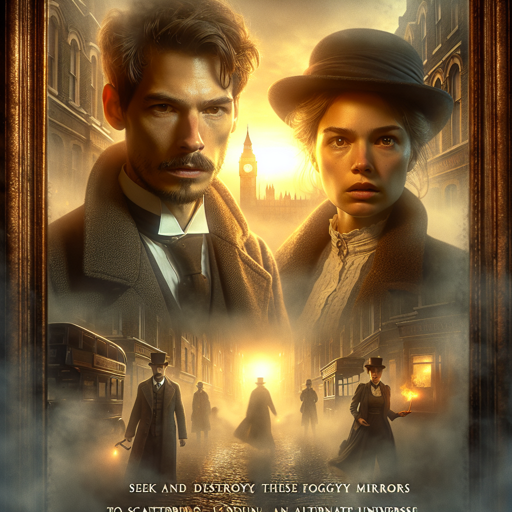

# Foggy Mirrors

## A Quest Through Invisible Reflections

### Synopsis

In a Victorian era town of London, a brilliant but eccentric scientist, Vincent Faraday, invents a glass that provides a window into an alternative universe. These 'Foggy Mirrors,' as they later come to be known, provide a bridge into this unseen world where one's deepest desires and darkest fears come to light. However, the path through the foggy mirrors is filled with myriad dangers. The plot revolves around Faraday's apprentice, Isabella Clarke, as she navigates her own trials in this world in an attempt to find her missing mentor.

#### Based on Great Expectations by Charles Dickens

#### Texts generated by gpt-4, images generated by Dall-E

### The Prodigious Invention
#### Introducing the Victorian era world of Vincent Faraday, an eccentric world-renowned scientist, and his most curious invention yet — a glass panel capable of presenting an unseen alternative universe.

London, Victoria era, a different world yet similar, glimmering with the golden haze of gaslights and the hearty aroma of coal-fired homes. The hustle and bustle, the eager hustle of omnibuses, and in the heart of all this splendid madness, there nestled a quaint townhouse. Known for its intricate design and sumptuously cloaked in ivy, it was the magnificent abode of Vincent Faraday, the unrivaled savant of the epoch, notorious for his irrefutable geniuses and insurmountable idiosyncrasies.

Faraday was a man of little vanity and remarkable poise. A man with eyes that sparkled with the enchantment of the world’s great mysteries. His reputation preceded him not just because of the world-shattering knowledge he possessed, but primarily due to his quixotic character, concealed with an almost regal austerity.

It was an ordinary day, with the usual activeness reminiscent of a well-oiled clock, until it wasn't. Faraday, usually caught between his eccentric thoughts and intricate designs, was found in an intensified fervor. The numerous gadgets and engineering marvels that adorned his workspace were momentarily deserted. Instead, his attention, no - boil it down - his obsession was fixated on a plain looking glass panel, splendid without poise, and mysterious with secrets it held in its sleek dimensions; a mirror but not in a typical sense.

As the clouds drove the day into darkness and covered London with their somber shade, Faraday lit his lantern, casting the soft luminescence over the shroud of secret onto his invention. "Glass panel capable of exhibiting an unseen alternative universe", he mumbled to himself with a sense of accomplishment parallel to God at the creation of time.

Gently placing his aged, yet determined hands on the glass panel, the profound invention, he closed his eyes. His heart drumming in his chest reverberated into a rhythm, a cadence which led the glass to cloud up. It was as though fog had descended, condensing onto the surface of the mirror; a slow peaceful phenomenon that transpired before one's eyes. Faraday had heard the silent whisperings of creation, the lullaby of the unknown, and from this calm lull, his invention ‘Foggy Mirror’ was born.

 Faraday's ingenuity breathed life into the panel, and before his eyes, the mirror resonated with an ethereal radiance, channeling unseen universes fraught with allure and danger in measures he had yet to discern. What should've been unsettling was a waltz caught in his eyes; it was beauty he saw, magnificence he felt and fear, a variable he knew would slit through this tranquility soon.

As he opened his eyes, the mirror held multitudes of profound imagery. Images that swept past, fleeting as the morning visage of a dream yet leaving the profound imprint of a ghastly night terror. Some were vivid with beauty, bursts of color and creativity that blotted out the dour greyness of their world. Others, held macabre tokens of an unfathomable dread, darkness that cloaked unimaginable horrors.

This ornate glass panel brave enough to present an unseen universe could change everything or lead to utter chaos. The subtle threat of unpredictable doom danced amid the promise of unimaginable discovery and thus was born Vincent Faraday’s prodigious and mysterious invention.

As the day broke, painting London with a soft hue, Isabella Clarke, the wide-eyed apprentice and the ever-keen pursuer of adventurous knowledge, walked into the townhouse. Little did she know, this was the inception of an ultimate journey - of discoveries dread and yet remarkable. As she approached Faraday's room, bidding hallo to the small melodies of a day still young, her breath caught in her throat. 

Ahead, in the chest of these grand walls lay the first stroke in the grand painting scarred with science, thrill, and surreal wonders of ‘Foggy Mirrors’. It was just a mirror, appearing ordinary, audacious in its simplicity. And yet, as her mentor would soon reveal, it was anything but. It was the door to a journey that would ripple across their universe imminently, changing her life and potentially their whole world, forever and a day.

### The Enigma of the Foggy Mirrors
#### Understanding the properties and mystery of the 'Foggy Mirrors' and its power to localize deepest desires and greatest fears from an ethereal world.

In the wake of yesterday's events, my quarters had come to take on an eerie feel. The quiet, once comforting to me in its assurance of solitude was now fractured frequently by the echo of my mentor’s inventions ticking and humming as they saw to continuing his works in the absence of those capable hands.

Stepping into the vast study of my missing mentor, once a world of extraordinary brilliance, I found myself facing the centerpiece of it all; The Foggy Mirror. Its ethereal glow illuminated the room dimly, casting dramatic shadows on the dust particles that filled the air. Perhaps it is your typical Victorian fear of the unknown, yet there was a certain dreadful pull about the Foggy Mirror I could not shake off. 

A sheet of icy glass that bore no reflection, only the opaque haze attributable to the other world's fog, trapped within its shiny facade. A fog from a bizarre reality, a universe separate from our own, where all the deepest desires and darkest fears were trapped. These were trapped not in the chains of secret whispers or forbidden thought, but living, breathing entities that existed in the cold fog.

Touching the mirror, I felt a familiar rush. The energy was unsettling, an unseen undercurrent of constant activity that had no parallel in our world of laws and physical constants. The fog was dense as it tasted of the strange and foreign undercurrent that combined fear, ambition and raw power, swirling and engrossing all that it had trapped within.

I wondered about its power to manifest the unfathomable or improbable. I sometimes dreamt of the unimaginable riches one could access, the power it could provide our British Empire or the knowledge it could bestow on us about the human psyche. Yet, despite our vast understanding of the physical realm, we were clueless about humanity's deepest, abstract desires, or the unbeknownst monsters that lurked in our nightmares. 

As I gazed into the fog, I introspected my biggest dreams, my raw desires. Although quick to identify them, I couldn’t help but brace the sickening sense of dread, the terrifying realization that our deepest fears too, would be evident and confronting. I often wondered how Vincent, for all his ingenuity must have controlled his mind’s workings near the mirror. Is that why he had disappeared – he fell prey to his desire or was ensnared by his fear?

On the help desk, Vincent’s logbook jotted the beguiling sentiments he fed into the foggy mirror. Desires of discoveries, recognition, advancements flickered in quick rush, followed by a despair of isolation, fear of acceptance and a clear dread of his mind’s monsters. 

I had my own fears, but I was curious. Despite its dangers, I was inexorably drawn towards the other side. Apprehensive but determined; I resolved to learn its ways, to see the unseen, to decipher the truth about these so-called Foggy Mirrors. I had one goal, one desire overpowering every other fear – Return Faraday safely from the other side. 

Engulfed in feelings both contrasting and complimentary, my palms against the chilly glass, I was not just looking at the fog’s mystery, but on a journey to solve the foreboding enigma.

Fate had put me alongside Vincent Faraday, and destiny had set me on this path. The world behind the mirror was unexplored, and murky dangers certainly lurked there, yet I found it was my curiosity – my unparalleled desire to know, to understand, and to save – that bound me most compellingly to the foggy world on the other side.

### 'Into The Looking Glass
#### When Vincent Faraday mysteriously disappears, his apprentice Isabella Clarke finds herself stepping through the foggy mirrors into this alternate reality.

Isabella Clarke stood alone in Faraday's intricate laboratory, the foggy mirror before her humming with an ethereal energy. Her heart pounded like the frantic tempo of a drummer. Even though she was in the familiar confines of the workspace, she was enveloped in an array of bone-chilling dread and intrepid thrill facing the unknown portal.

Her white knuckles clutched a single personalised item of her mentor, a worn, brass, Faraday pocket watch which was supposed to act as her guiding compass in that unfamiliar world. The watch had a strange overarching connection with the mirrors; a small compass carved into the back oscillated violently when it neared the glass not pointing towards magnetic north but something else altogether, perhaps its twin companion on the other side.

"Reflective navigation," Faraday had called it, a concept as obscure as the world itself, and awe-inspiring like its creator, Faraday. However, now with him missing, his hasty advices served as a worrisome parody. Fear seemed to course through Isabella's body, but her mentor's reassuring smile danced in the sketches of her memories, propelling her inch ever so close to the mirror. 

With eyes draped wide with intrigue, she scrutinized the mirror with an analytical eye. The sheet was not crystal clear reflective. It was like a pair of spectacles that had been breathed upon - foggy and vague. Yet, inside the miasmic swirls twirled an unearthly world of inexplicable lights and shadows, elegant antitheses of their tangible world. It pulsed with a strange life and pulsed back at her with a strange echo, somehow emanating liveliness and eeriness simultaneously. One could never comprehend these sketches without stepping into it, a step Isabella knew she had to take. 

She held the pocket watch over the mirror once again. The twitching needle became frenzied as if urging her on. Taking a deep breath, as though preparing to plunge into an icy, uncharted ocean, she offered a final glance at the world she had known - securing to memory her tiny room with its myriad knickknacks, her priceless stifled white apron, and most significantly, their wonderfully peculiar world in the brass-rimmed lenses of the spectacles typically perched on Faraday's enlightened eyes.

Edging closer to the mirror, she cautiously extended her hand, fingers trembling as they hovered over the shifting surface. Instead of encountering cold glass as she had expected, her fingertips washed over a cloud of paradoxical warmth and chills simultaneously.

With a gasp, she pressed on fiercely and hurled all logic to the winds, surrendering to the mysterious call of the foggy mirrors. Suddenly, an unseen force yanked her forward as a rush of wind slapped against her face erasing the reality she once knew. Eyes clenched against this peculiar assault; she could be certain she was no longer in her old universe.

Slowly, her eyes blinked open to gaze upon a realm intertwining her deepest longings with churning fears; the nightscape stretched out before her in a grand pastiche. Clutching the familiar pocket watch was an amber-haired apprentice who clashed with the hues of her ambitions and the shadows of her worries.

Taking a shuddering breath, she fought down the fear and focused on the next task  - the rescue mission — to save Faraday.

Thus, clutching onto the remnants of courage, Isabella ventured deeper into the haunting beauty of the alternative universe painted in Victorian aesthetics, flinging herself fully into the curious enigma 'beyond the looking glass.' As a wave of foreboding cruised through her veins, she knew this realm held strange and possibly dangerous destinies. Still, her firm resolve would not waver; she would bring Faraday back.

### Test of Resolve
#### Isabella faces her own deep desires and darkest fears as she explores the alternate universe to find clues to her missing mentor's whereabouts.

The glow of the opening portal steadily faded, leaving Isabella Clarke alone in a place not her own. Around her, shadowed images of her homely workshop took form; distorted and dark, it was as if the now impressive array of deck dials and microscopes were drenched in nocturnal despair.

Pulling her gaze away from the unsettling familiar-but-not-familiar scene, Isabella focused on her daunting task. Find her mentor. Vincent Faraday’s steps had perhaps traced the same pathway she was now to follow. A sigh parted her lips, raising a simple question - where to begin?

Remembering Faraday's words, “Our deepest desires and darkest fears come to life,” she shivered, for within her lay the love for scientific discovery battling an imprint of fear associated with the unknown — double-edged dreams that could come true in this disconcerting realm.

Her deepest desire. A desire to be a scientist, not just an apprentice. Despite living in an era that did not readily celebrate a woman's scientific acumen, she yearned to follow Faraday’s path. Yet, underlying her love for her mentor was a whisper of rivalry — a yearning to stand equal. A thought which, in the mundane reality, sat quietly at the base of her scholarships and experiments, but here, surged forward, materialising in front of her.

A non-physical whisper of presence, an apparition wielding a refulgent beaker. ‘Dr.Isabella Clarke’ it chimed cheerily, ghostly molecules dancing inside the glassware, spelling it out. Priding in live discoveries, alterations of reality, this spectral figure promised a future saturated with accolades and experiments — an offering of a relocated lab stocked with patrons and prodigies looking at her as their scientific anchor.

“That is not where Vincent would be,” remarked Isabella, breaking the vision broodingly. Intellectual pleasure, she recognized, was a path astray from her pre-set goals, in the midst of it; she wouldn’t harvest clues leading her to Faraday. She stepped back, letting the mesmerising vision fade into the foggy background.

Shaking off intoxicating desires that did not serve her immediate purpose, she fraternal tapped onto possibly the most concealed part of her science-clad front: her fears.

Smokey trails surged forward before her eyes, images twisted into familiar sequences showing her cherished but estranged past. Her biggest fear was never being reunited with her family in Cornwall again. Letters breaded with inquiries about her well-being; the distant echo of her birth-name 'Issy'; and yelling whispers of pestilent ridicule hitting her parents for planting a 'natural philosopher’s' darkly taints in their daughter’s fate – a futuristic spectacle of death, suffering, anguish.

In the haunting vantage of family torment, she saw Faraday – despair drove him closer than prosperity could. Bound by her mentor, she stepped into her fears, aiming to trace a trail led by horror, unforeseen struggles and eventually, enlightenment.

As she ventured deeper, spiders of fear weaved labyrinthine threads around her, enclaved in their obscure design. Disappointment, alienation, voiceless woes, a woman immersed in science, and an optimistically curved journey dissected by adversity – her pursuit after Faraday lured her closer to her dwelling darkness and shining future. Hovering within the fringes of her deepest desires and darkest fears, the invisible reflections in her psyche offered crucial ladders to her mentor’s current station.

Compelled by ardour and desperation, she pushed past spectral greetings of her desires, waded through visceral echoes of undesirable outcomes. 'Rather unfortunate fears', she tried to assure herself as if taming dragons from a grotesque nightmare in rampant swirl of cyclonic devastation and loss.

A part of her was shattered, yet dawned in valor. In her search for Vincent, she had cleared out a path for herself. Her paces were collective of epistles carried by winged perceptions, a quest picked out personally for her; scourged by the mirror, she acknowledged her desires and detested her fears.

Neither locus completely held Faraday. But Isabella had embarked on the most intimidating exploration. Her resolve allowed the machinery to churn the cogwheel, succumbing the foggy mirrors to appear vulnerably definitive, allowing her to withdraw nuanced hints towards her mentor's absence.

Unstoppably brave, spurring forth, and more resolved than ever, Isabella vowed to continue her search mindful of the cruel carousel of emotions she experienced.

Squaring her shoulders, she stepped deeper into the distorted world, dredging through the ethereal mist that clouded her forward path, unsure of what she might encounter next – but ready, nevertheless. The future may be unpredictable, but her resolve was not.

### Horrors Unleashed
#### Events take a dark turn as Isabella unearths the truth about 'Foggy Mirrors' and its potential hazards.

Isabella stood all breathless, observing the alternate mirror room. There was a hellish spectacle on display, and Isabella instinctively knew that something about the 'Foggy Mirrors' was devastatingly wrong. Every face that she glimpsed in the haunted mirrors appeared monstrous, distorted by fear, contorted in agony. She was surrounded by a myriad of grotesque terrors that roared with no sound within the silhouettes of the mirror.

Her breath hitched as she scrutinized the faces embedded in the mirrors closer. Each of them was familiar. Neighbourhood residents, friends, family, acquaintances, everyone she knew back in London. Each engrossed in a battle, fighting their worst fears. The quite dreaded to be surpassed by a clamor, those of prestige and name strived not to lose their honour, while the gluttons desperately tried not to fall into the ravages of starvation. Every face was wrinkled with a macabre kind of terror, the kind one wishes even upon their direst of enemies.

“Faraday,” she muttered under her breath. Isabella struggled to shake off the disoriented feeling that was now creeping over her. It made sense now, Vincent's abrupt disappearance, him leaving no trace.

The horrifying truth began to make a terrifying sense. Surely, her beloved mentor was caught in the same misfortune. Her eyes closed in mortification; Vincent must be somewhere facing his own dreadful fear.

‘Foggy Mirrors’ were not merely gateways into an unseen world. They were binding contracts with the devil, entrapping them into a horrific theatre of their darkest fears becoming palpable realities. Changes in the mortals on the other side brought dreadful repercussions onto their counterparts in the alternate universe. As if the mirrors were puppeteers, and they mere marionettes tethered cruelly to an opposite world's whim.

This revelation sparked a feel of desperation within Isabella. She needed to find Faraday, they had to find a way out of this hideous prison, or risk forever being trapped within it. Shivering, she dug out Faraday's vintage compass from her pocket, its faded letters and peculiar symbols seeming haunting under the dim candlelight. She remembered his words as clear as glass, “When you're lost, follow the compass. It leads not to a destination, but the path you need to find.”

Slowly, with painstaking care, she dusted off the old device and determinedly set a course. At every dreadful display in the mirrors, she steeled herself, reminded herself of the goal at hand— to find Faraday and bring him back. Something within her clenched resiliently. Resolutely, she plunged herself deeper into the rooms of horror, with a newfound resolve and an unwavering belief.

The world inside the ‘Foggy Mirrors’ was a reflection of their reality but terribly warped to satisfy the thirst for panic and horror of some malevolent entity. What they carelessly dismissed as an idyllic, alternative universe was turning out to indeed hold a mirror to their world— but a distorted one.

The dilemmas this odious verity posed were undoubtedly enormous. The city, far more the world, would spiral into chaos should word of this get out. Isabella shivered not merely from the encompassing eeriness but because of what exactly she had come to understood.

A discovery that held the most significant decorum of invention, exploration, creativity had swiftly turned into folly of ghastly implications. Seemingly, Isabella Clarke had journeyed from the precipice of grandeur straight into the jaws of horror.

Thus, the empty halls of the 'Foggy Mirrors' echoed with Isabella's nervy heartbeat as she entered a jaunted expedition to find Vincent Faraday, clutching onto the flickering light of hope, unknowingly entangled in a world of caged fears. Gradually, each step within this horrifying reality was no less than Horrors Unleashed.

### A Mind in the Fog
#### The narrative explores the psychological enigma of enduring submersion in an environment where desires and fears are tangible realities.

Isabella, our heroine, had entered a dimension not taken by many before her. Now stained by the ethereal touch of the 'Foggy Mirrors,' her mind reeled with apparitions in the fog. She had stepped into an unseen space — where fear and desire were no longer shadows lurking in the psyche but tangible realities, assuming epiphanic forms in her path. It was a place where her subconscious battled the force of reality.

Lost in a forest of swirling opalescence, Isabella was dealing with the one proposition she wasn't prepared for — an existential crisis. Within the glass’s fluctuating clarity, the abstract constructs - desire and fear - had been metamorphosed into comprehensible phantoms, thereby sowing the seeds of her uncertainty. 

Navigating her way was, inevitably, an emotional roller-coaster. A realm where wistful dreams became charming meadows and trepidation took the shape of monstrous cliffs, it was literally and metaphorically an arena of staggering highs and unfathomable lows — a demanding test of one's resilience. Each occurrence within the mirrored world reflected upon a piece of her psyche — her merits, her weaknesses, her past, and her future potentialities.

At one instance, she found herself gaining fortitude when she happened upon an animate representation of her father’s scientific journal. The brown, leather book she used to sit by in her childhood, fascinated by the complexities within. Here, in this alternative dimension, the book shimmered with otherworldly magic and when she touched it, she found herself filled, inexplicably, with joy and newfound resolve. It was a physical manifestation of her latent desire to uphold her family's legacy in science.

However, to look into the mirror was also to confront monstrosities — the embodiment of one's deepest fears. A debilitating angst filled her heart whenever she glanced through the fog and saw the specter of failure taking the physical form of a dark ominous cloud resting atop a cliff, far in the distance but looming closer with each passing moment. Its resemblance to the thunderclouds she fears, so petrifying during violent storms, had her paralyzed in its regard.

It felt at times that her mind could not endure this looping sequence of visceral emotions — exuberance metamorphosing into terror and vice versa. Yet, for Faraday and for the purpose her heart held dearest — to safeguard her world from the potential harm 'Foggy Mirrors' might inflict, she persevered.

Internal coercion moulded her endurance. She would not let wistful dreams become mindless chases nor her fears consume her spirit. Every manifestation within the enigmatic world of Foggy Mirrors was pitted against her unyielding resolve, like a diver challenging the ceaseless ocean depths.

These ethereal experiences, however dreamy or terrifying, redefined Isabella. She grew bolder in her experiences, understanding that there was nothing more misleading than fear and nothing more empowering than desire when distinguished clearly. 

Feeling renewed, Isabella pushed forward, combing through eerie woodlands, across mystic shores, and scaling nebulous peaks. Here, amidst unsettling enigma and shocking revelations, Isabella became a swift squall - seeking not to dispel the mystery, but to understand and maneuver it. To not withstand the waves but to surf them. To not fear the beasts but to exert dominance over them.

As Isabella came to the cogitation that what stared at her in the 'Foggy Mirrors' was her elemental self, shrouded and distorted by the subliminal mind’s assertions. The journey had shed the veils off a critical, life-altering truth – not in an alternate universe, but within the confines of her own mind, existed a fearsome warrior and a pragmatic dreamer.
The skirmish against disquieting uncertainties within the metaphysical labyrinth had begun their inoculation in Isabella’s mind - embedding obstinate perseverance within her, tattooed with battles fought with her deepest fears and wildest dreams.

Endowed with the newfound wisdom of self and an indomitable spirit to tackle the arduous journey ahead, Isabella courageously emerged — not trapped within the foggy echoes as apprehended, but rather reborn, from the cacophonous opera staged by her mind within the chilling fog.

### Mirror Image
#### Isabella confronts her mirrored doppelganger, a physical embodiment of her greatest ambition and her worst dread.

There stood Isabella Clarke, under the unnatural glow of the otherworldly luminescence, staring into the face of a vaguely perceived shadow of herself. Yet, in the blond swirls of the tenebrous mirror, the image reflected back at her bore not the usual innocence she recognized, but a vastly more forceful demeanor marked by vehement ambition and unrestrained dread.

"Who art thou?" she queried of her reflection, startling at the peculiarity of the question. There was a certain unnaturalness in confronting a mirror image and being unsure if indeed she recognised the person she was looking into.

Her mirrored fallacy responded where ordinary mirrors refrained - sentient unlike mere reflections. The mirror's tonality was softened, akin to Isabella's own, but layered with an air of enigmatic perspicuity. "I am thou, in your grandest aspirations and most appalling frights. Shall we then, partake in a conversation, or wilt thou keep questioning my mortality?"

Intrigued and frightened at the same time, Isabella felt a lump in her throat. The doppelganger - for that seemed the most accurate descriptor - stood there in the mirror, coolly interpreting her shock. "Why are you here?" she managed to ask through her burgeoning cualms.

"To express thine essence with the realities thou art fearful to acknowledge," the cryptical image goaded. "Often, we hold inhibitions of the voices perched softly in our interiors, whispering the crux of existence," it explained.

As Isabella listened, the audacity of Faraday's invention struck her, merging the barriers between the real and the surreal, making more visible the distinctions within one's psyche. But more concerning was the realization of her deepest ambition.

"To be a renowned scientist," the doppelganger enunciated, its voice piercing the eerie quietude. "To rise above the conventions which clutter thy path and embrace the true essence of thy scientific curiosity."

Recognition stung. That indeed was her highest ambition, the propensity to create, to invent, to stand shoulder to shoulder with Faraday himself. But it was an ambition closely guarded, kept safe from the scrutinizing society that wouldn't appreciate a woman's mind running parallel to her male counterparts.

But where there's ambition, there's also fear, oozing with uncontrollable prominence. "Thy fear is disappointing Vincent, falling short in his eyes. To not live up to his expectations, let alone your own."

An uncomfortable sensation rushed through Isabella. The fear felt so personal, so overpowering that its revelation was more traumatizing than facing her own mirrored reflection.

"Art thou here just to torment me?" she asked, her shock metamorphosing into trepidation.

"Certainly not," the doppelganger whispered. "Just to help ensure thou dost not let your fears undermine your ambitions."

Sher resolution amplified, Isabella glanced at the eerie glistening mirror. Uncertainty remained, the path back to Faraday foggy, obscured with perilous variations of self-doubt, but she now recognized her ambition and feared her dread. Comprehending her doppelganger was but a step in picking apart this 'Foggy Mirror' puzzle. A stepping stone closer to Faraday.
She saw her reflection nod — affirming, as truly Vincent would have in a parallel situation. Even the mirrored image in the 'Foggy Mirror', her doppelganger, had seemingly revealed a sense of purpose in the whole episode.

Mirror, mirroring me and my true essence — Isabella pondered — banishing the lingering fear. Peering into her own eyes reflecting in the mirror, she set onto an uncharted journey deeper into the unseen dimension of dreams and dreads, embracing her grandest of ambitions and placating horrors; she persevered to unravel the conclusion to her chase after the lost Faraday.

### Finding Faraday
#### After numerous ordeals, Isabella finally deciphers the cues pointing to Faraday while confronting the reality that 'Foggy Mirrors' is unfathomably more perilous than they had presumed.

Isabella had been alone for what felt like an eternity. She had lost any sense of time in this ethereal plane. Despite resolving to traverse this journey with as much candour as she could afford, the perils of confronting her worst fears and alluring desires had taken an inevitable toll. When she had set off into the foggy mirrors universe, she had somewhat naively presumed the venture to be more academically engrossing than perilous to life and sanity.

Battles leave scars. Some you can process, others stay hidden, eating at you from within. Since she had trodden into this enigmatical realm, Isabella had come face-to-face with both. Her discovery of Vincent's failed experiment wherein the glass panels novelized the worst poisons of the mind had unveiled a far grimmer and perilous reality than she had fathomed. Amidst such frigid introspections, each gasp felt like an accomplishment, and the continuing coherence of her mind was her only victory.

Her race within this ethereal universe had presented her with cryptic riddles decoded only through vivacious introspections. Each step further, she felt, was a step closer towards understanding Faraday. After all, this was an alternate universe painted from the strokes of Vincent's aspirations and nightmares.

Each looming shadow felt like a coded message from Faraday his cryptic handwriting scrawled on an unseen canvas. An old oak tree undulated in the flames of unmanifested desires; the dancing shadows hinted at a pathway leading forward. An imposing mountain with piercing cliffs seemed home to resounding horrors; yet, the echoes sounded familiar, a binary code of sorts. And then there was The Uncanny River, which seemed to sing a melancholy dirge - Faraday's dejection in liquid form.

Upon terminating her introspective charade along this uncanny river, a sudden epiphany struck as a thrum deeper than the river’s undulations. An obscure pattern matched the once scoffed calculations amidst Faraday's abandoned parchments. She deciphered a concealed mathematical enigma directly hinting towards a particular dawn with specific UV radiations basking over the elegant Thames Bank. Visions of the enhanced solar panels Faraday had constructed along the bank flooded her mind. This valley of twisted realities had opened an avenue, hinting at her beloved mentor’s location.

Her eureka moment was tarnished swiftly as a grim realization soon followed. The innovativepanels Faraday conceptualized commanded a double-edged sword nature. While they could project enchanting allegory accentuating the beauty of one's aspirations, the same mirage could shroud one's AI-based truth reality into unremitting terror. Whatever hedonistic landscape projected could also unearth corresponding horrors; thus, the subsequent scenery was a parallel mural of the user's worst horrors. ‘Foggy mirrors’ had thus inadvertently become a powder keg, with the power to trigger chaos and pandemonium in the physical world if accidentally activated.

Isabella traced him, her own visions validated by the victory lap pulsating within her heart. She now knew the nature of the journey ahead, the trials that awaited. After enduring a lesson of living lifetimes in this shadowy conclave, she was battle-scarred. Enigmatical riddles and cryptic sighs of the universe had toughened her up, and she now claimed an unvanquished spirit. The visage of Faraday cried out a silent beacon in her fragmented dreams – the next code to decipher.

Taking caution, she repeated Faraday's quoted directive beneath her breath, over and over – "Reality is merely an illusion, albeit a very persistent one." Future paths will need this key, fathoming what this champed world of enchanted mirrors will unleash next. No obstacle seemed undefeatable now; she had found Faraday.

The semblance of hope latched onto a battle-weary heart, she stood ready with newfound courage to stride with purpose towards a fight greater than she had anticipated, for her mentor, and the survival of their world. She was more ardent, desperate now more than ever- to embark on a quest for Faraday. Dawn's hope clung to her hems as she stepped ahead, hopeful to find Faraday.

### Escape from the Alternate Universe
#### Isabella and Faraday make a daring escape from the alternative universe, meeting overwhelming challenges head on.

Escape from the Alternate Universe

With the churning adrenaline-surge of their audacious encounter still reverberating in their hearts, Isabella and Faraday faced the insidious truth – they were prisoners in an enchanting realm of their own discomforts. A labyrinthian site that was a mirror reflection of vulnerabilities they dared not confront in their own world. Deep within this realm, the disconcerting knowledge that it was their construct created a sort of existential unease.

"This place, it's playing our fears and desires against us," uttered Isabella, her voice a bare whisper resonating with unvoiced fear. The rune she clasped - the one previously discerned by her intellect – seemed unusually heavy to her jangled nerves. 

Faraday looked at her, his once effervescent eyes now wearied beyond measure. The polished man of science who once inhabited sublime corners of London theatres preaching about the virtues of reason and rationality, now looked at his glassy prison with new eyes, a telling scar on his weathered features bore testament to his unspoken ordeal.

"We must be strong, Isabella. It's our will they're confronting. Our own reflections plotted in strategic chicanery," he sagely advised. Faraday saw the turning wheel of 'Foggy Mirrors,' and recognised the inscrutable hands at play.
 
Appreciating Faraday's sentiments, Isabella rekindled her sagging spirit. Remembering her past trials, she partnered resilience with resolution to stand upright in face of encircling fears. From the shadowy crevices of desires and haunts streamed forth trepidations that sought to subdue them. But armed with clear knowledge of what lies beneath, they faced these trials with valour instead of trepidation.

Their mutual understanding forged a silent partnership. They combined efforts to find a way out of this genteel prison, woven tightly with their darkest apprehensions. Proceeding on the precarious path fraught with reflections of twisted horrors and uncanny temptations, they collectively bravely faced every trial the mirrors subjected them to. A grinding trial of endurance, further hardened by the unsettling familiarity of each encounter.

Finally, amid the pale luminescence that lit up the vast extent, shadows waved and air fluxed towards a foggy mirror shimmering undecidedly. Streamers of muted smoky hues spiraling upward in erratic rhythms, evoking eeriness in abundance. Amidst its murky heart glinted the portal that was their escape.

Approaching, a whisper hissed from the depths of the mirror. "Courage, dear heart, to endure the unendurable," it beckoned, the voice a chilling dance of surrealism. Isabella and Faraday glanced at one another, affirming their silent pledge.

Gathering her will, Isabella carefully fed in the rune to solidify the portal. As the entrance stabilized, they took one last glance at their intriguing prison encapsulating their mastered fears and quenched desires.

Together, hands clenched in shared resolve, they plunged through the mirror. The transition swept them along, emotions whirled in a frenzied jumble within them. And then, with a profound thud, they were back on the terra firma. A haze of London smoke welcomed them and Reed Street, in its beautiful grimy glory, opened its arms to the wayward travellers.

They had finally made their daring escape. A hard-pressed adventure punctuated by trials that braved their mettle and plunged into the depths of their psyches and desires. As they stood exhausted, yet exultant on London's well-trodden path, they realized they came back richer, bearing a vastly deeper knowledge of their worlds; those within and outside foggy mirrors.

### Resurgence
#### Back in their own world, Faraday and Isabella spearhead the quest to destroy all 'Foggy Mirrors,' safeguarding their world from an impending cataclysm.

Chapter 10: Resurgence

Faraday and Isabella had emerged from the alternate universe, a world of dreaded fantasies and perilous illusions as if weeding their way out from a cobwebbed forest that sprung from the very bowels of one's deepest fears. Noonday warmth greeted them, as did the usual sights of Victorian London, hawkers wandering about the neighborhood, young workers rushing to the factories, factory smoke dissolving in a misty blue canopy.

The fragility of their homely world seemingly lay juxtaposed against the cold, unimaginable terror of the obscured universe in the foggy mirrors. It was apparent to both, arrived from a world where science cloaked trepidations as realities; an impending catastrophe lurked close.

"There's only one course of action left for us, my dear girl," Faraday's voice trembled with shaky determination, his face a hardened mask reflecting the light of a raging battle inside him. Isabella gazed at him, the appeal of a resilient warrior emanated from her stoic eyes.

"We must destroy every foggy mirror! Or, shudder me timbers, dire consequences would be witnessed," Faraday produced the sledgehammer he had hidden inside his weathered coat. This lethal instrument, iron-clad and of a stern aspect, was outlandishly monumental against the backdrop of Faraday's frail silhouette.

As they proceeded from one city hub to another, a determined urgency underlined their movements in a stealthy attempt for a search-and-destroy mission. Murmurs of the dying day dove into dusk as murkiness descended over the streets of London.

The foggy mirrors bore a witness to their admirable defiance; every blow of the sledgehammer echoed through the labyrinth of cobblestone streets and winding alleyways, flames of rebellion sparking amidst shards of shattered glass.

Isabella, keeping guard and scanning the regions for unwary voyeurs, bore an unwavering resolve in her gaze. Her mentor's trembling form in the periphery ignited a flame inside her, a flame kept alive by the whispering winds of imminent danger.

As the last of the fantastic contraptions of the 'Foggy Mirrors,' were disassembled, turned into dust and fragments of what was once a far too perilous reality, Faraday fell to his knees, astringent sweat slipping down his face, and a breathy sigh escaped his lips.

"We've done it, my dear. We've averted a catastrophe of unforeseen proportions," he stammered, looking towards the sky, a genuine smile tugged at his lips.

Victory hadn't felt so sweet before. Yet, with resolve and actions steadfast, they were heroes unwitnessed, remembered only by the haunted reflections of shattered dreams scattered as dust on city streets. It was a chapter they knew would remain tsill only their memoirs remained, a legacy they decided to bury in the ashes of the Foggy Mirrors. As they retired to the confines of their home, Isabella sighed, locking eyes with their world one last time.

An era of foggy mirrors ended that night, succumbing to two brave souls spearheading a narrated tale of subsequent events. A world narrowly escaped from a cataclysm, and while the echoes of the shattered mirrors played deep into the Victorian night, downtown London reveled in their ordinary lives, ignorant of the unsung heroism of Vincent Faraday and his apprentice Isabella Clarke.

Their struggle resurrected once more the mundane serenity as the menace receded. A new day dawned, heralding the morning of resurgence. Within this mundane echo of city life, an extraordinary adventure had ended perhaps to usher in the calm after the proverbial storm that was the 'Foggy Mirrors.' 

