# Mystery of the Forgotten Island

## An Adventure Unraveling History

### Synopsis

The novel follows the journey of a historian, Sarah, who stumbles upon an ancient map leading to an uncharted island. As she embarks on a risky adventure to discover the island, she unravels a series of cryptic clues that point towards a forgotten civilization and a treasure that could change history. Faced with dangerous adversaries who are after the same treasure, Sarah must use her wit and courage to outsmart them and uncover the island's secrets before it's too late.

#### Based on Murder on the Orient Express by Agatha Christie

#### Texts generated by gpt-4-1106-preview, images generated by Dall-E

### The Unexpected Discovery
#### Sarah finds an ancient map in a dusty library corner, sparking a quest for a lost island.

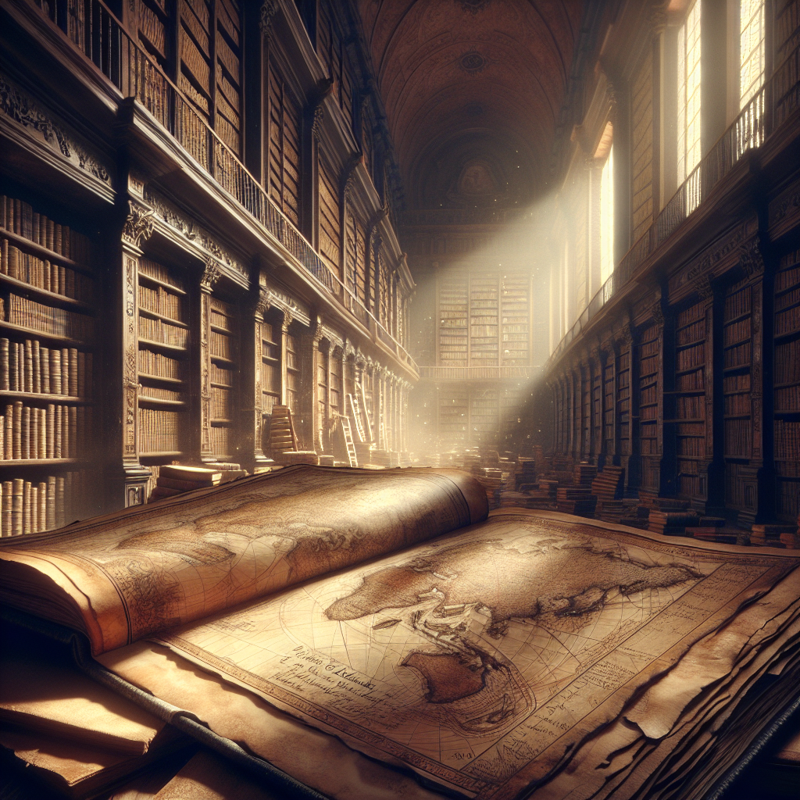
Chapter 1: The Unexpected Discovery

In the heart of the city stood an edifice of knowledge, the Grand Library, a place where the dust was as much a part of the history as the books themselves. It was here, among the labyrinth of shelves and forgotten tomes, that Sarah made her startling discovery. With an eye for the obscure and a passion for the past that rivalled the dedication of the most ardent scholars, she had spent countless hours in pursuit of forgotten history.

On that particularly drab morning, a ray of sunlight pierced through an upper window, illuminating a corner that looked as though no living soul had ventured there in decades. Sarah, a hint of excitement in her breath, drew close. Her hands, steady and precise, traced the spines of the books until her fingers brushed against a leather-bound volume protruding slightly from its neighbors.

With the care of an archaeologist unearthing a relic, she withdrew the book and a cascade of dust motes danced in the sunlight. As she opened it, a folded piece of parchment slipped free and fluttered to the floor. Puzzled, she bent down and retrieved the parchment, her heartbeat quickening as she realized what she held in her hands.

It was a map. An ancient map, the edges worn and the paper yellowed with age. The ink, faded to a delicate sepia, still sketched the contours of a landmass surrounded by the meticulous scrawl of longitude and latitude lines—a landmass conspicuously absent from any modern atlas.

Sarah could feel the weight of history pressing upon her shoulders as she meticulously unfolded the relic. The library, once a room filled with the serene silence of academic study, now echoed with the possibility of adventure. The map, drawn with an artistry that spoke of an era when cartographers were both artists and storytellers, was more than just a depiction of geography. It was a siren call to the unknown.

Her gaze was drawn to the corner of the map where the words "Isula Oblivione" were inscribed with flourishes, a name that whispered secrets. The Lost Island, it seemed, yearned to be found. But why had it been forgotten by the world? And who had taken such care to conceal this map within the pages of a seemingly inconsequential book?

Such questions seethed in Sarah's mind like a kettle set to boil. She knew then that her life would never be the same. For Sarah, who had longed to step out of the shadows of her more famous contemporaries, this was the moment she had been waiting for. This was her chance to etch her name into the annals of history, to unearth a treasure that transcended mere gold or jewels—a treasure of knowledge lost to time.

With the library stillness around her, Sarah pondered her next steps. She would need to decipher the historical significance of this find, and she knew just the person for the task. Professor James Montgomery, a gentleman of the old school and an expert in ancient civilizations, would be her first port of call. Together, they would chart a course to the island, assemble a team of the finest minds and souls, and embark on a journey that promised to be as dangerous as it was thrilling.

As Sarah gently refolded the map and secured it within her satchel, the weight of her discovery bore down upon her. But it was not the weight of burden—it was the weight of opportunity. She felt the stirrings of destiny calling her forth, and she was ready to answer its call.

Little did she know that her pursuit of the past would awaken more than just the echoes of ancient civilization. For, as is so often the case with treasures of great value, there are always those who lurk in the shadows, ready to snatch the glory for their own nefarious purposes. Sarah stood on the brink of a mystery that would test not only her intellect but her very will to survive.

This was her unexpected discovery, her journey's beginning, and the first step into a larger world, fraught with peril and promise. It was here, in the timeless quietude of the library, that Sarah's adventure truly began.

### Echoes of the Past
#### Deciphering the map, Sarah begins to understand the historical significance of her find.

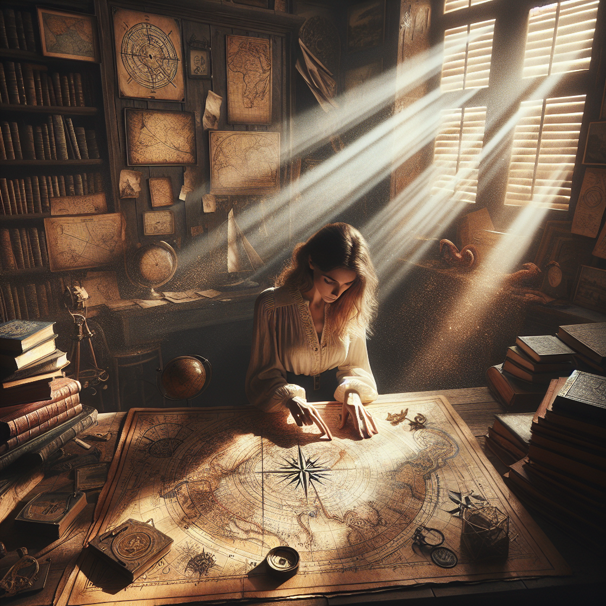

2. Echoes of the Past

The map sprawled before Sarah was like a window into another age, its edges worn and the colors faded. She took a long breath, the weight of history pressing on her shoulders. Alone in her study, the dust motes danced in the stream of light pouring through the half-closed blinds, settling upon the ancient parchment like witnesses to her discovery.

As she traced the lines drawn across the map's surface with a careful finger, Sarah considered how the art of mapmaking was in itself a silent narrator of times gone by. The precision in cartography bore the mark of its creator, and each choice in ink and label hinted at deeper stories. This map, however, was different. It spoke of an age undefined by modern texts, an island set adrift not just in water but in memory as well.

The cartographer had etched the map with symbols unfamiliar to Sarah’s educated eye. A dialect of iconography that suggested a civilization influenced by various known cultures, yet distinct in its identity. All attempts at previous translation had ended in a cul-de-sac of dead ends and scholarly frustration.

Sarah’s gaze was drawn time and again to the central motif – a circular labyrinth design flanked by four distinct markers: a serpent, a comet, a tree, and what appeared to be a sundial. Her intuition told her these were not mere embellishments. They were keys to understanding the true importance of the island.

With meticulous care, she brought out several reference books, the pages marked by her many annotations. Could the serpent be Ouroboros, an ancient symbol of cyclicality? Or perhaps it pointed to a local deity? The comet might represent a celestial event that was significant to the island's people—an omen or portent. The tree could symbolize life or a specific place on the island that was considered sacred. As for the sundial, time itself could be a riddle to unlock.

The more she delved into the historical tapestry, the more Sarah realized the island could hold the remnants of a culture that predated those known to the academic world. If she was correct, it would not be just a treasure of gold or jewels that awaited her, but a treasure trove of lost knowledge.

She pondered over the many expeditions that had set sail in search of lost lands, the fortunes and reputations made and lost on the roll of the ocean’s caprice. There were tales of islands that appeared on no maps, spoken of in hushed tones by mariners who had navigated every corner of the globe, only to vanish like mirages when sought.

This island, though, had an anchor in reality—a map that had survived the relentless march of time. For centuries it must have been passed down, hidden away, its secrets kept. Sarah felt a chill as she considered its implications. If this map led to a place of such consequence, why had it been buried in obscurity?

The historian in her knew that knowledge was often perceived as a threat to power. Perhaps this island had been purposefully forgotten, its existence erased by those who feared what it might reveal. The map was not just a guide; it was a silent testament to a history that had been silenced.

Her finger hovered over the island's drawn coastline, its intricate bays, and sharp cliffs. Then she saw it—the slight discoloration, almost imperceptible, near the northern edge of the map. Peering closer, Sarah used her magnifying glass and uncovered what looked like a hidden inlet, cleverly blended into the surrounding topography.

The revelation sparked a surge of exhilaration, and she could feel the whispers of the past growing louder, beckoning her toward the truth. She took no heed of the waning hours, nor the hunger that gnawed quietly. She had been claimed by the siren call of discovery, her mind awash with possibilities.

As twilight descended and the room darkened around her, Sarah sat back in her chair, taking a moment to grasp the sheer scale of what lay ahead. There was much to do: a team to assemble, funds to secure, a course to chart. But at this moment, with the veil of the past lifted ever so slightly, she knew she stood on the brink of rewriting history.

In that quiet room, Sarah could almost hear the echoes of lost voices carried across the ocean of time. With resolve, she rolled up the map, the artifact now a covenant between her and the forgotten island. Tomorrow, she would begin to unravel the tapestry of shadows and light that had concealed its truth for so long.

The adventure of a lifetime awaited her. And with a heart buoyed by the promise of the unknown, Sarah knew she was ready to meet it.

### Charting the Course
#### Preparations for the journey are made as Sarah gathers a team of experts.

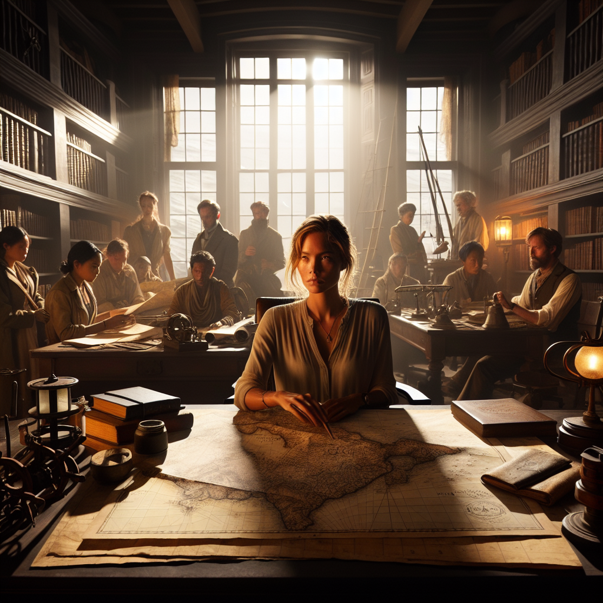

3. Charting the Course

The sun had just begun to dip below the horizon, casting long, somber shadows across the study, where Sarah sat surrounded by ancient tomes and nautical charts spread out like a fan of bygone eras. The thrill of the discovery had now given way to the pressing need for a practical plan. The ancient map she had uncovered was not merely a relic; it was a siren's call, beckoning her towards adventure and, perhaps, glory.

She had reached out to the most esteemed of her colleagues, individuals whose expertise spanned the gamut of necessary fields: cartography, linguistics, maritime navigation, and more. Sarah had learned since her early days at university that the success of an expedition such as this was invariably tied to the caliber of the team one assembled. And so she set her heart on bringing together a veritable symposium of the finest minds.

First, there was James Ellsworth, a linguist whose name resonated in academic circles with the same reverence as the verses of Homer. Then, there was Claire Davenport, a marine biologist who had sailed more seas than most had charted on maps. Thomas Gale, the cartographer, was the next piece of the puzzle, a man whose own personal cartography was a tapestry of travels that few could boast of. To navigate the treacherous swells of the ocean, they would look to Captain Edward Masters, an old sea dog whose eyes, it was rumored, could read the stars as if they were the pages of an open book.

Sarah's missive had been brief, but it carried the weight of history within its folds. "Join me on an expedition that promises to rewrite the annals of our past. Your expertise is critical," it read.

One by one, the responses trickled in; each affirmative reply stoking the embers of excitement within her. Before the week was out, they had all gathered in Sarah's study, a room that now seemed too small to contain such towering intellects and personalities.

James was the first to break the silence that had settled over the group. "Sarah, your telegram spoke of a discovery most profound. Might we be privy to the details now?" he asked, the curiosity in his voice barely contained.

With a smile, Sarah unfurled the map across the mahogany desk, pinning down its curled edges with an assortment of artifacts that littered her workspace. The group leaned in, their eyes hungrily scanning the faded parchment that promised so much.

"This map dates back several centuries," Sarah began, her finger tracing the jagged outline of the uncharted island. "My preliminary research suggests that it points to a civilization that, if I'm not mistaken, predates any known to our current history books."

A collective murmur echoed around the table. "Incredible," Claire whispered. "If this is true, the biodiversity alone could be astonishing."

"I've cross-referenced the coordinates here with modern satellite imagery," Thomas chimed in, adjusting his spectacles. "There's an anomaly, a landmass that seems to escape detection, almost as if it doesn't want to be found."

"And that is where we set our course," Captain Masters declared, his gruff voice betraying a note of adventure. "It will be no trivial journey. The seas in that region are capricious. We will need a sturdy vessel and a stout-hearted crew."

The next hours were consumed by fervent discussion, an intermingling of ideas and strategies. Supply lists were drafted, and routes were plotted, each decision scrutinized with a meticulousness befitting a mission of this magnitude. Every member of the assembly understood that what lay ahead was a voyage to the very edge of the world's memory.

It was well into the night when the meeting finally adjourned, with each individual charged with a set of tasks. The air was electric with anticipation; they were pioneers on the precipice of discovery, bound together by a shared destiny.

In the coming days, as Sarah set about securing the necessary funding and provisions, the enormity of the undertaking began to dawn upon her. Doubts, like dark clouds, threatened to obscure her vision, but she dismissed them with a resilience she had cultivated over years of overcoming the skepticism of her peers.

She would often find solace in the solitude of her study, poring over the map with a determination that bordered on obsession. She knew that with every step she took, she was walking a tightrope between history and myth. Yet, within her heart, the flame of discovery blazed fiercely, fueled by the promise of untold secrets that lay dormant, waiting for her to awaken them from their slumber.

As the day of departure drew near, the pieces of the puzzle fell into place. A ship had been chartered—the S.S. Valiant; a suitable name for a vessel that would brave such an uncertain odyssey. The crew, handpicked by Captain Masters, was a patchwork of seasoned sailors and young, eager souls thirsting for adventure.

The evening air was crisp as Sarah stood on the dock, watching as the Valiant was stocked with crates of supplies and equipment. She knew that from this moment on, every step was uncharted, every decision pregnant with the possibility of ruin or revelation. But the pull of the forgotten island was too potent, its secrets too alluring to ignore.

She turned to face her team, a motley crew of dreamers and scholars. "Tonight, we rest," she declared. "Tomorrow, we sail into the annals of history. To the forgotten island and the mysteries it holds."

And with that, Chapter 3 of their lives, of the expedition, of the world's history, quietly closed, leaving the pages of Chapter 4 to be written by the hands of fate and the whims of the sea.

### Sailing into the Unknown
#### The expedition sets sail, heading towards coordinates that promise mystery.

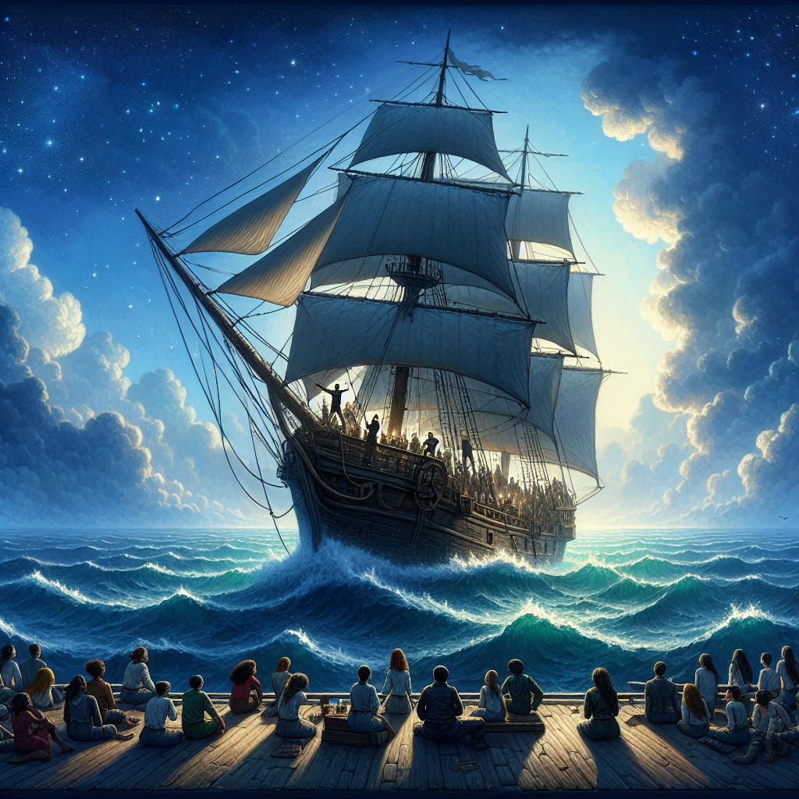

4. Sailing into the Unknown

The wind picked up its pace, slicing through the sails of the Sea Whisperer with a hungry howl that seemed to call out to the wilds of the ocean before it. Aboard the vessel, a cluster of intrepid souls, led by the unyielding Sarah, cast longing stares at the shrinking coastline that had been their world up until that very moment. Now, they were surrounded by the vast, seemingly endless blue that would serve as their home until they reached the enigmatic coordinates hidden within the worn creases of the ancient map Sarah had unearthed.

The embarkation had been a subdued affair, under the blanketing grey of predawn light. In the cold, mist-laden air, the expedition team went about their responsibilities with a silent efficiency that Sarah admired. She knew the importance of each member: the experienced Captain James, whose grizzled features spoke of countless battles against the might of the sea; Dr. Emily Holden, the linguist whose brilliance with dead languages might as well have been a key to unlocking time itself; Mark Bennett, the cartographer whose eyes saw lines and contours others could not; and even young Tim, the bright-eyed intern whose fervor for history was likely ignited by tales of Indiana Jones rather than the dry pages of textbooks.

The Sea Whisperer was a vessel of substance, with its dark wooden hull and sails as white as the cliffs they had left behind. It cut through the water with a grace that belied its might, leaving a frothing trail in its wake as it headed toward the unknown. Sarah stood at the bow, map in hand, feeling the spray of the sea as a baptism into a new chapter of her life. She'd read of explorers and adventurers, had spent nights under covers with a flashlight dreaming of being one of those dauntless figures who defied the ordinary in pursuit of the extraordinary. And now, her heart raced with the same fervent beat that must have drummed in the chests of those she'd idolized.

Days turned to nights and nights dawned into days, with the sun rising and setting like the punctuated rhythm of a world breathing around them. The skies stretched above them, a canvas of shifting moods; at times a vibrant blue, at others, a brooding grey. Stars emerged at twilight, speckling the dark expanse with glimmers of light, serving as ancient guides for those who dared to traverse the vast plains beneath them.

The camaraderie of the crew and the expedition team grew with each passing league, each salt-sprayed laugh, and shared meal of rationed provisions. Conversations flowed, rich with theories about what lay at their journey's end. The map was a constant topic, pored over with the intensity of scholars and the superstition of sailors. Whispers of curses and treasures lost in time intertwined with the creaking of the ship and the slap of the waves against its hull.

It was on the seventh night, a night so clear that the milky way seemed like a path drawn just for them, that trouble first showed its hand. An unexpected squall, swift and furious, assaulted the ship. Lightning cracked the inky blackness, and thunder roared its foreshadowing of a journey fraught with more than just the natural elements.

Sarah found herself beside Captain James at the helm, holding on as the Sea Whisperer was tossed about like a mere toy in the grip of a petulant god. The crew, experienced as they were, fought valiantly to keep the ship on course, while the expedition team did their part, securing themselves and any loose items that could become hazardous.

The storm raged, indifferent to the mortal struggle beneath it. But as suddenly as it had arrived, it dissipated, leaving behind an eerie calm and a ship that, despite being battered, remained unbroken. The crew set to work repairing minor damage, while Sarah's team congregated to inspect the map, ensuring their precious cargo had survived the storm's fury.

"I've never seen a squall come on so quickly," Captain James remarked, eyes scanning the horizon for signs of further treachery from the skies.

Sarah, who'd seen the worry etched deep within the lines of his face during the tumult, pondered the same. Could the storm have been a mere coincidence, or were they truly going to be tested on their journey to this mysterious island?

The days that followed were kinder, lending a sense of false security that perhaps the worst was behind them. But as they sailed further from the known world, the weight of their mission pressed ever heavier upon them. The expanse of ocean seemed to stretch into infinity, and with it, the realization that they were entirely alone in their quest. 

When the cry finally came—“Land ho!”—it was met with a symphony of relief and exhilaration. The sight of the uncharted isle rising from the horizon like a mirage coaxed to solid form ignited a fire in Sarah's chest. Her pulse thrummed with an urgency that mirrored the ships as it plowed toward the shore. This was it—their destination, the culmination of their dreams, the beginning of their true adventure. 

The Sea Whisperer edged closer, and the outlines of the mysterious island sharpened against the sky. Sarah clutched the ancient map, its secrets soon to be revealed, as her heart sailed forth on the wings of history's embrace. They were sailing into the unknown, and within it, the promise of a mystery that wove the past with the present, a treasure that could change everything.

As the ship anchored off the coast of the island that had been nothing more than a notion on an ancient scrap of parchment, Sarah breathed in the tangy scent of adventure. With it, a chill raced along her spine, for she knew that what lay ahead was more than history—it was legend, and they were about to step into its very heart.

### Island of Whispers
#### Landing on the island, the team encounters signs of an ancient society.

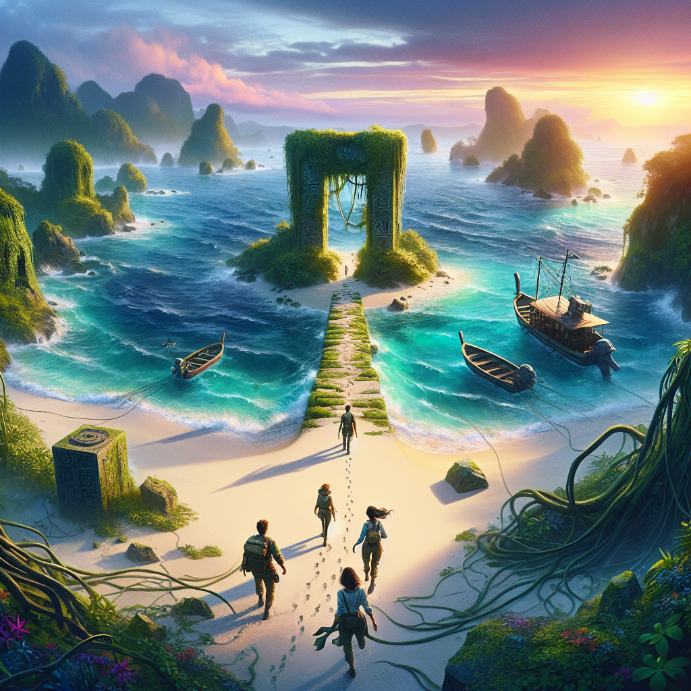

5. Island of Whispers

The Island of Whispers appeared to Sarah and her crew as a hushed sanctuary, a world untouched by time, nestled in the embrace of a cobalt sea. The journey to the island had been fraught with an air of foreboding, yet as they approached its shores, a calm serenity washed over them. The island, shrouded in mist, seemed to beckon them with the promise of ancient secrets cloaked in silence.

The landing was made on a narrow beach, the sands of which bore no footprint, nor any mark of human touch, the preservation so immaculate that it bordered on the eerie. It was as if the isle had been waiting, dormant, for the chosen ones to finally arrive and awaken it from a long, enchanted slumber.

Sarah’s heart quickened as she stepped ashore, her boots imprinting on the virgin sands. She cast a gaze at her team: a collection of archaeologists, historians, linguists, and her stalwart friend James, whose expertise in navigation had guided them through treacherous waters to their destination. They shared silent looks of both trepidation and exhilaration; the air was thick with anticipation.

Their first encounter with the island's past came in the form of a moss-covered archway, half-engulfed by the wild overgrowth. Etched upon its ancient stone was a language indecipherable at first glance, but Sarah's eyes, honed through arduous hours at the library, recognized a resemblance to early pictographic scripts. The symbols whispered of a society lost to history, yet its voice seemed to echo around them in an almost sentient manner.

James approached the arch, his fingers tracing the lines of one particularly ornate symbol. "These could predate any known civilization in this region," he mused aloud. His voice held an edge of awe but was underscored with caution, knowing that for all the wonder before them, the unknown often harbored danger.

With the archway as their portal, the team ventured forth into the verdant interior of the island. The tropical flora was a vibrant canvas of green, dotted with bursts of color from exotic flowers that released a sweet, heady perfume into the air. A symphony of unseen creatures formed a chorus, yet their hidden nature only added to the sense of mystery enveloping the group.

As they journeyed further, they stumbled upon a clearing where the ruins of what must have been a temple or palace lay in dignified decay. Vines clung to the crumbling columns like sorrowful lovers, and stone figures stood guard, their faces eroded yet still looming with a silent power that sent shivers down Sarah's spine.

"This was a place of significance," she whispered, almost afraid her voice would shatter the hallowed silence. "A center of their culture, perhaps, or of their faith."

The team set to work, documenting their surroundings, sketching, and taking photographs. Each fragment of pottery, each tool and ceremonial ornament, each carven glyph was recorded with meticulous care. The island, once a mere whisper in the annals of history, was slowly finding its voice through their efforts.

As the sun began to descend, casting a golden glow upon the ancient stones, they discovered a series of murals. These paintings, remarkably preserved, depicted a civilization of grace and sophistication: scenes of elaborate rituals, bountiful harvests, and celestial observations celebrated a profound connection between the islanders and the cosmos.

Yet, amidst these scenes of harmony, there were indications of a darker chapter—a series of stark, foreboding images that spoke of cataclysm and upheaval. The final mural, incomplete, was a story cut short, as though the artist had been interrupted mid-stroke by some terrible, swift turn of fate.

As dusk claimed the day, and shadows began to drape themselves over the ruins, the team made camp amidst the whispers of history that surrounded them. A fire crackled, casting a protective circle of light, yet beyond its reach, the darkness seemed to palpitate with the secrets of the island.

That night, the air was filled with the dreams of a lost past, and Sarah found herself listening intently to the hushed tones carried on the wind. The island, though silent in the language of the living, spoke to her in the lexicon of the lost, urging her to unravel the tapestry of its story.

And as the embers of their campfire died down to a gentle glow, Sarah knew that their true adventure had just begun. For in the Island of Whispers, the spirits of the past were reaching across the chasm of time, entrusting her with the revelation of their lost legacy. She vowed not to leave the island without heeding its call.

### A Trail of Inscriptions
#### Cryptic inscriptions lead Sarah deeper into the island's secrets.

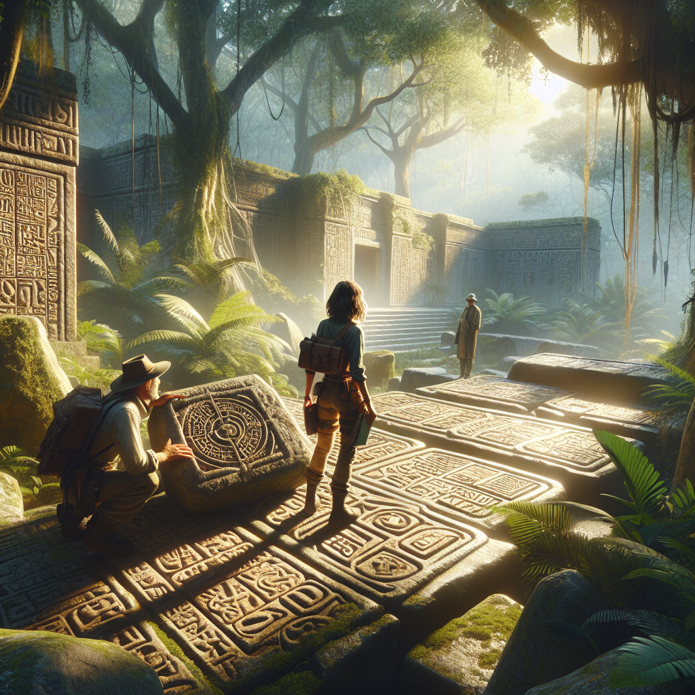

**6. A Trail of Inscriptions**

The rays of the early morning sun struggled to penetrate the thick canopy of the island’s forest, but where they did, they illuminated what appeared to be a tapestry of shadows and light. Sarah stood at the edge of what once could have been an agora, with her gaze drawn to the unusual carvings that adorned the ruins around her. The air, heavy with the fragrance of exotic flora, carried a silence that seemed to weigh upon her as she pondered the inscriptions before her.

"Remarkable, aren't they?" came Dr. Hale's voice from behind, his figure emerging from the underbrush with a notebook in hand. Sarah nodded, her mind still racing to make sense of the symbols that seemed to dance upon the stone.

"They’re unlike any script I've seen," she admitted, running her fingers delicately over the chiseled marks. "They're more than just letters or words; they're like—like a code."

The inscriptions were, indeed, cryptic. Each symbol appeared to be a meticulous amalgamation of geometric shapes, etched into the stone with a precision that implied both intention and knowledge. Sarah traced a sequence of the symbols, feeling the grooves of time-worn stone beneath her fingertips.

Dr. Hale hunched next to her, the brim of his hat casting a shadow over his intrigued gaze. "Notice the repetition of this symbol here," he pointed out, tapping a triangular glyph that recurred throughout the sequence. "It could indicate a form of punctuation, or perhaps a significant concept—a key of sorts."

Sarah’s eyes lit up with understanding. "Yes, and these adjacent shapes may represent sound or phonetic values that are modified by the presence of the key symbol!"

The two scholars exchanged an excited glance, the thrill of unraveling a mystery igniting a fervent energy between them. Their conversation was abruptly interrupted, however, by the sound of footsteps. It was Ana, the linguistics expert, her boots crunching on the scattered foliage.

"Ana, take a look at this," Sarah beckoned. The younger woman approached, her eyes widening at the sight of the inscriptions.

"I've started comparing these to the pictograms we found earlier. There are parallels, but this script is more linear, more advanced," Ana remarked, her voice a whisper of awe.

Together, they worked, sketching and analyzing, hypothesizing and debating. As the hours passed, the trio began to decipher the trail of inscriptions, revealing directions and warnings, histories and stories until a narrative began to form—a guide through the island’s heart.

"The inscriptions mention a path," Ana suggested, her finger following a line of text. "One that leads to the 'Chamber of the Moon'."

Sarah exchanged a knowing look with Dr. Hale. The island was revealing its secrets, one inscription at a time, and the Chamber of the Moon promised to hold answers they were searching for.

The progression through the island was slow as they followed the trail of clues. The inscriptions became a map, guiding them past pitfalls camouflaged by overgrown vines, through archways that framed the blueness of the sky, until they arrived at an ominous looking cave. The entrance was marked by two towering pillars, on which the inscriptions culminated in a warning:

"Those who enter, beware the tide of the moon, for it guards the chamber’s secret."

Puzzled by the meaning, Sarah theorized, "The tides! They must intersect with the moon phases. Perhaps there’s a time sequence to safely entering the chamber."

Dr. Hale nodded, his eyes scrutinizing the surrounding environment. "We should mark the cave's position relative to the sun. We'll need to know when to return here, and when it's safest to explore further."

Ana jotted down notes, her gaze occasionally drifting to the foreboding darkness within the cave’s maw. "This place is old, and its secrets have been kept for centuries. We may be the first in modern history to unveil them," she said, a hint of elation tinging her voice.

As the team retreated to set up camp and wait for the right moment to explore the Chamber of the Moon, Sarah couldn’t shake the eerie feeling that had settled in her gut. It was as if the island itself was watching, waiting to see if they were worthy to uncover its ancient mysteries.

The chapter closed with the fading light and a recognition that the true test of their journey was just beginning. The inscriptions had lead them to this juncture, but it was their courage, intellect, and the unyielding desire for discovery that would carry them through the veil of time into the heart of the island’s past. As Sarah lay in her tent, the inscriptions replaying in her mind’s eye, she knew that they were on the brink of something monumental, something that could indeed change history.

Outside, under the wash of the stars, the inscriptions stood as silent sentinels, guarding the path to truths yet to be uncovered, whispering the island's secrets to those who dared to listen.

### Shadows Among the Ruins
#### Mysterious figures are seen trailing the team, heightening the danger.

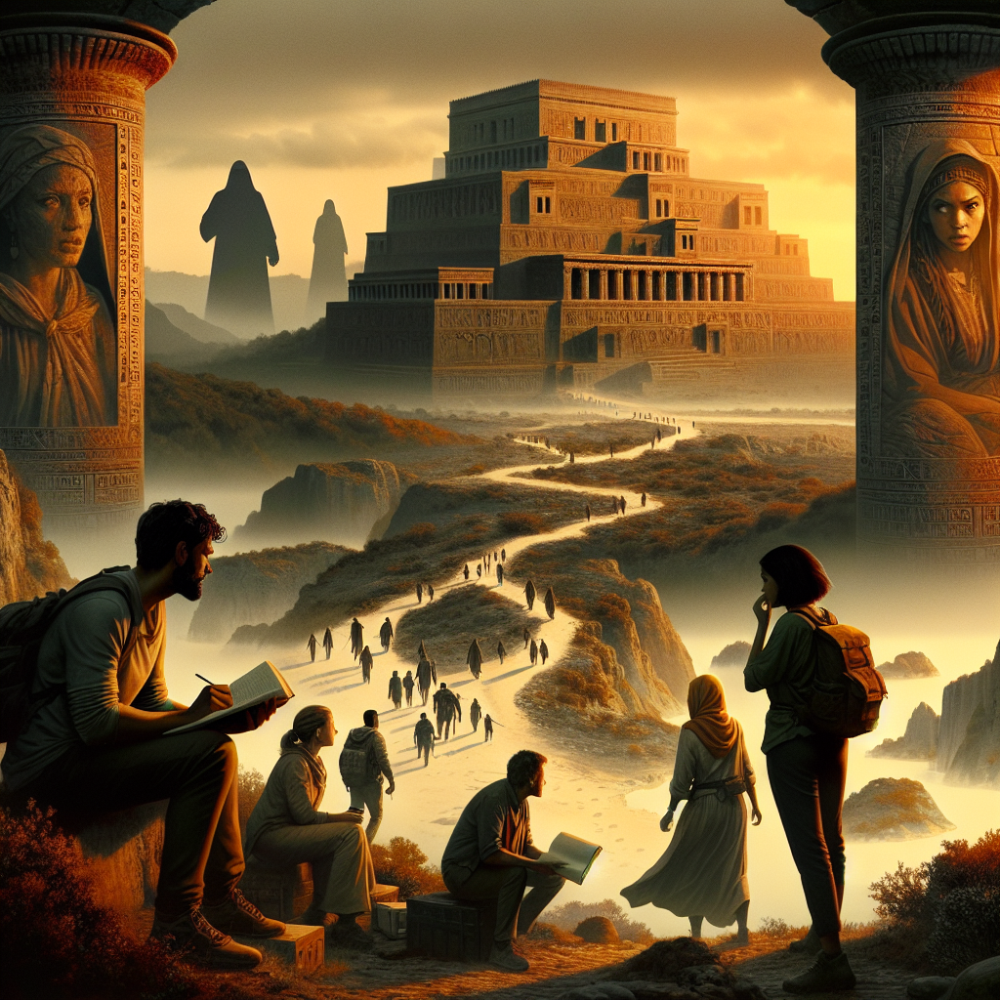

As the orange hue of the breaking dawn kissed the horizon, the ruins of the forgotten island unveiled themselves like the remains of a formidable citadel. Sarah and her team of experts had camped among the remnants of what once was, perhaps, a grand plaza—its stones whispering tales lost to time.

The morning light revealed more than just the opulent past of the island; it betrayed the presence of something—or someone—else. Dr. Taggart, the linguist of the team, first noticed the oddities. “Look here,” he motioned to Sarah and the others, pointing at the footprints that encircled their campsite. “We're not alone.” The crisp outline of boot prints meandered through the dust, weaving an ominous path around the tents.

Sarah's eyes narrowed as she studied the ground. The marks were fresh, most likely from the night just passed. Her thoughts raced back to the map, the inscriptions and now, this new riddle. The unsettling discovery suggested that their expedition was being monitored, and questions swirled in her mind. Were these silent watchers mere shadows or did they pose a tangible threat?

“Seems we're of great interest to someone,” mused James, the head of security, break the tense silence. “Could be locals, but...” his voice trailed off, leaving the thought to fester in the emerging day.

Sarah couldn't afford to let fear deter her mission. “We can't jump to conclusions,” she advised, though her own trepidation gnawed at her. “Still, we must be vigilant. James, double the watch and ensure everyone stays within eyesight.”

The group moved through the ruins with renewed caution, the weight of unseen eyes pressing upon them. They navigated through crumbled columns and overgrown courtyards, guided by the inscriptions which had led them here. It was not long before the thrill of discovery managed to momentarily overshadow the dread of their mysterious followers.

The team came upon a vast stone wall, its surface adorned with the cryptic language that had become the focus of their quest. Dr. Taggart and Sarah approached the wall, tracing the engravings with an academic reverence. The inscriptions told of a civilization that had flourished, traded and eventually, faced an unnamed catastrophe that seemed to have wiped them from the annals of history.

However, the shadows were never far from their minds. Sarah couldn’t help but glance over her shoulder occasionally, expecting to catch a glimpse of their pursuers. Their expertise in stealth was alarming, and a seed of suspicion took root in her mind that they could be dealing with more than mere curious locals.

As the day waned into the gentler light of the afternoon, the team had uncovered little else regarding the identity of their followers. Frustrated, Sarah called for a brief respite within what remained of a grand structure, possibly a temple or palace in its heyday.

The break was a facade for a more pressing discussion; one that needed to happen within the perceived safety of the ancient walls. The team huddled, seeking solutions to their predicament.

“If someone is after the same thing we are, we have to assume they're not going to play fair,” James warned, his voice heavy with implication.

“Then we must reach the heart of the island before they do,” Sarah concluded. “We have the advantage of the map and our interpretation of the inscriptions so far.”

The murmur of agreement was punctuated by the sudden snapping of a twig. Each member of the group went still, turning as one towards the source of the disturbance. From between two monolithic stones, a shadow dislodged itself, forming a figure that stood in stark contrast against the failing light. It was a man, eyes inscrutable, his attire that of a local fisherman.

“Do not be afraid,” he spoke, his voice a strange melody of accents. “I am here to warn you, not to harm.”

The tension did not ease from the group, but curiosity piqued. “Warn us of what?” Sarah challenged, stepping forward to bridge the gap.

“The treasure you seek has guardians,” said the man, a hint of sorrow lacing his words. “And there are those among you who are not what they seem.”

With those cryptic words lingering like a chill across the old stones, the man retreated into the shadows that had birthed him, leaving behind a silent team enveloped by the whispers of betrayal and the lingering sentinel of the ruins around them.

Chapter 7 of "Mystery of the Forgotten Island" would reveal more than just the shrouded past of the island; it uncovered the brewing storm of intrigue and danger that shrouded Sarah's expedition. In a dance as delicate as the art of archaeology itself, they now had to excavate trust from the ruins of suspicion.

### The Chamber of Reflections
#### A hidden chamber provides key insights but also more enigmas.

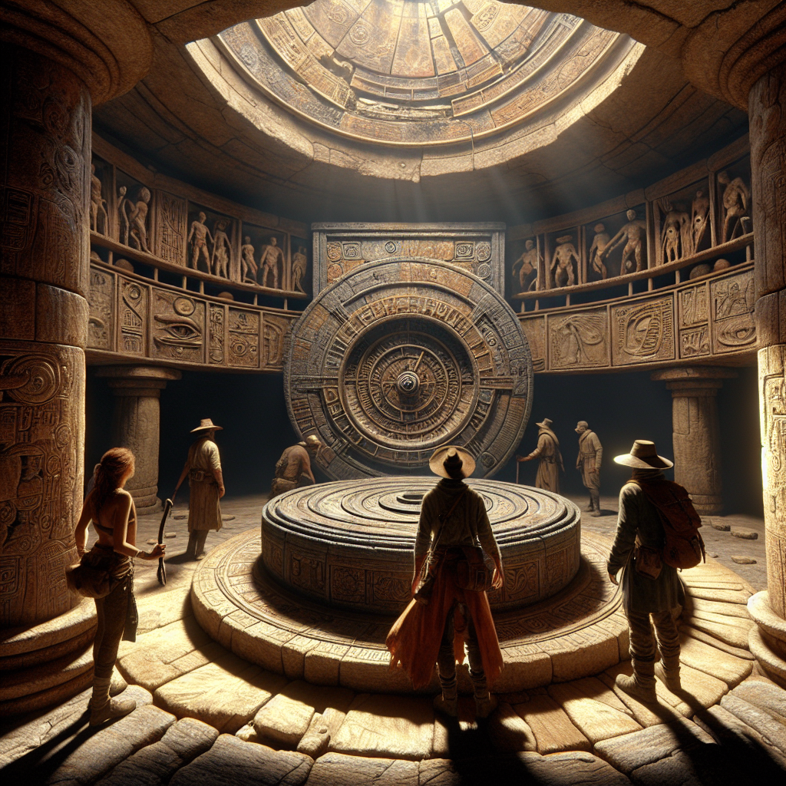

8. The Chamber of Reflections

The soft, eerie echo of their footfalls seemed to converse with the darkness as Sarah and her team descended further into the bowels of the forgotten island. The air was thick with the musk of earth and the weight of centuries. They had followed the trail of inscriptions down what appeared to be a ceremonial path flanked by towering, silent statues with faces eroded by time.

The path came to an abrupt end at a great stone door. Its surface was a canvas of intricate carvings, depicting what Sarah believed to be the island’s mythology - a tapestry of gods and men, of stars and the sea. With a shared sense of anticipation, the team pushed against the ancient barrier, and it gave way with a resonant groan, revealing the chamber beyond.

The Chamber of Reflections, as Sarah would come to name it, was an ancestral library of sorts. It was a medium-sized, circular room, its walls lined with shelves carved directly into the stone. On those shelves rested a multitude of objects: pottery, scrolls preserved in clay jars, and tools of a bygone era. The center of the room was dominated by a large, round table made of the same dark stone as the surrounding walls. Atop the table lay a dust-covered mirror, its surface dulled by age, yet it felt alive with a cryptic purpose.

As their torches and lanterns pierced the gloom, the objects in the room appeared to awaken from their long slumber, the gold and copper accents winking back at the light. Sarah approached the table cautiously, aware that every step she took was a step further into history, into the mind of a civilization that the modern world had forgotten.

She examined the mirror, running her fingers over the cool, smooth surface of the stone frame. Engraved upon it were scripts that matched those found amongst the ruins above. They were speaking of reflection, not just in the literal sense, but in the essence of looking inward, of understanding oneself and one's place in the cosmos. It was a message that transcended time, a plea for wisdom before action.

Sarah's attention then shifted to the scrolls. With the gentle hands of a devotee, she unsealed a clay jar and unfurled a brittle scroll. The writings were in the same cryptic language as the inscriptions outside, but there were diagrams too - star charts and maps of lands unrecognizable to any modern geographer.

“Look at this,” Sarah called to her team members, who gathered around with a mix of excitement and reverence. “These aren't just religious texts or historical records. This society understood celestial navigation. They may have reached further than we ever imagined.”

The team debated whether the island's inhabitants had made contact with other, distant civilizations, perhaps even influencing cultures that historians had always considered to be entirely independent of one another.

Their discussion was cut short when Ethan, Sarah's trusted cartographer, called out from the far end of the room. “There’s something odd here,” he said, indicating a section of the seemingly solid wall. Upon closer inspection, they found a series of stones subtly different in color from the rest. Pressing against them in various combinations, they suddenly heard the click of ancient mechanics springing to life. A portion of the wall slid away, revealing another, smaller chamber.

Inside this secret annex, the air was different. There was a sense of recent disturbance, an intrusion upon the sanctity of the past. And there, in the dimness, lay a fresh set of footprints in the dust, leading to a now-empty pedestal. 

Sarah’s heart sank. They were not alone on the island. The shadows they'd seen amongst the ruins were rivals, and they were always one haunting step ahead.

The annex held other pedestals, and on one lay a single, unassuming piece of parchment. Its surface was blank, save for a single line of text in the center. "The one who seeks the mirror's truth, finds only what is carried within," it read.

Sarah had a realization; the mirror in the main chamber was not just a reflective surface. It was a metaphor, a philosophical lesson that whatever truths they sought, they already carried the answers within themselves. The real treasure was not gold or gems, but wisdom, the understanding of a shared past, and the guide to a better future.

But this wisdom now lay in the hands of others—others who might not respect its true value. As the chamber whispered its secrets of the past, it also foretold a future of more enigmas and, inevitably, confrontation.

Fusing scholarship with the urgency of the chase, Sarah and her team prepared to leave the Chamber of Reflections. With pieces of the past in their minds and the threat of their adversaries in the shadows, they knew their journey was far from over.

(Note: The above content is a creative interpretation based on the provided chapter description, designed to mimic the style of Agatha Christie's "Murder on the Orient Express", while integrating the adventure novel elements from the described novel.)

### In the Lair of History
#### Discovering the heart of the island's civilization, Sarah confronts its unknown history.

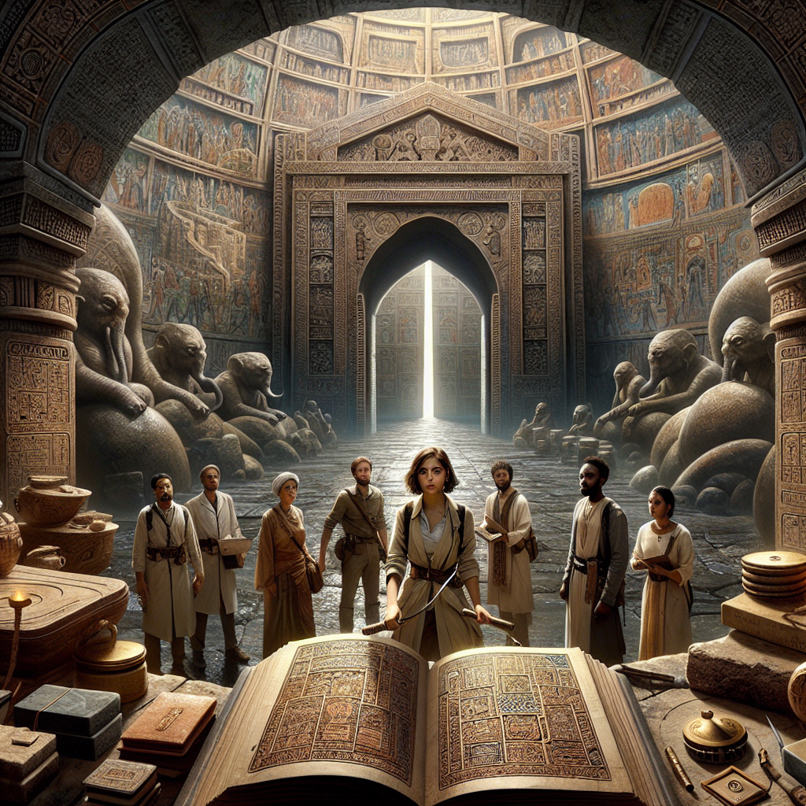

9. In the Lair of History

Sarah stood at the precipice of discovery, her heart racing with the knowledge that she was about to step into a room that had possibly not felt the tread of human feet for millennia. Her lamp cast eerie shadows on the ancient walls as she descended into the bowels of the island. Each step was a descent deeper into the heart of a lost civilization, the air redolent with the mustiness of time and decay.

The path ended abruptly at a large stone door, intricately carved with symbols and patterns that spoke of a complex and sophisticated culture. Sarah’s fingers traced the cold, engraved lines, and she felt a shiver run up her spine. This was it – the pivotal moment of her journey.

She and her team had worked tirelessly to decode the inscriptions they had found earlier in the Chamber of Reflections. It was those very clues that had led them here, to the lair of history itself. This chamber, Sarah speculated, was where the island's secrets would finally unfold.

Dr. Emilio Martinez, the linguist in her team, stepped forward with the translation that would grant them access. "It says, 'In the union of sun and moon, the path shall reveal itself,'" he informed, his voice echoing in the silent antechamber.

Sarah watched as the others set up mirrors, trying to angle the weak sunlight that filtered down from a narrow crevice far above. A beam of light hit the mirrors and bounced around the carvings, ultimately focusing on a crescent shape etched near the door's handle. The door groaned in protest, the sound ancient and forbidding, as it slowly swung open, revealing the chamber within.

The Lair of History was a vast, domed space, its architecture a testament to a grandeur that Sarah had only ever encountered in the pages of dusty books. Frescoes adorned the walls, their colors dimmed by age but their stories vibrant and alive. Murals depicted scenes of a society at the peak of its power – rulers, commoners, gods, and beasts all mingling in a tapestry of life that Sarah had never imagined.

Her eyes were inexorably drawn to a massive stone structure in the center of the room. It was an altar or perhaps a throne, she thought, as she approached it reverently. Atop it rested a book – a tome bound in what appeared to be leather, but upon closer inspection, was material unknown to her.

The book was a historical record of the island’s people, filled with entries in a script that was yet unfamiliar to Sarah’s team. They had discovered artifacts before, but this was different; this was the voice of the civilization itself, speaking out across the ages.

As Sarah flipped carefully through the pages with gloved hands, she realized that this was not just the history of the island—it was a history of mankind, one that had been lost to time and the elements. It spoke of connections to other ancient civilizations, of knowledge shared and lost, of a cataclysm that had wiped the island from memory.

Each turn of the page was a revelation, and it soon became clear that what Sarah had initially sought as a treasure was far more significant. This was knowledge that could rewrite the history books, that could provide invaluable insight into the human past.

Among the texts and illustrations, there were also warnings – dark prophecies of greed and destruction, of a secret so powerful that it had led, perhaps, to the civilization's downfall. Sarah felt the weight of responsibility settle on her shoulders. She was no longer just an archaeologist; she was a guardian of history.

Suddenly, a shadow darted across the chamber’s edge. Sarah looked up, heart pounding. She had been so absorbed in the discovery that she had neglected the possibility that they were not alone. A figure stood at the chamber’s entrance, silhouetted against the dimming light. It was not one of her team members.

"Who's there?" she called out, but the figure did not respond. Instead, it turned and vanished as quickly as it had appeared. The hunt for knowledge was fraught with danger, and Sarah was reminded that they were not the only ones interested in the secrets of the forgotten island.

She closed the book and looked at her team, resolved. They must be cautious and clever. For while they had found the heart of the island's civilization and its unknown history, they were not the only ones who wished to claim it.

"Let's secure the tome," she said firmly. "We have much to learn, but we must also protect what we've uncovered. Our journey is far from over."

As her team nodded in agreement, Sarah felt a mix of elation and fear. The forgotten history of an entire civilization lay at her fingertips, but so did the shadows of those who would do anything to possess it. In the Lair of History, Sarah had found her life's work, her greatest challenge, and perhaps, her most formidable adversary.

[Note: The content of the chapter and the book description provided are works of fiction, designed to emulate a style reminiscent of Agatha Christie's "Murder on the Orient Express" while maintaining an original narrative. The chapter seeks to capture a sense of discovery, tension, and the weight of historical responsibility.]

### The Riddles of the Ancients
#### Ancient puzzles challenge the team, guarding the treasure's secrets.

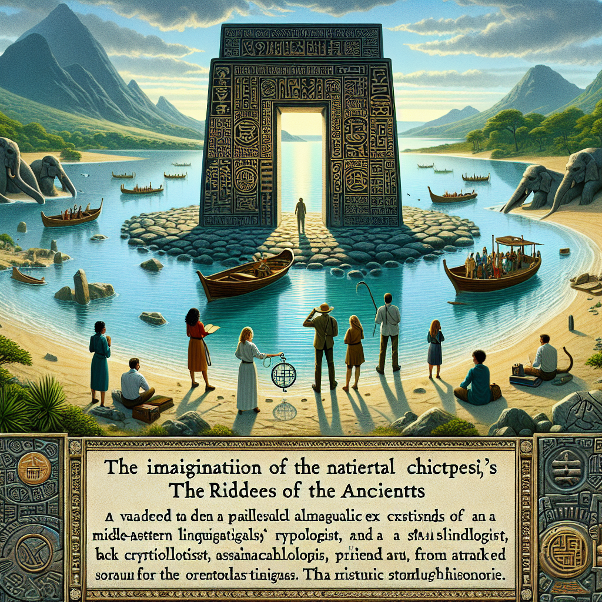
Given the constraints and the descriptions provided, let's craft the content for Chapter 10, "The Riddles of the Ancients," keeping in mind the narrative style exemplified by Agatha Christie in "Murder on the Orient Express," and infusing it with an archeological mystery spin.

Chapter 10: The Riddles of the Ancients

The heart of the island pulsated with the silent whispers of a time long past as Sarah and her companions stood before the colossal stone gateway that barred passage to the inner sanctum. Enigmatic symbols, untouched by the erosive hand of time, sprawled across its surface, their meaning obscured by the fog of antiquity.

"This is it, the very crux of our expedition," Sarah announced, her voice betraying a tremor of excitement. "Behind these walls lies the testament of a forgotten civilization, and perhaps, the treasure that we seek."

Her eyes, luminous with the thrill of discovery, traced the intricate carvings, searching for a kernel of understanding amidst the arcane script. Sarah's fingers danced across the cold stone, lingering on each peculiar symbol as if hoping to coax its secrets from the unyielding rock.

The team huddled around her, a collection of curious minds drawn from diverse corners of academia—each member an expert in their respective field. They stood poised at the threshold of history, ready to pry loose the clasps that had long held shut the doors of knowledge.

Alec, the linguist, adjusted his spectacles, squinting at the glyphs as he shuffled through his notes. "These inscriptions, they share a semblance to Linear A, yet they are unlike any script I've encountered," he mused. "Deciphering them will be akin to untying the Gordian knot."

Beside him, Mia, the cryptologist, rubbed her chin thoughtfully. "Perhaps they're not intended to be read but solved. These ancients loved their puzzles—a test to deem the worthy."

The sun hung low, casting an orange hue that set the stone portal aglow, as if bestowing upon it a blessing or perhaps igniting a warning. The shadows grew long, and with them, the anticipation became a palpable force that gripped each member of the expedition.

"It's a riddle," Sarah concluded with a decisive nod. "Each symbol must correspond to an element or a principle. If we can interpret the pattern, the sequence, we may well unlock this architectural enigma."

For hours they toiled, consulting texts, drawing correlations, and voicing theories. The gateway stood as an implacable sentinel, its silence a daunting challenge to their efforts. Finally, as the azure tapestry of the sky began to don the first shimmering stars of evening, they found the key that turned the lock of ages.

A sequence of seven symbols—fire, water, earth, air, night, day, and life. Sarah stepped forward, pressing her palms against the depiction of life with the solemnity of one who is acutely aware that they stand upon the precipice of the profound.

There was a rumble, deep and resonant, that emanated from the bowels of the earth. The ground quaked as the stone gateway responded to her touch, the massive doors parting with a grating of stone that resonated in the bones of all who stood witness.

As the dust settled, a passageway revealed itself, leading into darkness. The team exchanged glances, each face a mask of elation and trepidation intermingled.

"Bring the torches," Sarah instructed, her voice echoing into the abyss that beckoned them forward. "The answers we seek lie ahead."

With each cautious step into the sanctum's maw, the air grew cooler, and the walls seemed to close in, adorned with further riddles and challenges. Puzzles of logic, of light and shadow, each a sentinel against the unworthy, tested their intellect and resolve.

Every obstacle overcome drew them deeper into the heart of the island, where the air was heavy with the scent of mystery. It was a dance with history itself, a ballet of minds entwined with the arcane musings of a civilization that had deftly hidden its legacy from the ravages of time.

The final chamber loomed before them, grand and silent as a mausoleum. Within its center lay an altar, and upon it, an object enshrouded in cloth. Even before the covering was drawn back, the energy of the room seemed to gravitate towards this singular point.

Sarah's hand trembled as she reached out, pulling back the cloth to reveal a statuette, wrought in gold and encrusted with gemstones that caught the torchlight and splintered it into a kaleidoscope of brilliance. The treasure of the ancients, a testament to their artistry and intellect—a beacon that had called across the ages.

The team erupted in a chorus of cheers and exclamations, the sound reverberating off the stoic walls. Yet, amidst the celebration, Sarah's gaze lingered on the statuette, her mind awash with questions.

Yes, they had found the treasure, but what of the civilization that had created it? What knowledge had they possessed, and what had led to their disappearance? The treasure was merely a piece, a fragment of a larger tapestry that begged to be pieced together.

As the echoed jubilance faded into the corners of the chamber, Sarah quietly vowed to unravel the full history of this island, to honor the legacy of those who had dared to challenge the future with their brilliance.

"Let us remember," Sarah spoke, her words a solemn shroud over the merriment, "that we are but temporary custodians of history. This treasure is not the end of our journey, but the beginning of understanding."

The expedition had unearthed a trove greater than gold—knowledge. Yet, Sarah knew that with such discoveries came responsibility, and the shadows that loomed at the edge of the torchlight whispered of challenges yet to come.

In keeping with Christie's style, the chapter is rich with detail and intrigue, focusing on the cerebral challenges rather than physical action, and ends with a contemplative note that sets the stage for further exploration and possible confrontation.

### Confrontation in the Depths
#### Rival treasure hunters force Sarah to defend her claim and her life.

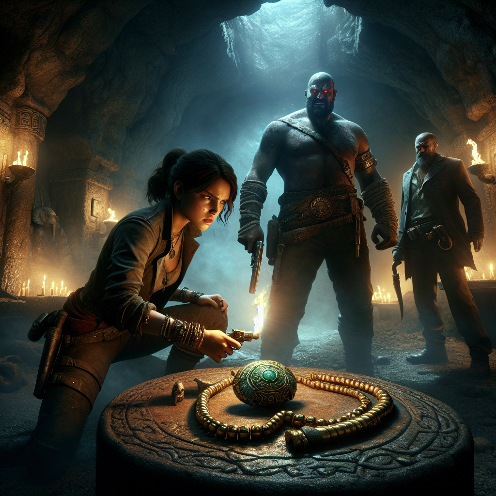

11. Confrontation in the Depths

Sarah's fingers trembled as they traced the grooves of the ancient stonework, her breath a mist in the dank underground cavern. The echoes that had once been solitary confidants were now tainted by the shuffling of boots and the abrasive whispers of her rivals. She had felt the haunting presence of the other treasure hunters for days, shadowy figures slipping in and out of view like ghosts of the island's past, but now they had materialized into a tangible threat.

As Sarah pressed forward, the narrow passage opened into a vast chamber, the centerpiece of which was an elaborate altar, bathed in the flickering light of torches. Upon it was the much-vaunted relic she had risked everything to find—a jade amulet, intricate and pulsating with the weight of eons. Yet as she approached, the hairs on the back of her neck stood to attention. She was not alone.

"Quite the find, Miss Sarah," a voice drawled from the shadows, slick with malice.

Sarah spun to face the source. A man stepped into the torchlight, an amalgam of rugged expeditions and moral bankruptcy. His eyes held a glint of triumph under the rim of his hat. Flanking him were two others, equally callous and unwavering. Garth Huxley, a notorious plunderer of history, had found her.

"Dr. Huxley," Sarah greeted coolly, her eyes narrowing. "Your reputation precedes you."

"Dr. Sarah Henley," he mocked, with a tip of his hat. "The academic who left her ivory tower for a taste of real adventure. A pity it ends here."

"Ends?" Sarah challenged. "You're mistaken if you think I'll simply step aside."

Huxley smirked. "You've done the hard work for us, deciphering the riddles of this forgotten place. But it's time you realized that in this game, only the most ruthless players claim the prize."

Sarah's gaze didn't waver, though she estimated her odds. Outnumbered and outgunned, she had but her intellect and the element of surprise. The chamber offered little in the way of refuge, its secrets unveiled and its purpose served. It was a tomb waiting to be sealed, if not for the exit behind the altar, known only to her through diligent study.

"You can't hope to get off this island with the amulet, Huxley. The island's guardians won't allow it," Sarah lied, injecting certainty into her voice.

A brief flicker of doubt crossed the treasure hunter's face before he snorted dismissively. "Fairy tales to scare children and the feeble-minded. Now, hand it over."

With a calculated breath, Sarah edged towards the altar. She had to stall, to weave a narrative that could buy her time. "You don't understand," she continued. "This amulet... it's a key. There's more to this island than mere trinkets and gold. It's about legacy, history—"

"—Power," Huxley finished, the word slithering out like a serpent. "And power is profit, which is all the legacy I require."

Without warning, he lunged for the artifact, but Sarah was quicker. She seized the amulet and darted for the hidden exit. Shots rang out, chipping stone and ricocheting in the confined space as she disappeared behind the altar.

The passage was narrow, a suffocating route carved by those ancient worshippers to escape persecution. Sarah felt the press of history around her as she navigated the dark, the jade amulet clutched tightly, its cold surface a reminder of the stakes.

She emerged into the twilight of the island's dense jungle, her lungs screaming for air. The pursuit was relentless but muffled by the labyrinth she had traversed. Clutching the amulet, Sarah ran on, haunted by Huxley's parting vow:

"This isn't over, Sarah Henley! That treasure belongs to me!"

Ahead, the jungle was a living maze, its every branch and shadow a potential adversary. Heart pounding, she dared to glance back at the hidden entrance to the chamber, now swallowed by vegetation and dusk. Somewhere within, Huxley and his men were cursing her name. Yet the threat behind was no match for the treacherous path ahead.

Driven by a mixture of fear and exhilaration, Sarah plunged deeper into the island's grip, the weight of the jade amulet around her neck a reminder of the unwritten chapter she had yet to claim. In the game of history, she mused, it was not brute force that prevailed but the cunning and resolve of those who held true to the quest.

The jungle canopy above whispered its ancient secrets, and Sarah Henley, historian and adventurer, listened intently. Her confrontation in the depths was over, but the race for survival had just begun.

(Note: The above text is a work of fiction, inspired by the style of Agatha Christie and your specified novel description. The character dynamics, settings, and plot elements are created to fit within the chapter synopsis provided. If you have further instructions or desire a different direction, please feel free to guide the continuation.)

### The Revelation
#### The true nature of the treasure is revealed, reshaping history.

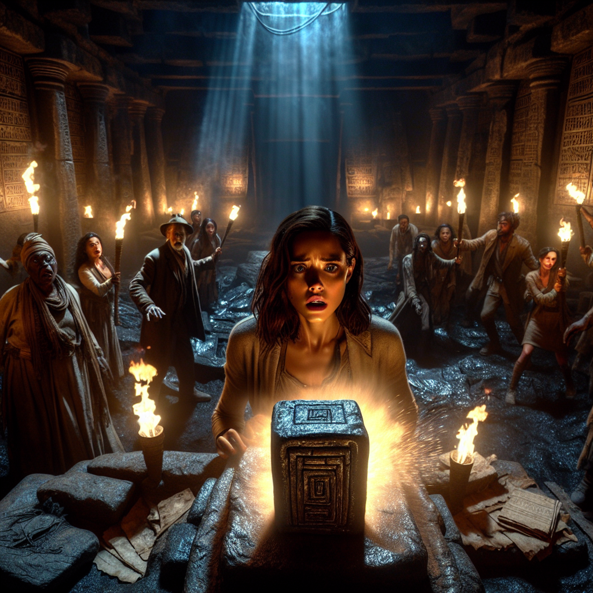

The dim glow from their torches flickered against the ancient walls, casting elongated shadows that danced sinisterly around Sarah and her weary team. They had been through ordeals no scholar should ever have to endure, but the promise of history's reshaping was within their grasp. In the silent awe of the cavernous space, the air was thick with the scent of the past, and each breath felt like inhaling the dust of centuries long gone.

As Sarah's eyes adjusted to the sparse light, the central structure of the chamber became apparent: a monolith not of stone or metal, but of something far more overwhelming. It was an artifact of unimaginable complexity and craftsmanship, surrounded by dried pools of ink and reams of papyrus that crumbled at the slightest touch.

"This," Sarah whispered to herself, "changes everything."

The relic before them, she realized with a historian's intuition, was no mere treasure. It was a printing press - a device impossibly ahead of its known invention, complete with intricate movable types and etched plates of knowledge that predated even the earliest civilizations of Sumer and Egypt.

Her team gathered around as Sarah gently ran her fingers over the cold, metallic surface. Here was proof, cast in iron and copper, that history as they knew it was merely a veil over the true story of humanity's intellectual birth.

"It's not possible," murmured Dr. Matthews, the expedition's linguist. "The implications would..."

"...challenge every textbook, every lecture we've ever given," finished Professor Clark, the ancient technology expert on the team, his voice laced with equal parts excitement and terror.

Sarah could feel the weight of centuries of false assumptions shattering around her. This was not a treasure of gold or jewels, but of lost knowledge, a wellspring of ancient innovation thought to come hundreds of years later. This island, this forgotten cradle of ingenuity, had birthed a revolution in communication, the spread of ideas, and ultimately, the collective memory of the world.

With trembling hands, Sarah picked up a piece of papyrus, somehow preserved from the ravages of time. The inscriptions were unlike any language known to modern scholars, yet there was a familiarity to the characters that teased the edges of her expertise. This was the Rosetta Stone of the island's civilization, a key that could unlock the gateway to understanding an entire lost chapter of human history.

Dr. Matthews leaned in, his eyes scanning the text. "It's a derivative of Proto-Canaanite," he declared, the thrill of discovery rekindling the flame of his erudition. "Every scholar has theorized about the missing links between ancient alphabets, but to hold the evidence in one's hands..."

Sarah could hardly believe the words that were coming forth from her team, a litany of groundbreaking revelations. This press, these writings, could very well be the predecessors of the Phoenician alphabet, from which Greek, and thus all Western alphabets, descended.

In a silence that was heavy with reverence and awe, the team set about documenting their find. Cameras clicked and notebooks were filled with hurried sketches and notes. The chamber, once silent, hummed with an energy of activity as each member of the team worked to preserve the proof of their unprecedented discovery.

But as the initial flush of triumph ebbed away, Sarah's thoughts turned to the gravity of their situation. This was knowledge with the power to redefine humanity's understanding of its own past, but it was also a magnet for those who would use it for less noble purposes. The rival treasure hunters who had harried them to this cavern would undoubtedly return, and with them, the threat of this wisdom falling into the wrong hands.

"We must protect this at all costs," Sarah said, her voice carrying the mantle of responsibility. "This press isn't simply our discovery; it belongs to the world. Its knowledge must be shared."

Nods of agreement rippled through her team, a pact silently formed in the shadows of the chamber. The task ahead was monumental; they would need to secure the artifact, translate its knowledge, and reveal it to the world in a way that would protect its integrity and ensure its survival. 

Sarah turned to face her team, their faces alight with a blend of fear, anticipation, and determination. "We have found what many would consider the impossible. But with this comes a duty that we must uphold. Let us make the necessary preparations for securing our find and making our escape. The journey back will be fraught with challenges, but what awaits us is a legacy that will forever alter the annals of history."

With renewed vigor, Sarah and her team set about their task, mindful of the great responsibility that had been thrust upon them. The treasure of the forgotten island was not of material wealth but of intellectual riches, a revelation that would reshape the understanding of human history for all time.

As they worked through the night, safeguarding the printing press and its accompanying documents, Sarah knew that the true adventure was only just beginning. The world outside the cavern walls remained oblivious to the tidal wave of change that was about to sweep over it.

And in that sacred space, history waited, breathless, for the dawn of its new day.

### The Escape
#### With the treasure and knowledge secured, Sarah must now escape the island's final trap.

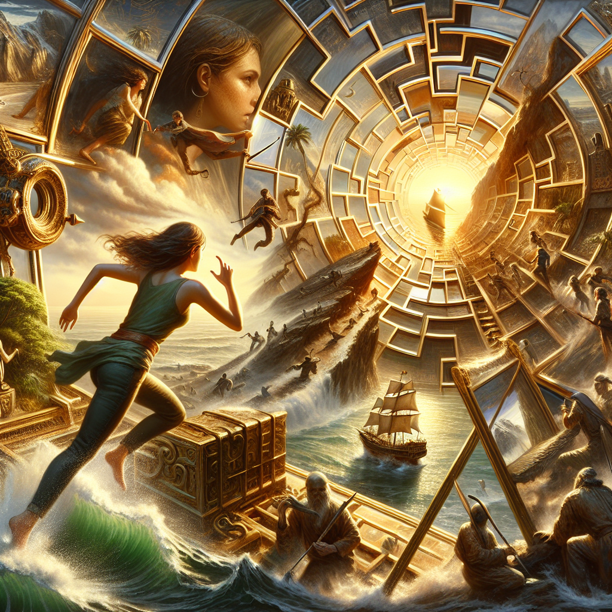

13. The Escape

Sarah's heart raced as the grandeur of the island's final trap unfolded before her. The chamber in which she stood was a labyrinth of precisely aligned mirrors, each reflecting an image of the treasure she clutched tightly to her chest. The artifact, a relic of a bygone civilization, was now hers, but so too was the peril that shadowed its possession.

"Think, Sarah, think," she muttered under her breath. Like the famed Hercule Poirot would have done, she knew that the key to her conundrum lay in the puzzle itself. The ancients had been clever, but they had not accounted for her resolve.

The mirrors were a clever deception, a trick of the eye designed to disorient and trap the unwary. Each step Sarah took reverberated with a soft click on the stone floor, an eerie reminder that the echoes of the past were all around her. If she chose incorrectly, the mirrored maze was certain to become her tomb. She recalled the words etched into the base of the artifact: "The true path lies in the reflection of one's soul."

Sarah closed her eyes and took a deep breath, centering her thoughts amidst the pressing danger. Her mind wandered back through the journey that led her here—the map that had fallen like a portent into her lap, the treacherous voyage, and the challenges she had faced. She had come too far to falter now.

She opened her eyes and peered at the reflections, discerning the subtleties in each. One mirror's reflection stood out, a slight aberration that could not be seen but rather felt—a cool breeze that whispered through the stale air of the chamber.

Sarah approached the mirror and pressed gently against its surface. To her amazement, it gave way, a door camouflaged within the illusion. She stepped through just as she heard the distant sounds of her adversaries bumbling into the chamber she'd just vacated. Their shouts and curses faded as Sarah advanced through the darkened passageway that meandered beyond the mirror.

The passage was rough and unadorned, a stark contrast to the splendor of the traps that protected the treasure. Her hands brushed against the damp walls, the sound of dripping water a stark reminder of the island's indifference to her plight.

Minutes, or perhaps hours, passed as she journeyed through the hidden veins of the island. Sarah's mind did not rest, for she knew the chances of pursuit were high. She reckoned that her exit would not go unnoticed for long, and her rivals were as determined as they were ruthless.

Finally, she emerged into the waning light of day. The dense foliage of the island seemed to reach out to her, but Sarah knew better than to embrace its false comfort. She hastened towards the beach where her ship lay anchored, the artifact’s weight now a comforting presence against her.

Suddenly, a rustling stirred to her left. Sarah froze, her hand reaching for the pistol she had secreted away at her hip. A shadow flitted between the trees—a reminder that she was not alone.

With a silent prayer, she broke into a sprint, her legs pounding the earth with a fervor born of fear and adrenaline. Sarah could hear the crashing footsteps of her pursuer drawing closer. She wove through the trees, her mind calculating the distance to the shore with every desperate stride.

The beach was now in sight, the azure waves lapping gently against the hull of her ship. Her crew, ever-vigilant, had noticed her approach and were preparing to weigh anchor.

A shot rang out, close, too close, and a bullet whizzed past, severing leaves from their branches. There was no time for finesse. Sarah leapt from the tree line, her legs carrying her across the sand. She heard a shout, an imperative voice commanding her to halt, but she did not falter.

The gangplank was lowered, and Sarah clambered aboard, the artifact pressed against her chest. "Go!" she bellowed to the Captain, who needed no further prompting. The sails unfurled, catching the wind as the ship began to move, distancing Sarah from the dangers of the island.

As the island's silhouette diminished on the horizon, Sarah felt a swell of emotions. Relief, triumph, and an inexhaustible thirst for understanding. This treasure, this piece of history, had the power to rewrite the known narrative of ancient civilizations. It was a responsibility she did not take lightly.

Sarah pondered the journey ahead, knowing full well that the shadows of the past would always be close at her heels. But for now, she relished in the escape, in the victory of intellect and courage over the cunning traps of a long-forgotten island.

And as the stars began to pepper the sky, Sarah knew that the true adventure was only just beginning.

In the style of Agatha Christie, the chapter conveys a sense of urgency and intelligence in dealing with the treacherous trap laid out by the ancient civilization, focusing on the protagonist's internal thought processes and clever deduction to navigate her escape. It pays homage to Christie's intricate puzzle-solving plots while maintaining the unique essence of the adventure novel "Mystery of the Forgotten Island."

### Homeward Bound
#### The return journey is fraught with peril as adversaries give chase.

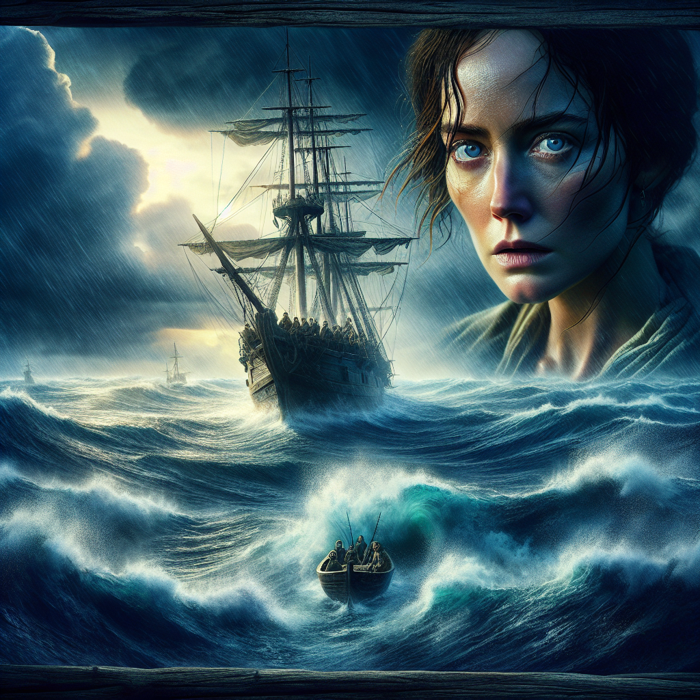

14. Homeward Bound

The vast ocean churned as the ship cut through its waves, a steadfast vessel carrying its crew and one historian, Sarah, away from the enigmatic clutches of the Forgotten Island. The salt-laden air was thick with the tension of a journey not yet complete, for the most perilous stretch lay before them—the path back to civilization, to safety.

Below decks, the dim light did little to comfort Sarah as she scrutinized the ancient treasure they had secured, the weight of its importance heavy on her shoulders. She had seen the unthinkable unraveling on that forsaken land, had faced adversaries whose greed knew no conscience. Now, as the ship bore them eastward, she feared what those same foes might dare in desperation to retrieve what she'd claimed.

Upon the deck, clouds gathered, casting long and ominous shadows. The winds, sensing the climax of the adventure, whispered secrets of their own, remnants from the island that refused to be left behind. Sarah, braving the elements, watched the horizon, her gaze piercing, vigilant. The sapphire sea could be as treacherous as any adversary, a reality she had come to respect.

Faces of the crew were etched with exhaustion, yet their eyes mirrored the steadfast determination that had seen them through the island's gauntlet. Sarah's colleagues, once academics and explorers, were now soldiers in their own right, bound by shared danger and a singular, burning drive to protect the history they had unearthed.

A shout rang out, wrenching Sarah's attention skyward. The lookout reported sails on the horizon, fast approaching—an ominous sign when they should be alone on this stretch of ocean. Captain James, a seasoned sailor with a heart as deep as the abyss, peered through his spyglass, his brow furrowed with concern.

"They're flying no colors," he said, the unspoken foreboding clear in his voice.

Sarah's heart quickened. It could be mere chance, a passing vessel with no ill intent. Yet in her gut, she knew: the rivals that had hounded them on the island had not abandoned their chase. The treasure, with its untold ramifications for history, was too rich a prize to surrender.

"We must prepare," Sarah said, her voice carrying an authority that had been forged by danger.

The crew sprang into action. The sails were drawn tight, the ship leaned into the wind, racing against an enemy hidden behind the natural curtain of the sea. Sarah and her colleagues secured the treasure deep within the ship's bowels, behind false panels and locked doors. They armed themselves, not with swords or guns, but with cunning and the shared knowledge of their hard-won prize.

The chase was on, the gap between the vessels closing as night descended, shrouding both ships in a game of maritime cat and mouse. The moon, a silver sentinel, provided the only light by which to navigate the deadly gambit unfolding.

Hours passed in tense silence, punctuated only by the creaking of the ship and the slap of waves against the hull. Then, in the dead of night, the inevitable confrontation. The shadow of the pursuing ship loomed ever closer, its intentions now crystal clear as it fired a warning shot across their bow.

"We will not go down without a fight," Captain James declared, steadying his crew with a determined gaze.

Sarah stood by his side, her mind whirling with strategy. She considered every historical siege and escape she'd studied, searching for a solution in the annals of the past. Her research, her passion, had always been her weapon, and it would not fail her now.

With a daring maneuver, they baited their pursuers into a narrow strait, known only to Captain James. The enemy, blinded by greed, followed, not realizing the peril until it was too late. Sarah watched and waited as the rival ship was ensnared by the treacherous rocks that guarded the passage, her decision cemented by the unwavering need to preserve what they had found.

As dawn broke, painting the sky with strokes of orange and pink, the enemy ship foundered, the relentless waves and unforgiving stone taking their toll. Sarah's heart harbored no joy at the sight, only relief. The sea had claimed the final skirmish, and the wind now carried them homeward.

Exhaustion settled over the crew as the adrenaline ebbed away, but Sarah remained watchful until the first signs of their home port broke the horizon. Only then did she allow herself to believe that their quest was truly at an end.

With the Forgotten Island now a part of the past they sought to protect, its whispers would resonate through history, its legacy entrusted to those who would remember. The tale of their adventure would be told in hushed tones, a story of courage, intellect, and the unyielding search for truth.

As they docked, the sounds of a world unchanged by their journey greeted them, familiar and foreign all at once. But Sarah, her resolve unbroken, knew this was not the end. It was but a chapter in the greater annals of history, one that she, Sarah, had penned with heart and soul.

### Legacy of the Forgotten Island
#### Sarah reflects on her adventure and the impact of her discoveries on the world.

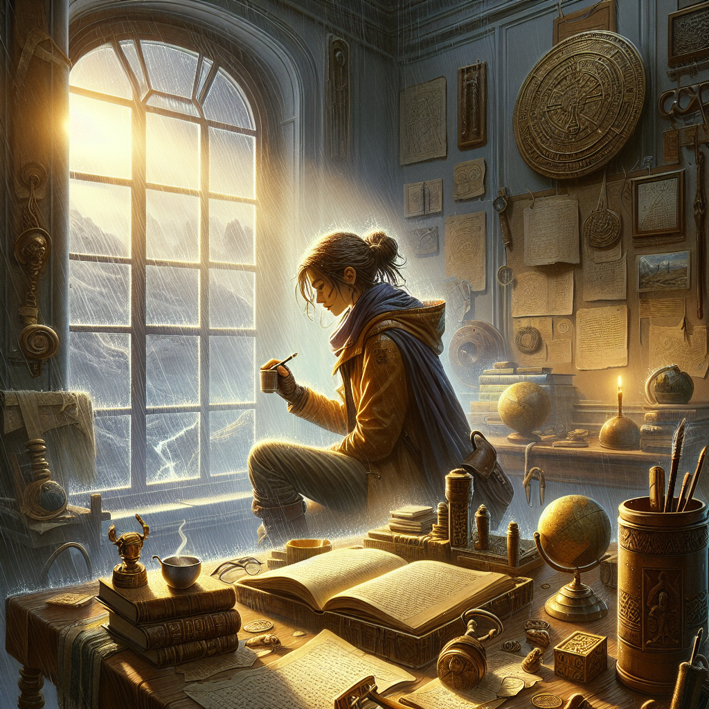
Chapter 15: Legacy of the Forgotten Island

Sarah sat by the window in her study, a cup of tea steaming gently on the desk beside her. She gazed out at the drizzle that softly pattered against the pane, a stark contrast to the tropical torrents she had encountered on the island. Her fingers traced the rim of the teacup idly, but her mind was far from idle. She was caught in a whirlwind of reflection, turning over the events that had so recently passed.

The island had been more than a mere notch on a historian's belt; it had been a testament to the ingenuity of a forgotten civilization, a people who had thrived and ultimately vanished, leaving their mark on the sands of time for Sarah to discover. And she had unraveled their story piece by piece, like a skilled detective peering into the dusty corners of history's grand mansion, uncovering secrets that many had sought but none besides her had found.

As the tea warmed her from within, Sarah contemplated the impact of her discoveries. The artifacts and knowledge she had brought back from that enigmatic isle had sent shockwaves through academic circles. She had presented her findings at conferences, each time to rapt audiences, and the sensation of her journey was only just beginning to settle into the collective consciousness of the world.

The treasure had been real—not in the form of gold or gems, but in the intricate tapestry of a culture long lost to the world. There were advanced tools, astonishingly preserved texts that shed light on their language and thoughts, and artworks that hinted at a worldview both profound and whimsical.

She remembered the Chamber of Reflections and the moment of profound clarity it had given her—the understanding that history was not just about the past but about the future it shapes. The island was a mirror reflecting humanity's own forgotten facets, and by bringing its memories to light, Sarah felt she had given voice to souls that had long been silent.

Her thoughts turned to the confrontation in the depths of the island, a memory edged with danger and adrenaline. Rival hunters, who like the classic villains of a Christie novel, had been more interested in plunder than preservation, had almost succeeded in robbing the world of the treasure's true value. It had been a narrow escape, and now, the quiet of her study seemed a world away from the booby-trapped tunnels and shadowy figures that had pursued her.

The revelation of the treasure's true nature had been just one piece of the puzzle, a chapter in a story whose epilogue was now being written by Sarah herself. She had emerged not just with relics, but with a new narrative, one that challenged long-held assumptions and promised to rewrite sections of human history.

The escape from the island had been her final trial by fire. As she had navigated the treacherous waters with her team, she had felt the weight of history on her shoulders. It was a weight she still carried, though now it was a privilege rather than a peril. With the treasure and knowledge secured, her greatest challenge was to ensure that the legacy of the forgotten island was preserved and understood.

Her adventure had been more than just an exploration; it had been a journey into the human spirit. The island had been a microcosm of the world: full of wonders and dangers, history and mystery. And like the world, it had been teeming with stories waiting to be told.

In this final chapter of her island saga, Sarah reveled in the quiet triumph. She had not just survived; she had thrived. More importantly, she had brought back with her the light of ancient knowledge, a beacon to illuminate the past and guide the future.

Outside her window, the drizzle had eased, and a shaft of sunlight pierced through the clouds, casting a golden glow over the world. Sarah smiled to herself, a mixture of contentment and contemplation painting her features.

The legacy of the forgotten island was secure, and with it, her place in the annals of history. It had been an epic tale of adventure, resilience, and discovery—an adventure that Agatha Christie herself might have relished. The island's secrets no longer whispered in the shadows; they spoke loudly, and Sarah had been their conduit.

She picked up her pen, the one she had reserved for moments of consequence, and began to write. The pages in front of her were blank, eager for the words to come. For Sarah knew there were more stories to tell, more histories to unveil. The forgotten island was but one chapter in the endless book of the past, and as she penned the final words of this chapter, she was already looking forward to the next mystery her historian's heart would pursue.

