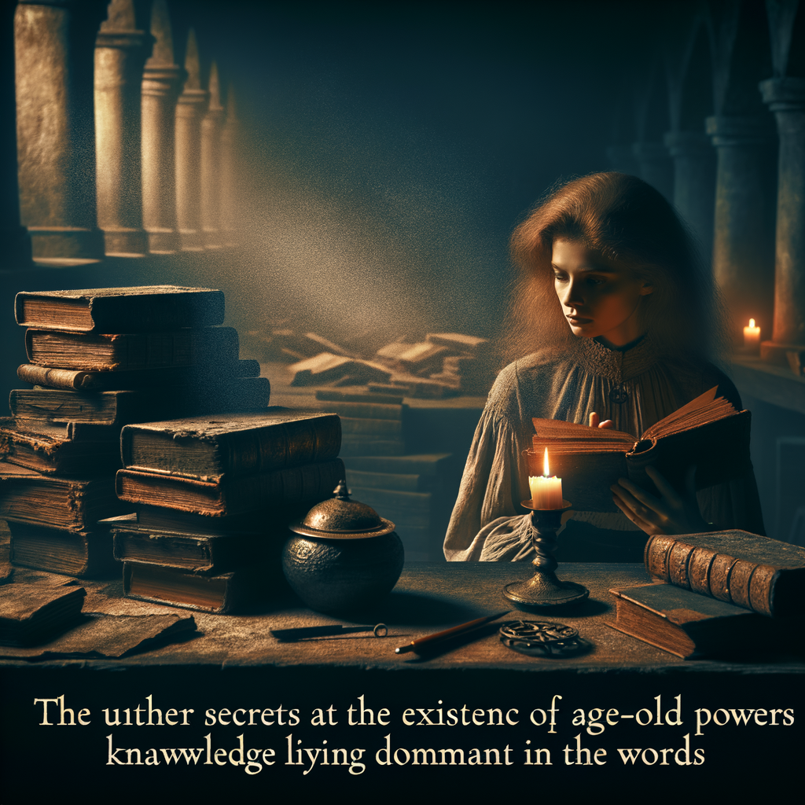

# The Rediscovery of the Ancients

## A Journey Through Forgotten Realms

### Synopsis

In a world where ancient magic has been long forgotten, a young historian named Elara stumbles upon a mysterious artifact that leads her on an epic quest. She must navigate treacherous lands, uncover secrets of the past, and awaken the dormant powers within her to fight a rising darkness that threatens to engulf the known kingdoms. Elara's journey for knowledge turns into a battle for survival, as she discovers her destiny is entwined with the fates of mythical beings and the very essence of magic itself.

#### Based on Frankenstein by Mary Shelly

#### Texts generated by gpt-3.5-turbo, images generated by Dall-E

### The Spark of Curiosity
#### Elara, a young historian with a thirst for knowledge, discovers an enigmatic artifact that hints at the existence of long-forgotten magic.

1. The Spark of Curiosity

In the tranquility of her study, surrounded by the musty scent of ancient tomes and the gentle flicker of candlelight, Elara, a young historian of fervent disposition and insatiable thirst for the hidden knowledge of yore, found herself poring over the brittle pages of a text so old it seemed a mere whisper away from disintegrating into the annals of time. Her delicate fingers traced the faded ink, her mind racing with the excitement of a scholar on the cusp of unearthing truths long buried beneath the dust of ages.

It was amidst these solemn hours of the night, when the world outside her window lay hushed and the stars themselves seemed to hold their breath in anticipation, that Elara stumbled upon a reference so peculiar, it quickened her pulse with an unaccustomed fervor. The passage spoke of a relic, an artifact of such enigmatic power, it was said to be the key to a trove of arcane wisdom, a testament to the existence of magic that had been all but consigned to the realm of fables and children's tales.

The notion of such a discovery set her heart ablaze. Could it be that the world she knew, a world governed by the immutable laws of nature, might conceal within its bosom remnants of a forgotten age where the impossible had been made manifest through the weaving of spells and incantations? The very thought was enough to cast her into a reverie from which she emerged with a resolve as unshakable as the ancient stone of the university walls that had nurtured her intellect.

Compelled by this newfound purpose, Elara embarked upon a journey that led her to the depths of the university's archives. It was there, amongst scrolls and parchments older than the lineage of kings, that her quest bore fruit. Her hand trembled as she unearthed a curious object, ensconced within a coffer wrought of a metal that gleamed like the sun's own gold, yet was cool to the touch as though it drank the warmth from her skin.

The artifact itself was of a peculiar nature, an orb that seemed to pulse with an inner light, its surface etched with symbols that defied comprehension, each line and curve a silent testament to an age when the world had danced to the rhythm of a different drum. With bated breath, Elara held the orb aloft, and as the candlelight played upon its facets, it seemed to come alive, casting prisms upon the walls like a myriad of captive rainbows.

In that moment, it was not merely the orb that was awakened, but something within Elara herself. A spark of curiosity that transcended the mere pursuit of historical fact; a yearning to grasp the ungraspable, to understand the very essence of the magic that this sphere of mysteries represented. She felt it then—a connection to the ancients who had once walked the earth, whose whispers of power and glory seemed to echo through the very chambers of her soul.

Yet, as the clock in the tower above struck the midnight hour, Elara was roused from her contemplation by a sensation of unease. The shadows in her study stretched and twisted in peculiar fashion, as if animated by a will of their own. A chill descended upon the room, and the orb, which had a moment ago exuded a warmth like that of a living creature, now grew cold as the deepest reaches of the sea.

She realized, with a jolt of fear that coursed through her veins, that her discovery was not hers alone to contemplate. Forces, unseen and insidious, had turned their gaze upon her, drawn by the stirrings of ancient magic that she had unwittingly unleashed. The weight of her responsibility bore down upon her, a mantle heavier than any crown, for she knew that her quest was no longer simply a pursuit of knowledge, but a race against the encroaching darkness—a darkness that sought to reclaim the secrets of the past for its own nefarious ends.

With the orb in her possession and the resolve of the brave in her heart, Elara closed the heavy tome and extinguished the candles that had kept her company through her scholarly vigil. Dawn was approaching, the harbinger of a new day, and with it, the beginning of an odyssey that would lead her through the veils of mystery and into the very maw of peril. For in her hands lay the spark that would either illuminate the world or consign it to an oblivion from which there would be no awakening.

Thus, with a spirit enkindled by the flame of curiosity and a mind sharpened by the edge of anticipation, Elara stepped forth into the unknown, where the whispers of the past beckoned her onward, and the quest for the rediscovery of the ancients awaited.

### Whispers of the Past
#### Delving deeper into ancient texts, Elara uncovers clues that lead her to believe in the reality of ancient powers.

2. Whispers of the Past

The gentle glow of candlelight flickered across the vast chamber of the Great Library, casting long, quivering shadows upon the walls lined with ancient tomes. Elara, her countenance alight with the fervor of discovery, sat hunched over a massive, leather-bound volume that whispered secrets of a time long past. The text, written in an archaic script, had resisted the probing eyes of many before her, but Elara's unyielding spirit would not be so easily deterred.

As the hours waned and the night deepened its embrace, she deciphered the cryptic symbols with the aid of forgotten lexicons and the intuition of a scholar's heart. The musty scent of the parchment filled her nostrils, a perfume as intoxicating as the knowledge it held. She marveled at the revelations that unfolded before her, the truths that only the most audacious would dare to contemplate.

It was within these hallowed pages that Elara uncovered the chronicles of the Ancients, a civilization whose mastery of the ethereal arts had once woven the very fabric of reality. Theirs was a society where magic was not merely a tool but an extension of one's being, a force as natural as breath and as potent as the fiercest storm.

The more she read, the more the scholar could feel the dormant knowledge within her stir, as if the words were not only to be understood by the mind but also felt within the soul. It seemed that the Ancients had harnessed powers beyond comprehension, bending the elements, communing with creatures of air and earth, and even touching the minds of others with a mere glance. They had lived in harmony with the arcane, and the world had flourished under their care.

Yet, as Elara turned each page with hands trembling from both excitement and exhaustion, a tale of tragedy began to reveal itself. It spoke of a cataclysm, a fracture in the tapestry of magic that had led to the downfall of the Ancients. Their powers had become unstable, turning upon them with a ferocity that had rent the skies and shattered the earth. In their hubris, they had overreached, and the very essence of magic had recoiled, withdrawing from the world, leaving it barren and bereft.

A heavy sigh escaped Elara's lips as she pondered the weight of such hubris. The once-great civilization had fallen into the annals of myth, their existence all but erased, as if the world wished to forget its brush with annihilation. Yet, here she was, a lone historian, unearthing their legacy, daring to touch the forbidden knowledge that had led to their undoing.

As dawn approached, painting the horizon with hues of gold and crimson, Elara's eyes fell upon a passage that caused her heart to race with newfound purpose. It was a prophecy, vague and enigmatic, yet it spoke of a time when the Ancients' magic would stir once more. A harbinger would arise, borne of the old blood, to bridge the chasm between the arcane and the mundane, and restore harmony to a fractured world.

Could it be, Elara wondered, that the artifact she had discovered was the key to this ancient prophecy? The relic, with its intricate carvings and dormant power, had led her to these very texts. It was as if fate itself had woven her into the tapestry of this quest, guiding her to unlock the mysteries that had been lost to the sands of time.

In that moment, the whispers of the past grew louder, urging her forward. Elara knew that her journey was only just beginning. With the rising sun as her witness, she vowed to delve deeper into the secrets of the Ancients. She would traverse the forgotten realms, awaken the dormant powers within her, and, if destiny willed it, become the harbinger who would restore the lost harmony.

The flame of the last candle flickered and died, leaving Elara in the soft embrace of the morning light. She closed the ancient tome with a sense of reverence and rose from her seat, the echoes of a bygone era reverberating within her. The whispers of the past had spoken, and she was ready to heed their call.

### Across the Shrouded Moors
#### Elara's quest takes her through dangerous, mist-covered moors where hidden dangers lurk, and the lost secrets of magic begin to surface.

3. Across the Shrouded Moors

The mist hung heavy over the moors like a shroud, concealing the treacherous bogs and the silent, creeping creatures that called this desolate place home. Elara wrapped her cloak tighter around her shoulders, the chill of the damp air seeping into her bones. The land was a tapestry of rolling hills and hollows, all draped in the ghostly fog that blurred the line between earth and sky.

As she ventured further, the firm path beneath her feet gave way to uncertain, spongy ground. With each step, Elara's heart quickened, for the moors were a place of legends, of whispered stories that spoke of wanderers led astray by will-o'-the-wisps, never to return. She could not shake the feeling of unseen eyes watching her every move, of whispers carried on the wind, eluding her grasp just as the words began to form in her mind.

It was here, amidst the sighing reeds and the hidden quagmires, that the forgotten secrets of magic were said to lie buried, waiting for the one with the courage to unearth them. Elara had always possessed an insatiable hunger for knowledge, a desire to peel back the layers of the past and gaze upon the truths concealed beneath. Now, the very air she breathed seemed thick with the weight of undiscovered mysteries.

The day waned, and the light that filtered through the mist grew ever fainter. Elara's progress was slow, measured; she could not afford the folly of a misstep. The silence of the moors was a thing alive, broken only by the occasional cry of a distant bird, or the rustle of the heather when the wind deigned to speak.

As twilight approached, Elara stumbled upon a circle of ancient stones, half-buried and covered in lichen. They were arranged with a purpose lost to time, their weathered surfaces etched with symbols that teased the edge of recognition. Her fingers traced the grooves, and a shiver ran down her spine—not from the cold, but from the touch of something ancient stirring within her soul.

She withdrew the artifact from her satchel, the one that had set her upon this perilous path. The relic seemed to hum with an energy that grew more insistent in the presence of the stone circle. Elara held it aloft, and the symbols upon the stones ignited with a faint, ethereal glow. The air crackled with potential, and the mist swirled as if alive, coalescing into ephemeral visions of a time when magic was as real as the stone beneath her feet.

In that moment, Elara understood that the moors were not just a place of danger, but also of profound power. The lost arts whispered to her, tendrils of ancient wisdom seeking the warmth of a living soul. She felt a pull, a calling to reach beyond the veil of time and reclaim the forgotten lore that hungered for a voice in the world once more.

The visions grew more vivid, and Elara saw the moors as they once were: a place of gathering, where the veil between the realms was thin, and beings of light and shadow walked in harmony. The echoes of their voices mingled with the wind, lamenting the loss of their kinship with mankind. A sense of urgency gripped Elara; she was the bridge, the restorer of the broken chain that bound the world of the living to the echoes of the past.

But as the night deepened, so too did the sense of foreboding. The dark force that sought to quench the nascent flame of magic became aware of her presence. Elara felt it as a coldness that seeped into her marrow, a darkness that sought to snuff out the light of her discovery. She knew she must be swift, for the power that stirred within the moors was a beacon that could draw friend and foe alike.

With the relic still clasped in her hand, Elara whispered an oath—a promise to the ancients, to the guardians of the forgotten realms. She would carry their legacy, she would face the encroaching darkness, and she would not falter. Her voice, though soft, carried the strength of conviction, and the mist parted before her, revealing a path that glowed with a pale luminescence.

As she walked the path that unfolded at her feet, Elara felt the weight of the ages upon her shoulders. Yet she was not bowed by it; instead, she was buoyed by the knowledge that her quest was righteous, and that the very fabric of the world depended on the courage of her heart.

The moors receded behind her, the mist closing in once more, as if to shield her passage from prying eyes. Elara stepped forward with newfound resolve, for she was the vessel of the ancients, and her journey had only just begun.

### The Awakening
#### In the ruins of an old citadel, Elara faces a pivotal moment where she unlocks dormant magical abilities within herself.

4. The Awakening

The day had waned into a somber twilight by the time Elara reached the crest of the hill, where the ruins of the ancient citadel lay scattered like the bones of a forgotten colossus. The desolate remnants bore witness to the glory that had once graced these lands, now reduced to mere whispers in the annals of the world. A chilling wind danced through the fractured arches and overthrown columns, as if the spirits of yore were lamenting their forsaken abode.

Elara's heart was a tumultuous sea, waves of anticipation crashing against the shores of trepidation. The enigmatic artifact she had discovered—its surface etched with runes that pulsed with a light as if mimicking the rhythm of a living heart—was the lodestar that had guided her to this forsaken place. Her fingers traced the contours of the relic, and a shiver ran through her, not from the cold, but from the silent call she felt emanating from the stone.

The citadel's shadow enveloped her as she stepped through what once must have been a grand gateway, now but a gaping maw leading into darkness. The very air seemed to thicken with the dust of ages and the echoes of a power that had laid dormant, awaiting the spark that would rouse it from slumber.

In the heart of the ruins, there stood an altar, untouched by the cruel hands of time and decay that had claimed the rest. Upon it rested a pedestal, carved with the same cryptic runes as her artifact. A silent understanding washed over Elara, and with reverent hands, she placed the artifact upon the pedestal.

No sooner had the artifact touched the ancient stone than a brilliant light burst forth, enveloping Elara in its embrace. The runes glowed with a fierce intensity, and the air thrummed with the awakening of a force that had not stirred in millennia.

Elara felt a searing pain that rent her mind, as if her very soul were aflame. She would have cried out, but the light was a shroud that muffled her voice, isolating her within its blinding cocoon. And then, in the crucible of that agony, a transformation began. Whispers—no, voices—flooded her consciousness, speaking in tongues long forgotten, yet somehow known to her. They spoke of the essence of the universe, of the weave of magic that bound all creation together.

The pain receded, leaving in its wake a wellspring of power that coursed through her veins. Elara's eyes, once the color of the forest's depth, now shimmered with the luminescence of the stars themselves. She felt the pulse of the earth beneath her feet, heard the song of the wind, and understood the language of the fire that flickered in the ruins.

The voices coalesced into a singular presence, a spirit of the citadel, who had watched over the slumbering magic. "Elara," it spoke, its voice a melody that resonated within her very being, "you are the Awakened. The binds that have held our world in blindness have been fractured by your hand. The magic of the ancients flows through you now, a gift and a burden that you must bear."

Elara stood, her form no longer that of a mere seeker of history, but a vessel of a legacy reborn. The weight of her destiny pressed upon her shoulders, a mantle she was yet unsure how to wield. "Why me?" she whispered, her voice steady though her spirit quailed.

"The artifact chose you, as it was destined to from the moment of your birth," the spirit replied. "You have a purity of heart and a strength of will that this world sorely needs. Darkness stirs, and it seeks to quench the light of knowledge and wonder. You must become the bulwark against this tide."

The light dimmed, and the spirit's presence faded, leaving Elara alone amidst the silent stones. The night had deepened, and stars peered down upon the citadel, their twinkling gaze a watchful sentinel. Elara felt their light within her, a beacon to guide her on the journey ahead.

With newfound resolve, she stepped from the ruins, the artifact now a part of her, its glow a subtle warmth against her skin. Magic had awakened in the world once more, and with it, the echoes of a past both wondrous and terrible. Elara's quest for knowledge had become a quest for survival—for herself, for the mythical beings that lurked in the shadows, and for the very essence of magic that now bound her fate to the future of the known kingdoms.

The Awakening had begun.

### Shadows Stirring
#### As Elara grows in her power, a dark force becomes aware of her presence, marking her as a threat to its own sinister plans.

5. Shadows Stirring

In the hours where the moon held dominion over the sky, the young Elara, whose pursuit of knowledge had awoken the dormant embers of ancient magic, found her spirit restless and her mind troubled. Her newfound abilities, burgeoning within her like the first bloom of spring, had not gone unnoticed.

As she lay in her modest chamber, the walls adorned with the relics of her scholarly life, the silence was thick, and it seemed to press upon her with the weight of an unseen gaze. It was a sensation that crept upon her subtly at first—a whisper of unease that might be dismissed as the fancy of an overwrought mind. But as the nights grew longer and the shadows deepened, so too did the certainty that something malevolent was stirring in the darkness beyond her window.

Elara rose from her bed, her thoughts a tangled skein of apprehension and resolve. She approached the pane, her breath misting the glass, and peered into the inky void. The lands around her abode were quiet, too quiet, as though the very earth held its breath in anticipation of some grave event. She could not discern the shape of the malevolence that lurked beyond her sight, yet she felt its presence as surely as one feels the chill of winter's approach.

She clung to the artifact she had unearthed—a talisman of old, its surface etched with runes that seemed to dance and shift beneath her gaze. It had been her key to unlocking the arcane forces that slumbered within her soul, and now it seemed, it had also drawn the attention of some dark force that coveted the power it represented.

It was a being of shadows and whispers, a sentinel of the dark epoch that had preceded the age of man, and it sought to quench the light that Elara had kindled. The darkness was a cunning adversary, it moved with stealth and purpose, and it had marked her as an obstacle to its sinister machinations. It would not be long before it sought to extinguish the threat she posed.

Elara retreated from the window, her mind racing as she considered the magnitude of the peril she faced. She understood now that her quest for knowledge had consequences far beyond her own yearnings. The world itself hung in the balance, and she, a mere scholar with a heart full of curiosity, was to play a crucial role in the unfolding drama.

In the days that followed, Elara poured over her tomes and scrolls with a fervor that bordered on the obsessive. She sought out the hidden wisdom of the ancients, the secrets of the mystical arts that might fortify her against the encroaching darkness. Her days were consumed by study and her nights by vigilant watchfulness.

She practiced her craft with a singular focus, each incantation uttered, each gesture made with the precision of one who knows that the slightest error could spell disaster. She could feel her powers growing, the energies of the earth and air responding to her will, and with each passing day, she became more attuned to the pulse of magic that flowed through the world.

But as her strength grew, so too did the malevolence of the dark force that sought to thwart her. It was an entity that thrived in the absence of light, its essence woven from the fabric of nightmares and despair. It whispered to her in dreams, its voice a serpentine hiss that promised ruin and sorrow. It was a harbinger of chaos, a specter of the ancient world that had once been banished but now sought to return.

Elara could not face this foe alone. She knew that the path ahead would be fraught with danger and that she would need allies if she were to prevail. The mythical beings of legend, the creatures that walked the boundary between fable and fact, they too had felt the disturbance in the balance of the world. It was to them she must turn, for in their fate was intertwined with her own.

Thus, with a resolve born of necessity and a courage that belied her youthful appearance, Elara set forth from the safety of her abode. She ventured into the unknown, her heart alight with the fire of purpose. The darkness would come for her, of that she had no doubt, but she would not falter. She would meet it with the full measure of her power and the unwavering conviction that the light must always prevail over the shadows.

And so, dear reader, our heroine's journey continued, a solitary figure against the backdrop of an ever-darkening sky. The threads of her destiny were weaving a tapestry of epic proportions, and in its pattern, the fate of the world was held.

### Alliance of the Mythical
#### Elara encounters mythical beings whose fate is tied to the resurgence of magic and who offer their alliance in her quest.

6. Alliance of the Mythical

In the wake of her newfound abilities, Elara, the diligent pursuer of knowledge, found herself traversing a realm of wondrous marvels and unspeakable dangers. The very fabric of the world seemed to quiver at her touch, as if the dormant magic within her resonated with the latent energies of the earth. It was in the heart of an ancient forest, where the trees whispered secrets of bygone eras, that she chanced upon the Alliance of the Mythical.

As she wandered deeper into the woodland's embrace, the air grew thick with the scent of moss and the unseen life that thrived beneath the canopy. The forest seemed to breathe, its exhalations stirring the leaves in a hushed symphony. It was there, amid the chorus of nature, that they revealed themselves to her: the guardians of the old lore, the mythical beings of legend.

First to emerge from the dappled shadows was a being of such grace and beauty that Elara's breath hitched in her throat. She was an elf, her skin aglow with an ethereal light, her eyes the clear blue of the sky after the fiercest of storms had passed. Her name was Lysanthir, and she spoke with a voice that rustled like the wind through autumn leaves.

"We have watched you, Elara of the mortal kin," Lysanthir said, her gaze piercing through the veils of Elara's soul. "Your heart beats with the cadence of the ancients, and it is time to heed the call of your destiny."

From the burrows and hollows, from the hidden glens and secret springs, others came forth. A centaur of towering stature and noble mien, his hooves striking the earth with the authority of one who had seen the rise and fall of empires. His name was Therius, and his eyes held the wisdom of centuries.

A nymph, delicate and fair, emerged from the embrace of a weeping willow, her hair a cascade of green that shimmered with the life force of the forest itself. Her name was Calyndra, and she gifted Elara with a smile that warmed her to the core.

Lastly, from the shadows of the most ancient oak, stepped forth a creature of tales and children's nightmares—a dragon. Its scales shimmered like jewels, and its eyes glowed with the fires of a world that had once been. This dragon, whose name was Aetheron, lowered its massive head in reverence to the young historian.

"We, the last of the Mythical, have awaited the resurgence of the Arcane Pulse," Aetheron's voice rumbled, shaking the leaves from their branches. "Your awakening has signified the dawn of the age we have longed for."

Elara stood, her heart racing with a mixture of fear and exhilaration. "Why have you sought me out? What is it that you expect of me?"

Therius stepped forward, his voice a deep echo of the earth's own rumblings. "The darkness that stirs in the east is anathema to all that lives. It seeks to quench the light of magic and enslave the realms of this world. Alone, we are but remnants of a forgotten time, but together, with your power to unite, we can restore the harmony that once was."

Lysanthir approached Elara and extended her hand. As their fingers touched, a surge of understanding flowed between them. Elara saw visions of ancient battles, of the Mythical standing shoulder to shoulder with humans, elves, centaurs, and dragons fighting as one. She saw the unity that magic had once brought and the devastation its absence had wrought.

Calyndra's voice was like the babbling of brooks as she spoke. "In your hands lies the thread that will weave our fates together. Accept this alliance, and we shall lend you our strength, our wisdom, our very essence."

Aetheron's eyes softened, and a warmth radiated from his immense form. "But know this, Elara: the path you tread is laden with perils, and the choices you make shall echo through the ages. Are you prepared to bear the mantle of our combined hopes?"

Elara felt the weight of their words settle upon her shoulders, a burden that was hers to carry willingly. She nodded, a sense of purpose igniting within her like a beacon in the night.

"I accept," she said, her voice steady, despite the fluttering of her heart. "I accept your alliance, and together, we shall face the darkness that seeks to claim our world."

And so it was, in the heart of the forest that thrummed with ancient power, that the Alliance of the Mythical was forged. With the mythical beings by her side, Elara's journey was no longer a solitary quest. It was a crusade for the very soul of the world, a battle to rekindle the light of magic that had once united them all.

The alliance set forth from the forest, their resolve as unyielding as the mountains that pierced the heavens. The path ahead was fraught with shadows and despair, but within their hearts burned the unquenchable flame of hope. For in unity, there was strength, and in Elara, there was the promise of a future where magic would once again flourish.

### The Labyrinth of Echoes
#### Our heroine navigates a labyrinth filled with illusions and echoes of the past, where she confronts her deepest fears and desires.

7. The Labyrinth of Echoes

As I transcribe the events that unfolded within the serpentine confines of that Labyrinth of Echoes, my hand trembles with the vivid recollection of the fears and desires that assailed my spirit. The path before me was as much an enigma as the ancient texts that had guided my relentless pursuit. I, Elara, a humble seeker of the forgotten lore, now stood at the threshold of a realm where reality and illusion danced in a perilous embrace.

The labyrinth itself was a marvel of antiquity, its walls adorned with intricate carvings that seemed to pulse with a life of their own. The air was thick with the whispers of the past, each murmur a specter of a memory long buried in the sands of time. The ground beneath my feet was a tapestry of stones, each one a silent witness to the epochs that had swept over them like the tides of the sea.

With each step I took, the echoes of my own footsteps seemed to multiply, giving rise to a chorus of phantom strides that matched my own. The labyrinth was alive, and it spoke in a language of echoes, a tongue that resonated with the very core of my being. I could feel the magic thrumming through the stone, a subtle vibration that teased the newfound power that slumbered within me.

It was here, amid the labyrinthine pathways, that my past came to haunt me. The phantasmagoria of light and shadow gave form to figures that I had long buried in my heart. My beloved parents, whose untimely demise had been the catalyst for my scholarly pursuits, appeared before me, their visages wrought from the very mist that hung in the air. They spoke not a word, but their eyes conveyed a sorrow that pierced my soul. I reached out, hands trembling, only to grasp at the empty air as they dissolved into the aether.

With a heart heavy with grief, I pressed on, the illusions growing ever more vivid with each tortuous twist and turn. The labyrinth seemed to know my innermost thoughts, my deepest desires. A banquet was laid out before me, a feast of scholarly achievements and accolades that I had once yearned for. My name was echoed in the reverent tones of my peers, yet as I approached, the scene crumbled to dust, a stark reminder that my quest for knowledge had led me down a path far removed from such vanities.

It was then that I encountered my greatest trial. A mirror stood, solitary, in the midst of the path, its surface a pool of still water that beckoned me to gaze upon it. In its reflection, I beheld myself, not as I was but as I might have been. Power radiated from my figure, a power unbridled and untamed. I watched as the mirrored Elara wielded magic with a recklessness that set the very air ablaze. The temptation to embrace this potential, to let it consume me, was nigh irresistible.

Yet, amidst the cacophony of echoes, a voice of clarity spoke to my heart. It was the voice of the artifact that had set me upon this path, a gentle thrum that resonated with truth. I was not destined to be a tyrant of arcane forces, but a guardian of the balance that wove together the fabric of our world.

With newfound resolve, I turned away from the seductive reflection and strode forward. The labyrinth seemed to sigh around me, its walls acknowledging the strength of my conviction. The phantoms of my past and the illusions of what might have been faded into the mist, leaving only the path ahead.

It was not long thereafter that I emerged from the Labyrinth of Echoes, my spirit both wearied and emboldened. The sun greeted me with its radiant embrace, a stark contrast to the shadows I had left behind. I knew then that the trials I had faced within that mystic maze were but a prelude to the greater challenges that lay ahead.

For I had confronted the echoes of my soul, and in doing so, I had emerged with a clearer vision of the purpose that destiny had woven for me. The battle against the encroaching darkness was still to come, and I, Elara, would meet it with the full might of the ancient magic that now thrummed in my veins.

### The Siege of Nightfall
#### Elara and her allies prepare for battle as the dark force launches an assault on the kingdoms, seeking to extinguish the newfound light of magic.

8. The Siege of Nightfall

The ethereal gloaming had settled upon the land with an ominous stillness, as if the very air held its breath in anticipation of the coming tempest. The melancholy twilight had always been a harbinger of mystery and enchantment, but now it seemed to cloak a more insidious intent. Elara stood upon the ramparts of the ancient fortress, her countenance illuminated by the nascent glow of her own burgeoning power. The artifact, once a mere curiosity in her scholarly pursuit, now pulsed with the very lifeblood of the forgotten realms—a beacon against the encroaching darkness.

The forces of night had marshaled their ranks, a horde of shadows and spectres that sought to quench the light of the world and return it to an age of unyielding obscurity. Elara's heart was a tumult of emotions, a mixture of fear and resolve, but above all, a fierce determination to stand for what she had unearthed. The magic that had long slumbered within the earth and the hearts of the mythical beings now found its echo in her soul.

Beside her, allies of legend stood ready. Creatures of lore and fable, whose existence had been consigned to the whispers of bedtime tales, now revealed in the stark reality of necessity. Elves with their keen eyes and swift bows, dwarves wielding hammers that could shape the bones of the earth, and even the elusive nymphs, whose songs could stir the wind and water to their defense. Together, they waited for the siege that would determine the fate of their world.

The enemy was a miasma of despair, a legion conjured by a force that wielded the void as its weapon. Their master, a being of unfathomable malice, sought to extinguish the resurgence of magic that Elara had inadvertently sparked. The great bell of the citadel tolled, its sonorous chime a solemn prelude to the battle.

As the darkness surged forward like a tangible tide, Elara raised her hands, the arcane energy swirling around her in a luminous dance. She chanted the incantations that had once been but dead letters on a page, now alive with power and purpose. The air crackled and hummed with the force of her will; a barrier of light erupted forth, encircling the fortress in a protective embrace.

The first wave of shadows crashed against the barrier, their hisses and howls a cacophony of malice that clawed at the minds of the defenders. But Elara's magic held fast, her spirit unyielding. She felt the presence of her companions lending their strength to hers—a confluence of hope against the darkness.

The dwarves hurled their mighty weapons, crafted in the forges of yore, each blow a testament to their ancient skill. Elves let loose their arrows, each shaft finding its mark with deadly precision. The nymphs' voices rose in a haunting melody that stirred the very elements, a tempest unleashed upon the foe.

Yet the night was relentless, and for every shadow felled, another seemed to rise. Elara could sense the strain on her powers, the barrier flickering like a flame in a gale. It was then that she understood the true nature of the artifact she bore. It was not merely a vessel of power, but a key—a key to the unity of all who fought beside her.

She called out to her allies, her voice a clarion call that pierced the cacophony of battle. "Join your strength with mine, for together we are the daybreak that will banish this eternal night!" Her plea was met with a surge of might from the united hearts of all who stood with her. Their energies intertwined, a tapestry of courage woven in the face of annihilation.

A brilliant aurora of magic erupted, its radiance outshining the stars themselves. The darkness recoiled, its essence vaporized by the pure intensity of the combined will of the forces of light. The siege was broken, but Elara knew that the war was far from over. This victory was but the first glimmer of dawn, and the true battle—the confrontation with the heart of the darkness—loomed on the horizon.

As the remnants of the enemy scattered like ash upon the wind, the defenders of the citadel allowed themselves a moment of respite. Elara's eyes, once filled with scholarly curiosity, now gleamed with the fire of a warrior born from the crucible of necessity. She turned to her companions, her voice resolute amidst the echoes of triumph.

"The night has fallen back, but it will return. We must be ready, for the final confrontation is upon us. The light of magic has been rekindled, and we are its guardians. Together, we will face the storm, and in unity, we shall prevail."

And so it was that Elara, once a humble seeker of knowledge, had become the beacon of hope in a world shrouded by the specter of oblivion. The artifact, her guide through the annals of the ancients, had led her to this precipice—a battle not only for the survival of magic but for the very soul of the world itself.

### The Heart of the Storm
#### In the eye of an arcane storm, Elara faces the embodiment of darkness, testing her will and her mastery of magic.

9. The Heart of the Storm

In the bosom of the tempest, there stood a quietude so profound it seemed the world itself had paused to draw breath. Here, in the eye of the arcane maelstrom, the air was still, and the tumultuous winds that had raged with such fury but moments before were now but a distant whisper. Elara, with her raven locks billowing softly around her, beheld the tranquility with a sense of awe and trepidation.

It was within this serene void that the embodiment of darkness coalesced before her, a figure cloaked in shadows so dense they seemed to swallow the very light around it. Elara's heart quickened, and she could feel the pulsing energy of her own magic, a vibrant contrast to the oppressive force that now faced her.

"You have come far, Elara, historian of the forgotten realms," the darkness spoke, its voice a chilling blend of scorn and begrudging respect. "But you tread where you are not welcome. The ancient ways have slumbered for eons, and I would see them lie undisturbed."

Elara's spirit, however, was not so easily daunted. "The time has come for the past to awaken," she declared, her voice resounding with a strength that belied her fear. "Your reign of shadow ends here."

The entity laughed, a sound that caused the very air to tremble. "Foolish child, can you not see? You stand alone, a mere mortal against the tide of eternity."

Yet Elara knew she was not alone. The alliance she had formed with the mythical beings whispered in her mind, their presence a silent chorus of support and shared resolve. She drew upon her newfound powers, the magic that had stirred to life within the ruins of the old citadel, and raised her hand defiantly.

A brilliant light emanated from her palm, casting an incandescent glow that pierced the surrounding gloom. The darkness recoiled, its form wavering as if it were but a mirage on the verge of being dispelled. "You dare to challenge me with your nascent powers?" it hissed, its composure shaken.

"I do not challenge you alone," Elara replied, her voice steady. "I am the conduit of a legacy that has slumbered for too long. The magic of the ancients flows through me, and with it, I shall restore the balance you have sought to destroy."

The entity surged forward, a wave of malevolence intent on extinguishing the light that Elara wielded. But she stood resolute, her mind clear and her will unyielding. She chanted the ancient incantations she had learned from the depths of forgotten tomes, her words weaving a tapestry of power that shimmered in the air.

The storm around them roared back to life, as if summoned by the battle of wills that unfolded at its heart. Lightning forked across the sky, illuminating the scene with stark flashes of white. Elara felt the magic within her swell, responding to the elemental fury that raged around them.

With a cry that melded with the thunder, Elara released the pent-up energy, directing it at the dark figure before her. A cascade of luminescence, pure and searing, collided with the shadowy form, and a sound like the breaking of a thousand chains echoed through the void.

The darkness shattered, fragments of its essence dissipating like smoke in the wind. The arcane storm began to abate, its fury spent, and the eye of calm expanded, pushing back the chaos until all was silent once more.

Elara stood alone amidst the calm, her breathing heavy with the exertion of her victory. The tempest had passed, and with it, the threat that had loomed over the kingdoms. She had faced the heart of the storm and emerged triumphant, her mastery of magic proven against the very embodiment of darkness.

As the first rays of dawn pierced the horizon, painting the sky with hues of gold and crimson, Elara knew that her journey was far from over. But in this moment of respite, she allowed herself to feel the weight of what she had accomplished. The ancient powers had been awakened, the balance restored, and hope had returned to the world.

Yet the path ahead remained fraught with uncertainty. The rediscovery of the ancients was not an end but a beginning. And Elara, with the might of the old magic at her command, would be its herald.

### The Harmony Restored
#### With the darkness vanquished, Elara's quest culminates in a newfound balance between the realms of magic and the mortal world.

In the style of Mary Shelley's "Frankenstein," the chapter "The Harmony Restored" might read as follows:

10. The Harmony Restored

Upon the cessation of the tumultuous gale of arcane force, an ineffable calm descended upon the land. The kingdoms, which had trembled under the siege of nightfall, now basked in the gentle glow of dawn’s embrace. Elara, our intrepid heroine, stood amongst the ruins of the battlefield, her countenance reflecting a profound tranquility that only those who have braved the abyss of despair and emerged victorious could comprehend.

The darkness, that insidious entity which had sought to claim dominion over all that is pure and luminous, lay vanquished at her feet. Its form, once a churning vortex of malevolence, was now but a wisp of shadow, dissipating like a specter at the break of day. Elara, with her powers now fully awakened, had proven herself not merely a guardian of ancient lore but a beacon of hope for all the realms.

She gazed upon the horizon, where the realms of magic and the mortal world seemed to converge in a symphony of colors. The mythical beings, erstwhile allies in her formidable quest, gathered around her, their eyes alight with gratitude and reverence. The fae folk, the mer creatures of the deep, and the winged seraphs of the high aether—all bore witness to the dawn of a new era.

The balance, which had been so perilously disrupted, was now restored. The river of magic that flowed between the worlds began to course with a renewed vigor, its waters clear and resplendent. Where once it surged with a torrential might, threatening to overwhelm the banks of reality, it now meandered with gentle purpose, enriching the soil of both the corporeal and the ethereal.

Elara turned to address her companions, her voice resonating with the wisdom of the ancients, "Behold, the harmony we have achieved this day is not the end of our journey, but the beginning of a covenant between our worlds. We must be ever vigilant, ever kindred spirits, to ensure that the darkness finds no refuge to fester and grow anew."

The assembly nodded in solemn agreement, each being taking to heart the gravity of her words. The unity forged in the crucible of conflict had engendered an indelible bond, one that would be upheld through the ages. The mythical creatures, once relegated to the whispers of legend, would now walk alongside mortals, guiding them in the stewardship of magic.

As the day wore on, the people of the kingdoms emerged from their places of shelter, their eyes wide with wonder at the transformation that had occurred. The air itself seemed to pulse with vitality, and where the blight of darkness had withered the very essence of life, now the fields grew verdant and the orchards bore fruit of unparalleled sweetness.

Elara, with her task fulfilled, felt a profound sense of purpose swell within her. She had traversed the gulf of ignorance, sought out the forgotten lore, and awakened the dormant power that lay within her soul. And in doing so, she had not only saved her world but had rekindled the ember of wonder that resides in the heart of all who dare to dream.

But our historian, ever humble in her bearing, knew that the accolades and songs of praise were not for her alone. She addressed the throng of people who had gathered, their faces upturned like sunflowers to the sun, "Let us not forget that it was our combined strength, our shared belief in the impossible, that has brought us to this moment of peace. Let us carry forward the lessons of our past with the knowledge that together, there is no night so dark that we cannot overcome."

With the setting of the sun, a feast of celebration was held in the great square of the capital. Songs were sung, tales were told, and the dance of joy entwined every soul in attendance. Elara, though at the heart of the revelry, felt a quiet pull, a yearning for the solitude that had once been her constant companion.

Under the cloak of night, she stole away to the ancient library that had sparked the ember of her journey. Amongst the tomes and scrolls, she found her solace, her sanctuary. For it was in these silent halls that the whispers of the past had first called to her, and it was here that she would continue to seek the wisdom for the morrow.

Thus, the tale of Elara, the historian who became the architect of destiny, comes to its close. But let us not forget that every ending is but a prelude to another beginning, and the harmony restored is merely the first note in an everlasting symphony of adventures yet to unfold.

