# Whispers of the Ancients

## A Tale of Mystical Reckoning

### Synopsis

In the heart of a forgotten forest, a young scholar named Elara stumbles upon an ancient ruin. Within its crumbling walls, she discovers a hidden chamber that houses a collection of arcane scrolls. Her discovery awakens a dormant magic that begins to weave a tapestry of events entwining her fate with that of the once-mighty civilization that vanished eons ago. Guided by enigmatic dreams and aided by a motley crew of companions, Elara embarks on a quest to unravel the mysteries of the past while facing a sinister cult that seeks to harness the forgotten powers for their own dark purposes. As the lines between history and myth blur, Elara must confront truths that challenge her deepest beliefs and discover the strength to overcome a threat that could shatter the very fabric of reality.

#### Based on The Time Machine by H.G. Wells

### The Scholar in the Forest
#### Elara, a young scholar, discovers an ancient ruin in a forgotten forest, finding arcane scrolls that awaken dormant magic.

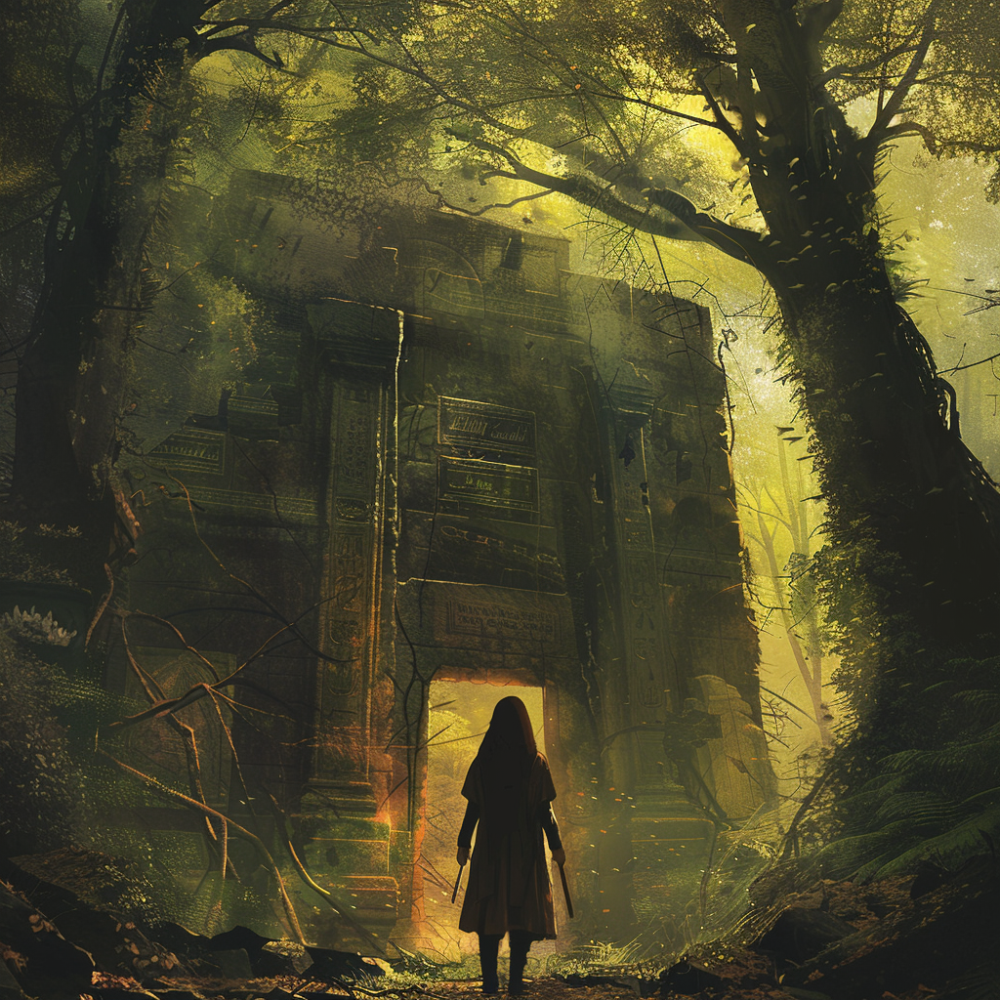

1. The Scholar in the Forest

In the quietude of the vast and venerable forest, where the foliage whispered secrets of a bygone era to any who would listen, there dwelt a young scholar named Elara. Her mind was as keen as the edge of an obsidian blade, and her thirst for knowledge was unquenchable. It was on one particularly luminous afternoon, under the canopy of ancient oaks, that Elara made a discovery that would forever alter the trajectory of her scholarly pursuits.

Elara had been tracing the folklore of the region, a tapestry of tales that spoke of civilizations lost and great power forsaken. The forest, largely untraveled by the common folk who feared the spirits said to roam amidst the trees, held no such terror for her. It was here, in the heart of this forgotten woodland, that the remnants of a ruin emerged before her, like the bones of some colossal beast breaking through the earth's skin.

The ruin, draped in the embrace of ivy and moss, was a silent testament to the grandeur that once was. Elara approached with a mixture of reverence and scholarly excitement, her heart racing at the prospect of unearthing history. The stones were cold to the touch, etched with glyphs that time had not entirely claimed. She recognized these symbols from the ancient scrolls she had studied in hushed libraries, the language of a civilization that had vanished as if swallowed by the very air.

Within the ruin, hidden beneath the debris of ages, Elara discovered a chamber that seemed to pulse with a latent energy. The air was thick with the scent of bygone incense and the weight of dormant magic. And there, amidst the shadows, lay a collection of scrolls, their parchment preserved against the ravages of time by some cunning alchemy.

With hands trembling from both eagerness and the chill of the place, Elara unfurled the first scroll. The script danced before her eyes, arcane and cryptic, yet as she read, the words began to stir something within her. It was as if dormant machinery within her very soul had been ignited, gears turning and ancient mechanisms coming to life.

A warm glow suffused her being, and Elara felt her consciousness expand, enveloping her in a cocoon of light. The forest seemed to recede, and she was adrift in a sea of starlight, where whispers of the ancients reached her ears, speaking of powers forgotten and wisdom lost.

The scrolls spoke of a time when magic was as common as the air one breathed, and the people of the ancient civilization wielded it with a deftness that seemed godlike. But there was a warning etched between the lines, a cautionary tale of hubris and the downfall that inevitably follows. The magic had not died; it had merely been put to slumber, awaiting the one who could awaken it once more.

As the light dimmed and Elara found herself once again in the confines of the ruin, she realized her life had irrevocably changed. The scrolls had awakened something within her, a power that thrummed in her veins like a second heartbeat. She knew, with a certainty that defied explanation, that her fate was now entwined with the whispers of the ancients.

What had begun as scholarly curiosity had transformed into a quest of mystical reckoning. Elara understood that the knowledge contained within the scrolls was not meant to molder in the seclusion of a forgotten ruin. It called for action, for an understanding that spanned beyond the mere historical record.

With the scrolls carefully secured in her satchel, Elara emerged from the ruin, her gaze cast upon the horizon. The forest, once a place of quiet solitude, now seemed alive with the echoes of a distant past. It was as if she had opened a door to a realm that bridged the chasm between history and myth.

The journey ahead would be fraught with peril, for dormant magic, once awakened, can be a beacon for forces dark and covetous. Yet, Elara felt a resolve steeling within her, a determination to pursue the path that had unveiled itself in the heart of the forgotten forest. It was here, in the embrace of the ancient oaks, that the scholar in the forest took her first steps towards a destiny that lay shrouded in the mists of time.

### Echoes from the Depths
#### The magic from the scrolls weaves a tapestry of events, tying Elara's fate to the vanished ancient civilization.

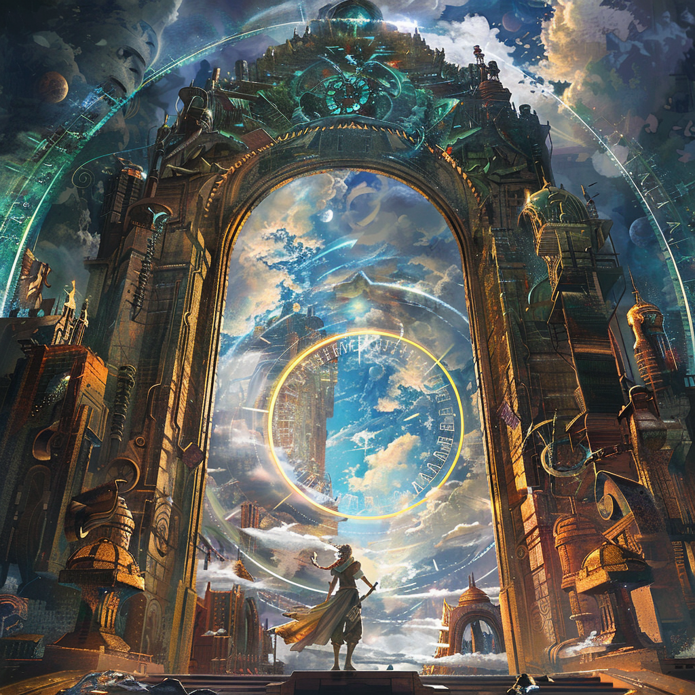

2. Echoes from the Depths

In the stillness of the ancient ruin, the air pulsated with an almost imperceptible hum, a residual whisper of long-silenced voices. Elara, with the scrolls of arcane knowledge clutched tightly in her hands, could feel the tendrils of dormant magic now stirring. The scrolls were inscribed in a script that danced before her eyes, elusive and complex, yet she found herself able to decipher their meanings as if the knowledge was a latent memory awakening within her.

She had uncovered a secret chamber, hidden beneath centuries of vine and stone. Here, the air was thick with the must of decay, yet it was interlaced with a fragrance that spoke of a time when this place was alive with the chants of scholars and the incantations of mages. It was in this sacred silence that Elara felt an inexplicable connection to the ancients, as if the very fabric of time was fraying at its edges, allowing whispers from the past to seep through.

The scrolls spoke of a civilization that had reached the zenith of its splendor, harnessing the forces of nature and bending them to their will. They had understood the deep currents of magic that flowed through the earth, and they had crafted a society that lived in harmony with this power. But there was a lament in these records, a tale of a cataclysm born of hubris and the darkening of their arts.

As Elara unfurled another scroll, a vision seized her. She saw a vast city with spires that clawed at the heavens and streets teeming with people whose eyes shone with the light of knowledge and power. But then the sky darkened, and a terrible storm of energy swept over the metropolis. Buildings crumbled; screams rose and fell in a crescendo of despair; the earth itself seemed to convulse in agony.

She gasped, the vision dissolving as quickly as it had manifested, leaving her breathless and disoriented within the chamber. These were not mere records; they were echoes of a reality that had been imprinted into the scrolls themselves, a living history that refused to be forgotten.

Elara's hands trembled as she reached for another scroll, her mind a whirlwind of fear and fascination. The magic of the ancients was potent, more potent than any tale or legend had dared to suggest. And it was clear that their fall had been as spectacular as their rise. What had caused such a civilization to collapse so thoroughly that only these ruins remained?

The answer, it seemed, lay in the final scrolls. With a mix of dread and determination, she began to read of the ancients' final days. A schism had formed among them, with some seeking to push the boundaries of their magic to godlike realms, while others warned of the dire consequences of such hubris. The dispute escalated, and from the fervent disagreement emerged a great conflict that consumed the city in a cataclysm of unleashed energies.

It was then, amidst the descriptions of this apocalyptic event, that Elara realized her own fate was becoming woven into the tapestry of this ancient tale. The magic of the scrolls had not merely been awakened; it had recognized in her a kindred spirit, a seeker of knowledge and a potential harbinger of a new era—or a new calamity.

With a heavy heart, Elara rolled the scrolls and secured them within her satchel. She knew that the path before her was fraught with danger and that the echoes from the depths of the past might very well resonate into the present, bringing with them the same cataclysmic forces that had once brought a mighty civilization to its knees.

Yet, amidst the trepidation, a flame of resolve was kindled within her. She would not allow fear to deter her quest. The mysteries of the ancients beckoned, and she would follow their echoes to whatever end they might lead. For in her heart, she believed that understanding the past was the key to safeguarding the future—a future that now felt more precarious than ever.

With the weight of history upon her shoulders, Elara emerged from the chamber, leaving the silence of the ancient ruin behind. The forest greeted her with the rustling of leaves and the call of distant birds, a serene contrast to the storm of thoughts raging within her mind. She stepped forward, her resolve firm, knowing that the echoes from the depths had become the first chords of a symphony that would either herald a new dawn or a requiem for the world she knew.

### Dreams and Omens
#### Guided by enigmatic dreams, Elara seeks to understand the messages that push her towards an unknown destiny.

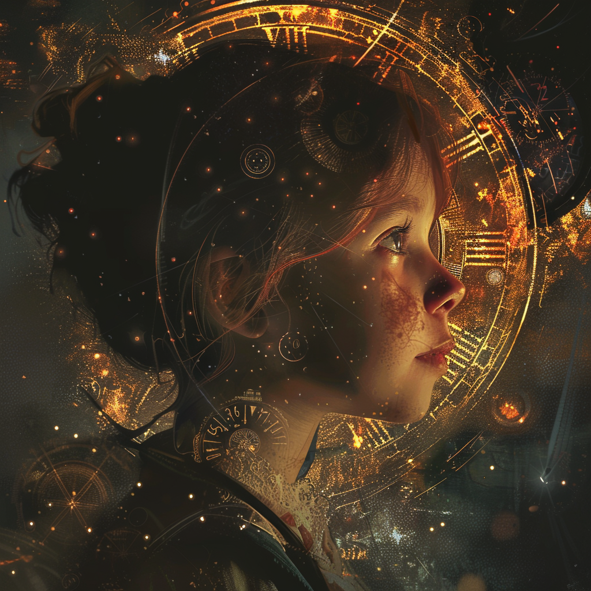

3. Dreams and Omens

Elara, ensconced within her modest chamber as the moon's argent fingers clutched at the edges of her window, found her thoughts adrift upon the sea of slumber. It was in the embrace of these nocturnal hours that the enigmatic dreams began to visit her with increasing fervor. Each dream, a mosaic of cryptic symbols and whispers, seemed to pull her deeper into the web of destiny that the ancient scrolls had spun around her.

One night, it was the vision of a great tree, its roots entwined with the very fabric of the earth, and its branches stretching towards the firmament, touching the stars themselves. The tree pulsed with a life of its own, its leaves inscribed with runes that glowed with a spectral light. Elara approached the tree in her dream, her hand trembling as it reached out to caress the bark. And as her fingertips brushed against the living script, a voice, ancient and profound, spoke to her from the depths of time.

"Seeker of truths long buried," it intoned, "heed the call of the ancients. The roots of the past entangle the present, and the seeds of the future are sown in the soil of bygone eras."

Elara awoke with a start, her heart pounding like a drum within her chest. The dream lingered in her mind, its message etching itself into her consciousness. She knew, with a certainty that defied explanation, that these were more than mere figments of her imagination. They were omens, fragments of knowledge from a world that had been lost to the mists of time.

In the days that followed, the dreams became her constant companions, revealing themselves in fragments and riddles. She saw a river of stars flowing through the heavens, a bridge of light that connected the earthly realm to the celestial. She walked along this luminescent path in her dreams, guided by the whispers of the ancients, whose voices seemed to echo from the very stones of the ruin she had discovered.

Elara spent her waking hours poring over the scrolls she had found, seeking a cipher that might unlock the secrets of her visions. The scrolls were resistant to translation, their language elusive, as if the words themselves were alive and shifty, evading her grasp just as she felt she had begun to understand them. Yet, within these parchments, she could sense the resonance with her dreams, a thread that wove through both, connecting them in a tapestry of mystery.

It was on one such evening, as Elara sat at her desk surrounded by the ancient texts, that a new vision came upon her. She saw herself standing at the edge of a precipice, the land stretched out before her torn asunder by some great cataclysm. From the chasm rose a darkness, a shadow that threatened to engulf the world.

And then, amidst the encroaching gloom, a light shone forth. It was neither the light of the sun nor the moon, but something purer, something primeval. It emanated from an object that lay at her feet—a crystal that pulsed with the same life as the great tree of her earlier dreams. As she reached down to touch it, the darkness recoiled.

Elara's eyes flew open, and she found herself once again in her chamber. The moon had set, and the first light of dawn crept across the sky. She knew what she must do. The dreams were not merely sending her messages; they were showing her the way. The crystal, the tree, the river of stars—all of them were pieces of a puzzle that she was destined to solve.

With a newfound determination, Elara gathered her scrolls and her meager belongings. The road ahead was uncertain, fraught with peril and enigma, but she could not ignore the call of the ancients that thrummed in her veins. It was time to leave the safety of her home, to venture into the world with eyes wide open to the wonders and dangers that awaited her.

As she stepped out into the crisp morning air, Elara felt the weight of the dreams upon her shoulders. They were omens, yes, but also beacons, guiding her towards an unknown destiny that shimmered on the horizon, just beyond the reach of understanding. She was ready to follow them, wherever they might lead.

### The Gathering of Allies
#### Elara forms a group of unlikely companions to aid in her quest to uncover the ancient mysteries.

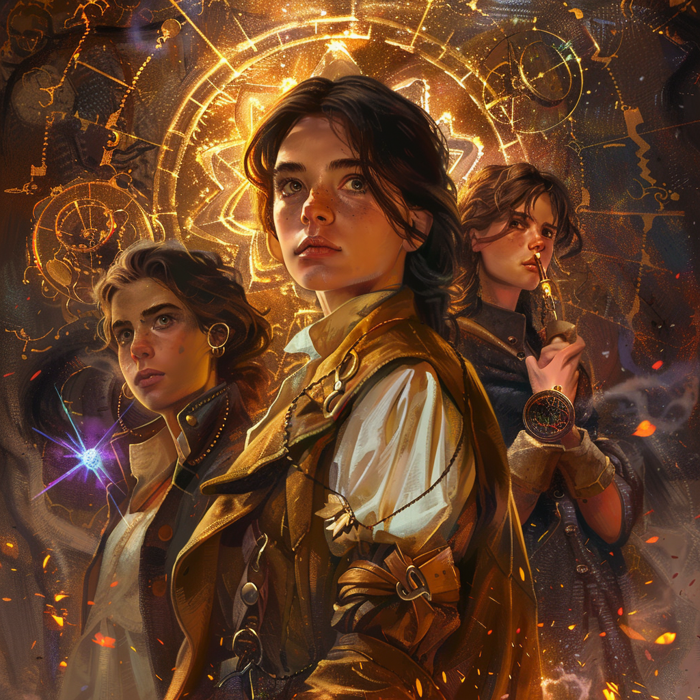
Chapter 4: The Gathering of Allies

In the wake of her profound discoveries and the haunting dreams that followed, Elara, our scholarly heroine, found herself compelled to seek those who would aid her in her perilous quest. For, indeed, the ancient scrolls had stirred more than just the ethereal tendrils of magic; they had awakened a sense of destiny that could not be fulfilled alone.

It was in the bustling heart of Marrowdale where the threads of fate began to entwine with others. Elara, with her eyes alight with the fires of purpose, knew that to unravel the secrets of the past, she would need a tapestry of skills at her disposal. And so, with the careful deliberation of one who studies the arcane, she set about gathering her companions.

The first to join her was a figure shrouded in mystery and whispers. Known simply as Thorne, he had been a mercenary of some repute, his skills with blade and bow the subject of many a fireside tale. Thorne, with a past shadowed by misdeeds, sought redemption, and in Elara's quest, he saw a path to absolution. His manner was curt, his eyes often scanning the horizon, as if expecting retribution to appear at any moment. Yet, in his guarded demeanor, there lay a readiness to defend the scholar with a fervor that spoke of a deeper, unspoken loyalty.

The second to heed the call was an enigmatic figure, a wanderer of the wilds known as Lyris. She had the earth in her veins and spoke the language of the trees and the streams. A druid, some said, a whisperer of nature's secrets. Lyris joined not for redemption or glory, but because the earth itself seemed to guide her to Elara's side, as if the very roots and vines entreated her to act. Her knowledge of the ancient world was rivaled only by her understanding of the living one.

Next was the jovial giant, Bromm, whose stature was matched only by his heart. A blacksmith by trade, his hands had shaped metal with the force of his hammer and the heat of his forge. But within his chest beat the heart of an adventurer, and the scrolls Elara sought spoke to him of a craftsmanship far beyond the ken of mortal minds. With laughs that boomed like thunder and arms strong enough to bend steel, Bromm pledged his strength to Elara's cause.

Lastly, there was the enchanter, Ilyan, a man whose fingers danced with arcane sparks and whose mind was a labyrinth of spellcraft. His was a life devoted to the pursuit of knowledge, and the ancient magic that Elara had awoken whispered to him of power and secrets that had been lost to the ages. Ilyan, with his hair as silver as the moonlight and eyes that seemed to pierce the veil of realities, saw in Elara's quest a chance to touch the infinite.

Thus was the cadre formed, a quartet of disparate souls bound by a shared purpose. They stood in the square of Marrowdale as the sun dipped below the horizon, casting the world into the gentle embrace of twilight. Elara, with the scrolls secured in her satchel, regarded her companions with a solemn nod.

"My friends, we embark on a journey fraught with danger," she began, her voice steady as the ground beneath their feet. "The path we tread may be shadowed by the unknown, but together, we shall illuminate the darkness with the light of discovery. Our quest is one of truth, and the perils we shall face are the guardians of secrets long buried."

Thorne, with a hand resting on the pommel of his sword, gave a gruff assent. Lyris simply closed her eyes and breathed deeply, as if drawing strength from the earth itself. Bromm cracked his knuckles and grinned, the anticipation of adventure alight in his eyes. Ilyan, ever the enchanter, murmured words of an ancient tongue, and a soft glow enveloped the group, as if to shield them from the encroaching night.

As the stars began to prick the velvet sky, the four set forth from Marrowdale, the weight of destiny upon their shoulders. They were an unlikely fellowship, a scholar, a mercenary, a druid, and a blacksmith, each bearing their own burdens, their own hopes. Yet in their unity, there was strength, and in their diversity, there was harmony.

The road ahead was veiled in uncertainty, but Elara led them with the assurance of one who had glimpsed the machinations of fate. She knew not all the trials they would face, but in the gathering of her allies, she found a newfound resolve. For in their eyes, she saw reflected the same fire that burned within her own heart—a fire kindled by whispers of the ancients, and the promise of mystical reckoning.

### Shadows of the Forgotten
#### Elara's journey leads her to confront a sinister cult that wishes to exploit the ancient powers for evil.

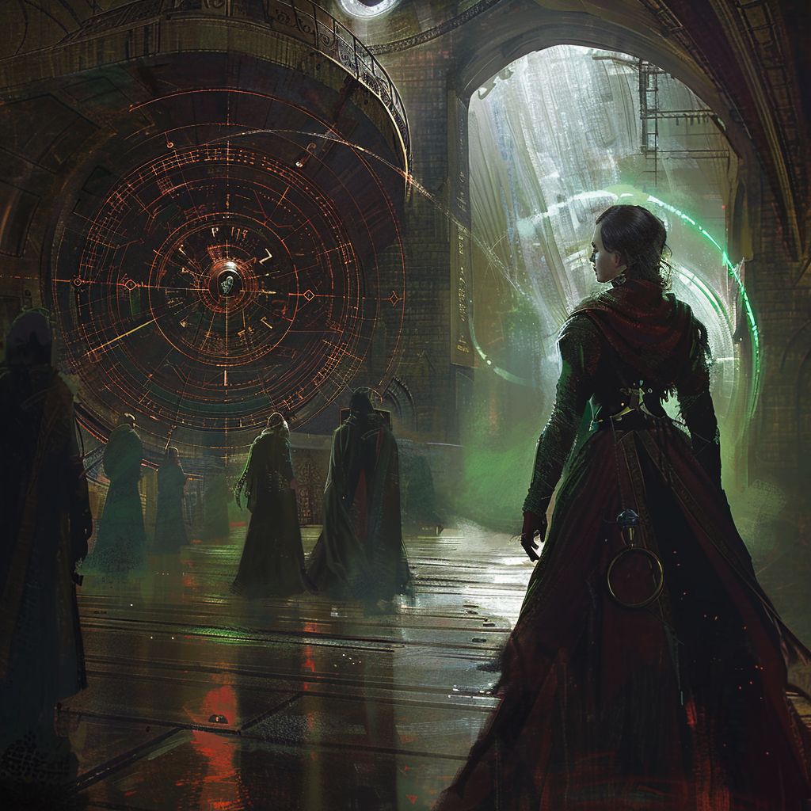

5. Shadows of the Forgotten

It was upon a dusk-tinged eve when our intrepid Elara, with her cadre of mismatched yet staunch companions, found themselves on the cusp of a malevolent gathering. The sinister cult, which they had been trailing through a lattice of cryptic clues and arcane omens, had convened in a desolate vale far removed from the eyes of the uninitiated. 

The veil of night was descending, and the sky bore an indigo hue, a canvas for the celestial bodies that watched in silence. Slinking through the dense underbrush, Elara and her allies observed the clandestine congregation from the safety of shadows. At the core of this convocation stood an altar, hewn from the darkest of stones, and upon it, a relic of unspeakable antiquity.

Our protagonist, Elara, shuddered as she felt the dormant magic within her stir, a silent response to the relic's unseen influence. Beside her, the torchlight flickered upon the faces of her companions—a rogue, a bard, a huntsman, and a sage—each marked by their own reasons for joining this perilous quest. They, too, felt the thrumming power that seemed to pulse from the heart of the altar.

The cultists were an assemblage of the disillusioned and the power-hungry, their souls ensnared by the promise of wielding forgotten magics for dominion over their world. Robed in garbs of sable and silver, they chanted in a language not spoken since the fall of the ancients, their voices rising in a crescendo that seemed to beckon the darkness closer.

Elara, whose scholarly pursuits had never prepared her for the skirmishes of the night, felt a surge of determination. The scrolls she had unearthed in the ruin were not meant for such perversion. The knowledge contained within was a testament to a civilization whose splendor was matched only by its enigmatic demise.

The leader of the cult, a figure draped in robes that whispered of forgotten sorcery, raised an obsidian dagger to the heavens. The blade caught the light of the stars, and for a moment, it seemed as though the fabric of reality wavered. Elara understood that the ritual nearing its zenith was not merely a summoning but a catalyst for a cataclysm that could rend the veil between worlds.

With a glance at her companions, Elara knew that the time for observation had passed. Action, swift and decisive, was required lest they become witnesses to a new epoch of darkness. The rogue, with eyes that gleamed like the blade he brandished, nodded. The bard, whose songs could stir the heart to courage, hummed a tune of veiled potency. The huntsman, silent as the grave, nocked an arrow—a sentinel of the wilds. The sage, eyes aglow with the wisdom of the ages, prepared incantations that had not been uttered in centuries.

Together, they emerged from the shelter of shadows, a phalanx of the righteous confronting the apostles of oblivion. The cultists, so engrossed in their profane liturgy, were taken aback by the audacity of the interruption. But they were not unprepared for conflict; dark energies swirled around them, summoned by their fervent invocations.

The clash that ensued was one of chaos and fervor. Steel met shadow as the rogue danced a deadly ballet, parrying and thrusting with lethal grace. The bard's voice, imbued with the magic of the ancient scrolls, became a weapon of its own, sowing confusion among the foe. The huntsman's arrows flew true, each a silent whisper of the forest's wrath. The sage's spells were a tapestry of light and fire, illuminating the night with the echoes of forgotten lore.

Elara, at the heart of the maelstrom, reached out with her nascent powers, unbinding the threads of magic that the cult sought to weave. The relic on the altar thrummed with a desperate energy, as though seeking to break free from the constraints of mortality.

The battle's tide turned as the cult leader, with a cry of rage and despair, sought to complete the ritual. But it was too late; the companions had sown disarray, and Elara's resolve was a beacon that shattered the shadows.

As dawn's first light pierced the horizon, the cult was vanquished, their dreams of power crumbled to dust. The relic, now dormant once more, was secured by Elara and her allies. They knew their journey was far from over, for the whispers of the ancients were ever present, and the threads of fate remained entangled.

But in that moment, beneath the awakening sky, they found solace in their triumph against the Shadows of the Forgotten.

### The Merging of Past and Present
#### As Elara delves deeper into the past, the lines between history and myth begin to blur.

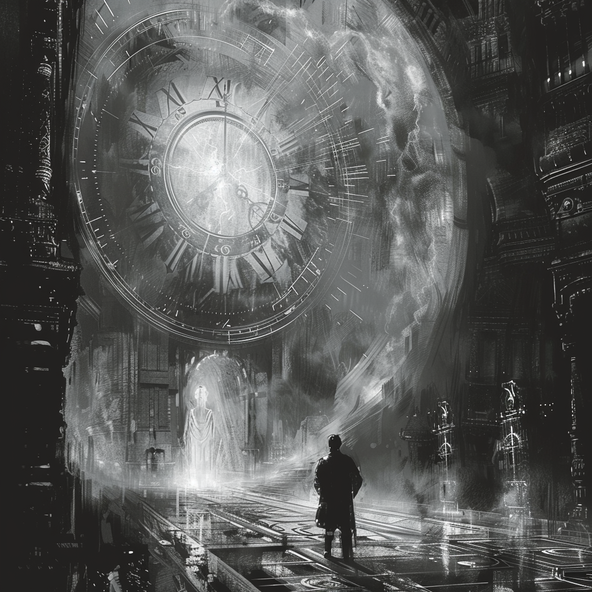

6. The Merging of Past and Present

In the dim light of the ancient chamber, Elara sat cross-legged on the cold stone floor, her mind teetering on the precipice of the world that was and the world that is. The scrolls lay unfurled before her, their edges tattered with the passage of countless ages, yet the symbols scrawled upon them pulsed with a vitality that seemed to defy time itself. The air was thick with the scent of moss and the must of decay, but to Elara, it was as if she breathed the very essence of history.

Her fingers traced the arcane glyphs, and as she did so, the whispers of the ancients seemed to fill the chamber, echoing off the walls and seeping into her very soul. Each symbol was a key, unlocking fragments of memories not her own. Visions of grandeur and decay, of wisdom and folly, danced before her eyes, blending with the reality of the ruin around her until she could scarcely distinguish one from the other.

The murmur of her companions reached Elara's ears, but they sounded distant, as though she were hearing them from across a vast gulf of time. They had gathered around her, a tapestry of souls from diverse walks of life, each drawn into the orbit of her quest. There was Thorne, the stoic warrior whose sword was as sharp as his taciturn nature; Mirelle, the enigmatic seer whose eyes mirrored the mysteries they sought; and Jovan, the rogue whose laughter was a balm against the weight of their purpose.

Yet, in the midst of their vigil, it was Elara who ventured alone into the depths of the past. With each parchment she deciphered, the ancient civilization that had once thrived within these walls seemed to rise from the ashes of oblivion, casting shadows upon the present. Elara could see them now, the people of a bygone era, moving through the corridors of power and knowledge, their lives an intricate dance of ambition and desire.

The vision grew stronger, and Elara found herself walking the streets of the ancient city that had once stood upon the land where now only ruins whispered of its existence. She walked among its people, sharing in their joys and their sorrows, their triumphs and their defeats. She witnessed the rise of the civilization, the flowering of its culture, the pinnacle of its achievements. She also saw its downfall, the creeping rot of corruption and the hubris that invited catastrophe.

As the line between then and now grew ever fainter, Elara felt a presence beside her—a guiding force that seemed to stitch the fabric of time back together. She turned to see a figure cloaked in the mists of the past, its features indistinct yet familiar. It was as if the spirit of the civilization itself had come to impart its wisdom, to offer the key that would unlock the secrets of its power and its demise.

The figure spoke, its voice a tapestry of a thousand whispers, "Seeker of truths, you who bridge the chasm of ages, know that the power you pursue is not a thing of darkness nor of light. It is the essence of our being, the heart of all creation, and it demands a guardian who understands the balance of all things."

Elara listened, her heart beating in time with the words that resonated with the very core of her being. She knew then that her quest was more than an academic pursuit; it was a calling, a responsibility to wield the knowledge of the ancients with care and wisdom. She also understood that the cult that hunted them sought to tip that balance, to wield the power for domination and ruin.

As the vision faded and Elara returned to the chamber of the present, the weight of her newfound knowledge pressed upon her. Her companions looked to her, seeing the change within her eyes—the clarity of one who has glimpsed the tapestry of time and found her thread within its weave.

Together, they rose, their resolve hardened by the merging of past and present. The quest would go on, and Elara would lead them, her every step guided by the whispers of the ancients that now thrummed in her veins. The path ahead was fraught with peril, but with the lessons of history as her beacon, Elara would face whatever darkness lay ahead, for the sake of the future that was still theirs to shape.

### The Cult's Pursuit
#### The cult intensifies their pursuit of Elara and her companions as they get closer to the truth.

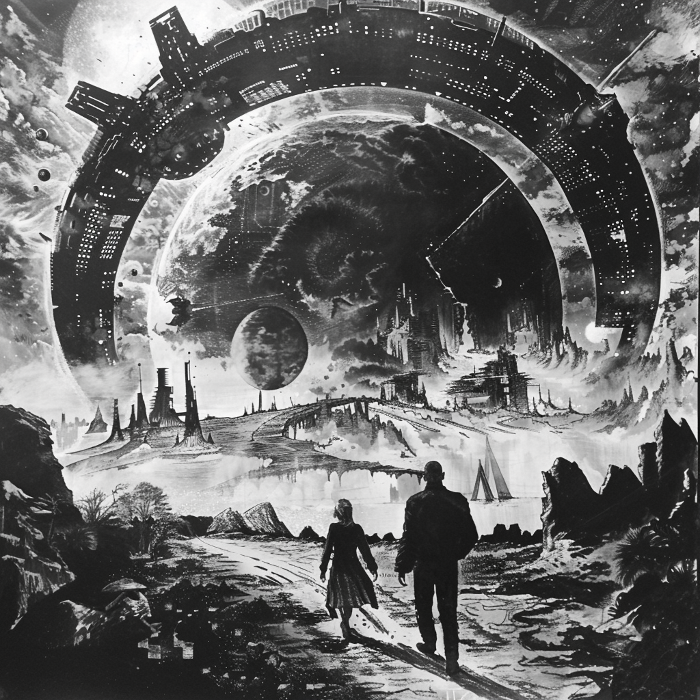

7. The Cult's Pursuit

With every step into the deepening twilight of the ancient forest, Elara and her companions felt the weight of countless eyes upon them. There was a palpable electricity in the air, a sense that the world around them had drawn its breath in anticipation of some great and terrible event. The scrolls, with their curling golden script, seemed to pulse with a life of their own, as if the secrets within them stirred in response to the imminent peril.

The cult, a sinister congregation who had long sought to twist the ancient powers to their own inscrutable ends, had intensified their pursuit. It was as though they moved between the shadows themselves, silent and deadly as the night. Their leader, a figure shrouded in cloaks of midnight hue, bore a staff topped with an orb that glimmered with an unholy light. His followers, a cadre of the dispossessed and the fanatical, whispered incantations that chilled the very soul.

Elara, with the scrolls clasped tightly against her chest, led her companions through a thicket of gnarled trees. Beside her strode Alden, a warrior of few words but steadfast heart, his blade unsheathed and ready. Behind them, the sage Myrin, eyes alight with the fervor of knowledge, murmured protective spells under his breath. Taryn, the rogue whose loyalty had been won by Elara's courage, scouted ahead, her footsteps silent upon the forest floor.

As they advanced, the air grew colder, the darkness deeper. Elara felt the ancient magic of the scrolls reach out, intertwining with her own burgeoning powers. It was a sensation both exhilarating and fearsome, for she knew the cost of such magic could be dire. Yet there was a truth to uncover, a mystery that beckoned her onward.

It was not long before the cult made their presence known. A volley of arrows, dark as the night and fletched with feathers of ravens, sliced through the air towards them. Alden's sword moved in a blur, deflecting the missiles, while Myrin's incantations raised a barrier of shimmering light. Taryn, appearing as if from nowhere, dragged Elara down behind the twisted root of an ancient oak.

"They are upon us," Taryn hissed, her eyes scanning the darkness for signs of their assailants.

"We cannot flee," Elara replied, her voice steady despite the pounding of her heart. "The answers we seek lie ahead. We must press on."

"And so, we shall," Alden muttered, his eyes alight with the thrill of battle. "Let them come."

The cultists emerged from the darkness like specters, their robes billowing in a wind that seemed to come from nowhere. The air crackled with the energy of their dark spells, but Elara felt the power of the scrolls surge in response. She whispered words she did not fully understand, words that had been locked within the ancient parchment, and a brilliant light burst forth from her hands.

The light seared through the shadows, driving the cultists back with cries of fury and pain. Alden charged, his blade a silver arc in the night, and Myrin's spells lashed out like tendrils of fire. Taryn darted amongst their foes, her daggers finding their marks with deadly precision.

The battle was a tempest of magic and steel, a dance of light and shadow. Elara could feel the strains of the ancient civilization that had imbued the scrolls with their power, their echoes guiding her every move. Yet the cult leader remained untouched, his orb absorbing the energies thrown against him, his face obscured by the darkness.

The confrontation reached its crescendo as Elara, wielding the power of the scrolls, faced the cult leader. Their magics clashed, a maelstrom of ancient forces that threatened to tear the very fabric of the forest apart. Elara could sense the leader's desire to possess the knowledge she held, but she also knew that such power could not fall into his malevolent grasp.

With a final, desperate cry, Elara unleashed the full might of the scrolls. Light blazed forth, blinding and pure, enveloping the cult leader in its radiance. When the light faded, the cultists were gone, scattered like leaves in a gale. The leader was nowhere to be seen, his fate a mystery that lingered in the silence of the forest.

Elara collapsed to the ground, the scrolls slipping from her grasp. Her companions gathered around her, their expressions a mix of awe and concern. The night was still once more, but the pursuit, they all knew, was far from over.

The journey to the heart of the ruins, and to the truth, would be fraught with further perils. But for now, they had survived. They had pushed back against the darkness with the light of ancient knowledge, and in that moment, they felt the bonds of their fellowship strengthen.

With the dawn would come the next step of their quest, and the shadows of the forgotten would loom once more. But Elara and her companions would face them together, their resolve unshaken, their spirits undaunted. The truth lay ahead, and they would not rest until it was uncovered.

### The Heart of the Ruins
#### Elara discovers the core of the ancient ruins and the secrets it holds.

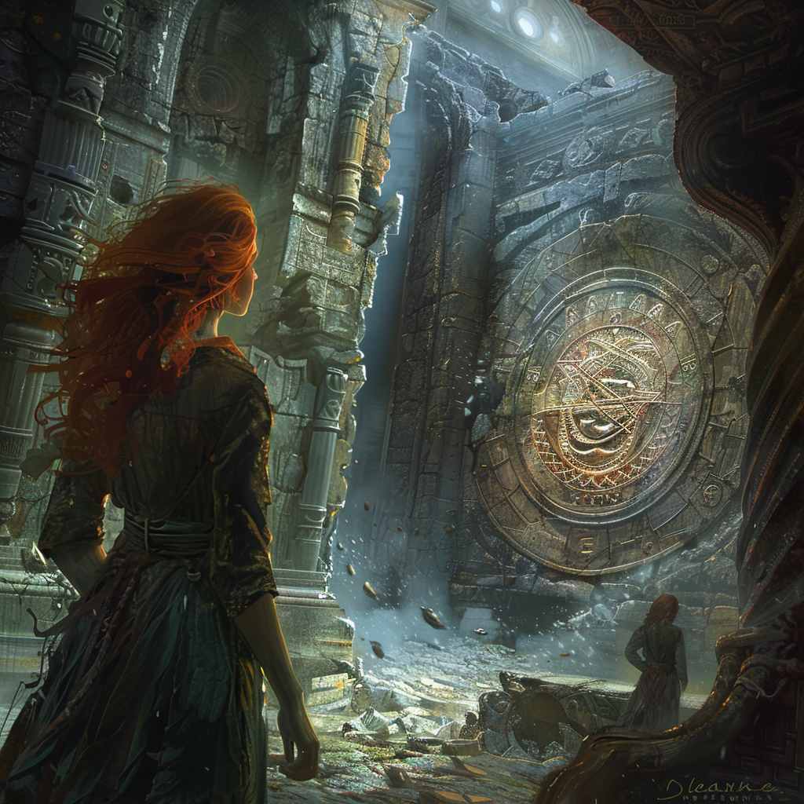

8. The Heart of the Ruins

Elara, with a heart beating to the rhythm of newfound purpose, stood at the threshold of a chamber that seemed to pulse with ancient wisdom. The air was thick with a palpable energy that stung her nostrils with the scent of ozone and time-worn stone. Here, in the heart of the ruins, under the gaze of the forest's tall sentinels, she felt as though she had stepped into a nexus of forgotten epochs.

Her companions, a motley assemblage of seekers and guardians of lore, ranged around her, their faces a mixture of awe and trepidation. They had come far, surviving perils both seen and unseen, their paths converging with hers in a tapestry woven by hidden hands. With each step into the sanctum, their shadows danced upon the walls, mingling with those of the ancients.

The chamber, vast and domed, was adorned with intricate carvings that spiralled upwards to a zenith where a single aperture allowed a column of light to pierce the gloom. In that shaft of illumination, a pedestal of obsidian stood, cradling an artifact that hummed with the echo of aeons—a crystalline heart, faceted and pulsating with a light of its own.

Elara approached, her fingers trembling with anticipation. She had deciphered the scrolls, their cryptic language now an open book to her eager mind. She had learned of the civilization's zenith, of their mastery over the natural and the ethereal, and of the calamity that had sent them into the annals of myth.

The crystalline heart was the nexus of their power, the core of their understanding of the universe's fabric, and, as the scrolls had whispered, the key to their undoing. It was said to be the repository of their collective knowledge, a wellspring of energy that, if harnessed, could alter the course of rivers, turn the skies to fire, or rend the very essence of time and space.

Her companions murmured amongst themselves, the weight of the moment not lost upon any soul present. The cult that shadowed their every move sought the heart for purposes vile and corruptive. Elara's quest was not merely one of enlightenment but a race against a gathering darkness that threatened to consume all.

With a breath drawn deep, Elara extended her hand, her fingers grazing the surface of the crystal. A shockwave of visions and voices surged through her, a maelstrom of the ancients' memories. She saw their triumphs, their art, and their marvels; she felt their aspirations, their love, and their unity. Then came their hubris, their downfall—the skies darkening, the earth quaking, and the heart, once their greatest achievement, becoming their prison.

The visions subsided, leaving Elara gasping upon the cold floor, her companions rushing to her side. She looked up at their concerned faces through eyes wet with revelation. She knew now what must be done.

The heart must not fall into the cult's grasp. It must be protected, its knowledge preserved but kept dormant. The ancients had flown too close to the burning sun of knowledge, their wings of audacity melting in its unforgiving blaze. Humanity was not ready for such power, or perhaps it was power that was not ready for the follies of humanity.

As the light above seemed to dim, a sense of urgency gripped them all. The cult would not be far behind; their malevolent intent was as relentless as time itself. Elara rose, her resolve steeling her spine. She turned to her companions, their faces now set with determination mirroring her own.

"We must safeguard the heart," she declared, her voice echoing through the chamber. "The ancients have entrusted us with this burden. We must bear it away from those who would unleash its fury upon the world."

They nodded, understanding the gravity of the charge. Together, they devised a plan to conceal the heart once more, to shroud it in riddles and protections that would confound any who sought to disturb its slumber.

And so, as the shadows lengthened and the forest whispered secrets only the ancients could fathom, Elara and her companions set to work, custodians of a past that must be remembered but never relived. The heart of the ruins, pulsing with the echoes of a lost era, lay in their hands, a silent testament to the perils of reaching beyond the veil of mortal understanding.

### The Clash of Ideals
#### Elara faces moral dilemmas as truths emerge that challenge her deepest beliefs.

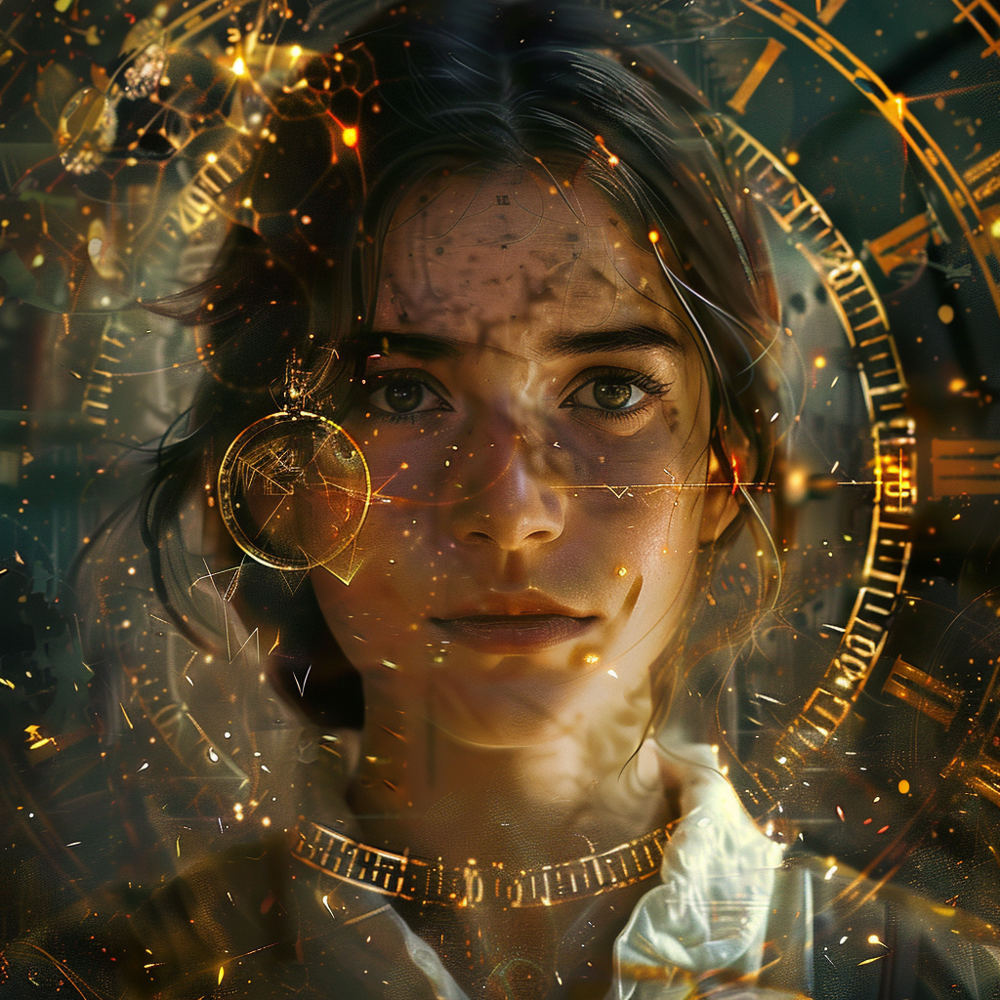

9. The Clash of Ideals

In the dim light of the ancient chamber, Elara's visage reflected the turmoil that churned within her. The scrolls, once a beacon of fascination, now lay before her as the bearers of inconvenient truths. Her companions watched with pallid faces, each burdened by their own understanding of the revelations that had unfurled.

It had been disclosed, through the cryptic language of the ancients, that the civilization which they had so revered, the authors of the great knowledge she sought, had themselves been architects of their own demise. The scrolls, written in a hand that trembled with the weight of its message, spoke of a society that had blossomed into an empire of intellect and magic, only to be consumed by hubris. They had tampered with the very fabric of reality, much as the cult they now opposed sought to do.

Elara's heart faltered, for her ideals of the ancient civilization as a paragon of wisdom and virtue had been dashed against the cold, unyielding truth. The very magic she had awoken and hoped to wield for good was born from a legacy of arrogance and destruction.

Her confidant, the stoic warrior Taelon, broke the silence that ensnared them. "Elara, these scrolls... they change everything. We sought knowledge and power to prevent a cataclysm, but it seems we may instead be walking the path of those who came before us."

Elara's gaze met his, seeing the concern etched across his features. "Indeed, Taelon," she replied, her voice a whisper that seemed to fear disturbing the remnants of the past. "The past is not the sanctuary of virtue I had imagined. It is a mirror reflecting our own imperfections."

A scholarly mage of their fellowship, named Caius, adjusted his spectacles as he pondered the situation. "This is a pivotal moment," he interjected. "We stand at the crossroads of history. Shall we learn from the ancients' folly, or are we doomed to repeat their fatal experiment?"

The question hung heavily in the air, a specter that loomed over the destiny they were to choose. Elara felt the weight of leadership upon her shoulders, knowing that the path they would take could either preserve the world or precipitate its ruination.

A gentle hand upon her shoulder drew her from the abyss of her thoughts. Lyria, an empath and healer, offered a smile tinged with sorrow. "Elara, we have trusted in your wisdom thus far. We have witnessed you confront the darkness with a light that is uniquely your own. Whatever choice you make, know that you do not make it alone."

Encouraged by Lyria's warmth, Elara turned her attention back to the scrolls, her resolve hardening like steel tempered in the forge of adversity. "We must confront this cult, not with the hubris of the ancients, but with the humility that their downfall teaches us. Our power lies not in the domination of reality's weave, but in the understanding and respect of its intricate patterns."

Taelon nodded, his hand upon the hilt of his sword, a symbol of his readiness to defend their cause. "Then we shall be the counterbalance to the cult's ambition. We shall be the guardians of the equilibrium that the ancients so carelessly disrupted."

Caius closed the tome he had been referencing, the dust of ages rising and catching the light like tiny stars in a firmament of knowledge. "A harmonious path, then. One that walks alongside the natural order, rather than seeking to overrule it."

The group, once fractured by the revelations, now found unity in a shared vision. A vision tempered by the harsh lessons of history, yet alight with the possibility of a future unmarred by the same tragic flaws.

Elara, with newfound clarity, spoke words that seemed to echo the resolve of her companions. "Let us then depart this place, armed with the wisdom of what must not be done. The cult's pursuit will be relentless, but so shall our defiance be unwavering. For the sake of all, we shall hold fast against the tide of darkness, a beacon of hope amidst the clash of ideals."

And so, the fellowship of Elara, bound by the threads of fate and the quest for a righteous path, ventured forth from the heart of the ruins. They journeyed back into the world that lay ignorant of the precipice upon which it teetered, ready to do battle with the shadows that threatened to engulf it.

In truth, it was not the magic within the scrolls that would determine their destiny, but the indomitable spirit within their hearts. Elara, once a scholar in the forest, had become a leader at the forefront of a mystical reckoning. The clash of ideals would not be won by might alone, but by the courage to embrace the lessons of the past and forge a new destiny from the wisdom gained.

### The Strength Within
#### Elara finds inner strength to face the looming threat that endangers reality itself.

10. The Strength Within

In the bosom of the night, when the stars cast a dim radiance over the ancient ruins, Elara found herself standing where the crossroads of destiny and free will intersected. The echoes of the invisible choir, the whispers of the ancients, were no longer mere murmurs in her mind but now a clarion call that reverberated within the chamber of her soul.

She, a humble scholar, had traversed a path fraught with enigmas and peril, each step guided by the inscrutable hand of fate. The scrolls she unearthed in that long-forgotten forest had ignited a fire of arcane knowledge within her, a fire that now threatened to consume the very fabric of reality.

Gone were the days when her greatest concern was the dust on her tomes or the ink's dryness upon her quill. Now, the cult, nefarious agents of chaos, hounded her every move, their shadows lurking behind each ancient stone and twisted tree. The weight of the world, it seemed, pressed upon her slender shoulders, a burden no single soul ought to bear.

But in this dark hour, as the moon played hide and seek behind a curtain of scudding clouds, a transformation was taking place within Elara's heart. The fear that once clutched at her throat with icy fingers began to thaw, melted away by an inner warmth that she could not fully fathom.

She considered the companions who had journeyed alongside her, each with their own tale of courage and resolve. They were a tapestry of valor, woven from the most unlikely threads - a silent guardian whose blade whispered death, a bard whose lute strummed the resonances of hope, and a thief whose nimble fingers had unlocked more than mere latches.

Their faith in her, a beacon in the oppressive gloom, fortified her spirit. Elara understood, with a clarity that pierced the shroud of her doubts, that the strength to confront the looming threat did not lie in the magic of the scrolls or in the might of her allies. It lay within the quiet recesses of her own being, in the untapped reservoir of her resolve and the indomitable will that had carried her this far.

With a breath that seemed to draw the essence of the ruins into her lungs, she closed her eyes and reached inward. The knowledge of the ancients, a once-whispered lore, now roared in her ears like a tempest. She saw, in the theater of her mind, the tapestry of events that had led her to this nexus, each thread a choice, each weave a consequence.

The cult desired to rend the veil between what was and what could be, to harness the primordial energies for their vile intent. But Elara, the unassuming scholar, had become the custodian of an ancient legacy, the final bulwark against the tide of oblivion that threatened to engulf all.

As the night deepened, she emerged from her introspection with a newfound resolve. Her eyes, alight with the fire of purpose, opened to the world that awaited her courage. She stood, not as a scholar, but as a sentinel of the ages, ready to inscribe her own chapter in the annals of time.

Her companions, sensing the shift in the air, rallied to her side. Words were unnecessary; their hearts beat as one. Together, they prepared for the confrontation that would determine the fate of their world, their resolve as unyielding as the stones that surrounded them.

Elara stepped forward, the scrolls in her possession no longer mere artifacts but symbols of the wisdom that had been passed down through millennia. With the strength that came from within, the strength that transcended magic and myth, she was ready to face the cult and the malevolent forces at their command.

For the truth she had uncovered in the heart of the ruins was this: within each soul lies the power to shape destiny, to defy the darkness with the light of one's own inner flame. And as the first light of dawn crept over the horizon, Elara knew that no matter the outcome, the strength within her would endure, a beacon for those who would follow in the footsteps of the whispers of the ancients.

### The Final Confrontation
#### A showdown with the cult leads to a battle where the fate of the world hangs in the balance.

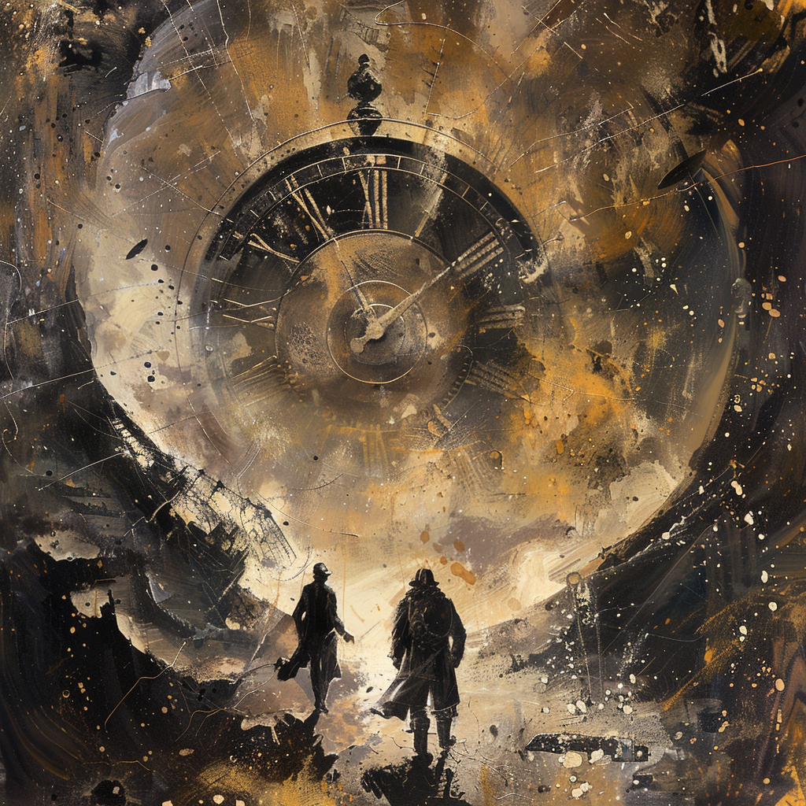

11. The Final Confrontation

In this peculiar and most critical chapter of our tale, the young scholar Elara, with her esoteric knowledge gleaned from the ancient scrolls and emboldened by the strength she found within, stood at the precipice of destiny. Her companions, a fellowship born of necessity and hardened by the trials they had endured, rallied behind her, forming a phalanx of determination against the darkened tide.

The cult, an assemblage of miscreants who had twisted the sacred knowledge of the ancients for their own nefarious ends, had convened in the shadow of the ominous ruins. Their leader, a figure both charismatic and cruel, had harnessed the eldritch energies to bend reality to his will. With chants that tore at the fabric of the cosmos, they sought to invoke a cataclysm that would reshape the world into their own malevolent image.

As the two forces met upon the desolate battleground, it seemed as though the earth itself held its breath, awaiting the outcome of this apocalyptic struggle. The air was thick with the electricity of potentiality, the ground trembled with the weight of eons, and the sky grew dark with the swirling mass of otherworldly storm clouds.

Elara, her countenance resolute, raised the ancient staff she had retrieved from the heart of the ruins. The artifact, a conduit for the raw energies of the universe, pulsed with a light that pushed back the encompassing gloom. Her allies, each skilled in their own right, closed ranks, their weapons and wills at the ready.

The cult leader, resplendent in his unholy regalia, stepped forth. His eyes, aglow with the fever of madness and power, fixed upon Elara. Words, ancient and terrible, spilled from his lips, causing the very air to warp and shimmer with the force of his command. The cultists responded in kind, their unified voices creating a cacophony that threatened to unravel the sanity of those who heard it.

The battle commenced, a maelstrom of magic and steel. Elara’s companions engaged the cultists, their valor shining like beacons in the oppressive darkness. Each parry and thrust, each spell cast and countered, was a note in the symphony of conflict that raged around the ruins.

Elara herself, with the staff in hand, stood as the fulcrum upon which the fate of the world teetered. She channeled the power of the ancients, her voice weaving incantations that rose above the din of battle. The staff’s light grew, becoming a blazing sun that cast long shadows across the field.

The cult leader, sensing his control waning, unleashed his full might upon Elara. The energies he commanded were monstrous, twisting the very air into grotesque forms that lunged with the intent to annihilate. But Elara, her resolve unyielding, met his assault with the purity of her own power. The two forces collided, a spectacle of light and darkness, each striving for supremacy.

It was in this moment of climax, as the forces of good and evil clashed with a fury that echoed through the ages, that the unexpected occurred. The staff, resonating with the untamed energies, shattered, its fragments hurtling through space and time. A silence, profound and all-encompassing, fell upon the battlefield.

From the epicenter of the explosion, a wave of energy rippled outward, washing over friend and foe alike. The cultists, their forms dissolving into motes of light, were swept away into the unfathomable reaches of the universe. The leader, his body unable to contain the forces he had sought to command, imploded into a singularity that vanished with a silent implosion.

As the light faded, the world itself seemed to sigh with relief. The ruins, the ancient sentinels of forgotten knowledge, stood witness to the rebirth of an era. Elara and her companions, though weary, found a peace that had eluded them throughout their harrowing journey.

The final confrontation had ended, not with the expected cacophony of victory or the lamentations of defeat, but with a quietude that spoke of balance restored. The world, once teetering on the brink of annihilation, found itself whole once more, its future unwritten and awaiting the pen of those who would shape it.

In this moment, Elara understood that the true power of the ancients was not in the dominion over the cosmos, but in the harmony with it. And as our intrepid scholar looked upon the new dawn, she knew that the whispers of the ancients would forever echo in the hearts of those who listened.

### The Shattering of Realms
#### The final outcome of Elara's quest has consequences that could fracture the fabric of reality.

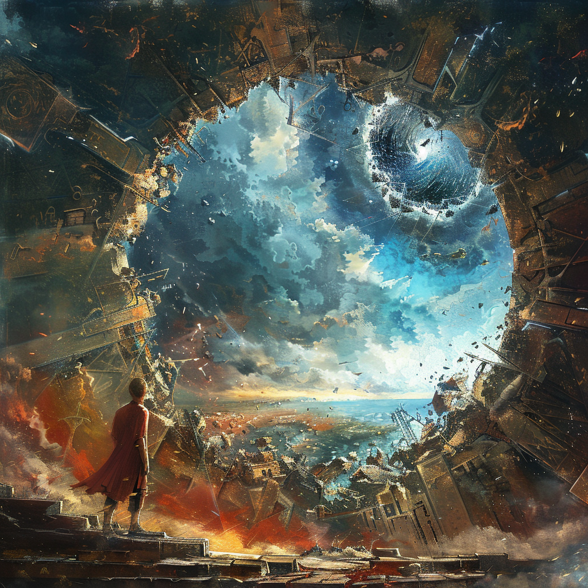

12. The Shattering of Realms

It was in the aftermath of that harrowing confrontation, as the dust of battle settled like the heavy hand of fate upon the ancient ruins, that Elara, our intrepid scholar, stood amidst the wreckage wrought by the final throes of the cult’s malevolence. Her companions, an assemblage of the most stalwart and diverse individuals, lay scattered about, some nursing their wounds, others tracing the contours of relief in their visages. The air was rent with the lingering echo of magic, a resonant frequency that seemed to hum within the very stones of the shattered temple.

The artifact that had been the fulcrum of the cult's dark aspirations lay fragmented, its pieces a mosaic of broken dreams and thwarted ambitions. Elara reached out, her fingertips grazing the jagged edges of the once-whole relic. A shiver of energy cascaded up her arm, a final, desperate whisper from the ancient civilization that had imbued such a creation with the essence of their understanding. It was in that ephemeral touch that Elara sensed the unmaking of the realms.

For as the artifact lay in ruin, so too did the boundaries that had held the worlds asunder. The fabric of reality, woven by the ancients with the threads of their profound knowledge, now frayed and tore under the strain of the unleashed magic. The air quivered before Elara's eyes, shimmering like the surface of a disturbed pond, and in those ripples, she glimpsed the myriad possibilities of existence, each clamoring for dominance in the wake of the artifact's demise.

The cultists, their ambition to harness the power of the ancients now their undoing, were swept away in the tumultuous sea of magic. Their cries, at once triumphant and despairing, melted into the cacophony of the shattering realm. Elara's companions rose to their feet, eyes wide with the realization that their struggle had wrought an outcome more dire than any they had feared.

"What have we done?" murmured Thorne, the grizzled warrior whose sword arm had turned the tide of many a skirmish. His voice, typically a bastion of certainty, trembled with the weight of uncertainty.

"It is not what we have done, but what we must now undo," Elara replied, her voice steady, though her heart echoed Thorne's misgivings. She turned to the others, her resolve a beacon in the maelstrom of magic. "The realms are fracturing, the barriers between worlds breaking. We must act, or all shall be lost."

With a rallying cry, Elara's companions gathered, forming a circle around the shattered artifact. Each brought forth the strength of their convictions, the power of their will, forging a semblance of unity in the face of dissolution. Elara drew deep into the well of her knowledge, invoking the ancient incantations she had gleaned from the scrolls, her voice rising above the din as she sought to knit together the unraveling tapestry of existence.

The very air around them seemed to pulse with potential, a storm of chaotic energy that defied the bounds of understanding. The ruins themselves, witnesses to eons of history, trembled as if in the throes of rebirth. And then, with a sound like the breaking of the world's heart, a brilliant light erupted from the center of their circle, enveloping them, the ruins, and the fractured realms.

When the light receded, Elara and her companions found themselves not upon the familiar ground of the ancient temple but adrift in an expanse of white, an interstitial space between realities. Here, within this blank canvas, they would make their stand, wielding the threads of creation to mend what had been rent asunder.

The task was Herculean, for the fabric of the realms was not easily repaired, and each thread they wove bore the weight of countless lives and histories. Yet, with each strand restored, the white expanse took on the hues of existence, a patchwork of worlds reborn from the brink of oblivion.

As time, an uncertain and fickle companion in this place, marched on, the realms began to solidify, their integrity returning as the mended fabric held fast. Elara, her knowledge now turned to wisdom, could feel the balance of power settling, a new equilibrium emerging from the chaos of the shattering.

At last, as if from a great distance, the call of their own world reached them, a siren song beckoning them home. With one final, concerted effort, they stepped from the white expanse into the reality they had saved, emerging amidst the ruins that had once been the cradle of their ordeal.

The world was changed, of that there could be no doubt. The ancient magic, once a whisper, now sang in the blood of the land, a melody of potential and promise. And as our scholars and warriors looked upon the dawn of this new era, they knew that their quest, though fraught with peril, had birthed a realm of untold possibilities.

The Shattering of Realms was, in the end, not a tale of destruction, but of creation—a story of how the courage of a few could mend the very fabric of existence and herald the birth of a new epoch.

### Epilogue: The New Dawn
#### The aftermath of the quest and the new world that arises from the remnants of the old.

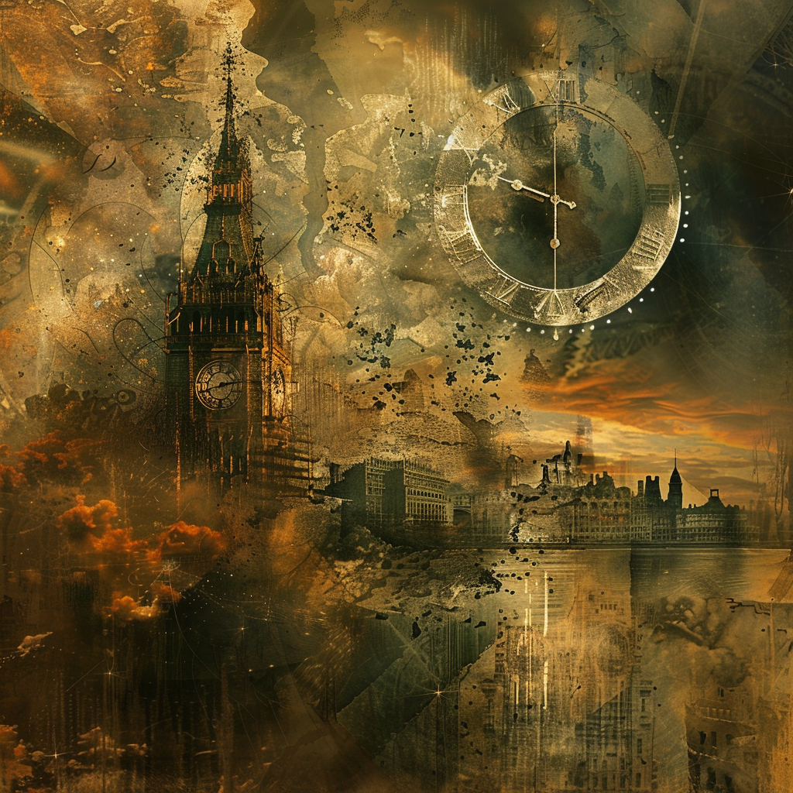

13. Epilogue: The New Dawn

The world that greeted our intrepid Elara in the wake of her tumultuous ordeal was one that, at first glance, bore the semblance of the one she had known. Yet upon closer scrutiny, it was evident that the tapestry of reality had undergone a subtle, but irrevocable, metamorphosis.

The ancient magic, long dormant and now unleashed, had suffused the very air with its arcane essence. It shimmered like heat above cobblestone, visible to those who had borne witness to the events that had transpired. Elara, her heart still heavy with the losses and triumphs of the quest, could see the ethereal threads woven into the fabric of the world.

It was a new dawn, and with it came a newfound respect for the ancient powers that had once been the downfall of a great civilization. Humankind, which had hitherto walked in ignorance of the deeper mysteries that lay hidden in plain sight, now stood at the precipice of a new era of enlightenment.

In the towns and villages, the folk spoke in hushed tones of the great battle that had rent the skies asunder and how the heroic Elara and her companions had stood firm against the onslaught of darkness. The cult, with its nefarious designs, had been vanquished, but not without cost.

The heroes that had survived bore the marks of the conflict, both seen and unseen. Elara herself, once a mere scholar with a thirst for knowledge, had emerged as a beacon of hope, a living testament to the resilience of the human spirit.

The companions who had journeyed with her, each carrying their own scars and tales, had dispersed to the corners of the world. They became the keepers of the truth, the guardians of the ancient wisdom that had been unearthed. It was their duty to ensure that the mistakes of the past were not repeated, that the balance between the arcane and the mundane was maintained.

The landscape itself had been altered by the cataclysmic energies released during the final confrontation. Where once there had been barren desolation, now life sprang forth in abundance. Verdant forests reclaimed the land, and the rivers ran clear and true. The ancient ruins, the epicenter of the upheaval, stood as a monument to the old world and the birthplace of the new.

Elara often found herself wandering the remnants of the great civilization that had come before. The scrolls that had once been her guide were now part of her. The knowledge they contained had been etched into her very soul, an indelible part of her being.

She pondered the dreams that had first led her on the path to destiny, now understanding that they had been the whispers of the ancients, reaching across the chasm of time to prevent a repeat of their own tragic folly. The scholar in her marveled at the intricacy of the universe, the interconnectivity of all things.

Her role in the grand scheme of things had shifted; she was no longer a mere seeker of truths but a custodian of the future. It was a mantle she bore with a mix of trepidation and pride, for she knew the eyes of history were upon her.

As the days stretched into months, the world began to heal. The magic that had been released was slowly being integrated into the daily lives of people. It was used not as a tool for domination but as a means to improve, to enhance the quality of life for all.

Elara watched as societies transformed, as the newfound knowledge eradicated diseases, as hunger became a ghost of the past, and as peace, that most elusive of treasures, was finally within grasp.

Yet, the scholar within her knew that this peace was fragile, as transient as the morning dew. Vigilance was the price of this new dawn. The whispers of the ancients, though now silent, had imparted a lesson that she would not soon forget.

As the sun dipped below the horizon, painting the sky with hues of crimson and gold, Elara closed her eyes and took a deep breath. The world had changed, and so had she. But one truth remained steadfast in her heart – the quest for knowledge never ends, and the journey, much like the river, flows ever onward.

And thus, the world turned, and the new dawn gave way to the promise of a future where the echoes of the past served as a guiding light, a beacon for all those who would come after, a testament to the enduring spirit of those who dare to dream.

